# INF115

- [INF115](#inf115)
  - [Kapittel 1 - Introduksjon](#kapittel-1---introduksjon)
    - [Databaseobjekter](#databaseobjekter)
    - [Systemkatalog](#systemkatalog)
    - [Lagrede programmer](#lagrede-programmer)
    - [Database-livsløp](#database-livsløp)
    - [Databasesystem](#databasesystem)
    - [Utføring av SQL-spørringer](#utføring-av-sql-spørringer)
    - [DBHS-familiene](#dbhs-familiene)
  - [Kapittel 2 - Spørringer mot én tabell](#kapittel-2---spørringer-mot-én-tabell)
    - [Utvalgsspørringer](#utvalgsspørringer)
    - [Operatorer](#operatorer)
    - [Jokernotasjon](#jokernotasjon)
    - [Sortering](#sortering)
    - [Mengdefunksjoner](#mengdefunksjoner)
    - [Gruppering](#gruppering)
    - [Filtrere resultat](#filtrere-resultat)
  - [Kapittel 3 - Lage og bruke tabeller](#kapittel-3---lage-og-bruke-tabeller)
    - [Datatyper](#datatyper)
    - [Opprette nye tabeller](#opprette-nye-tabeller)
    - [Primærnøkler](#primærnøkler)
    - [Sammensatte primærnøkler](#sammensatte-primærnøkler)
    - [Autonummererte nøkler](#autonummererte-nøkler)
    - [Håndtering av nullmerker](#håndtering-av-nullmerker)
    - [Unike kolonner](#unike-kolonner)
    - [Kandidatnøkkel](#kandidatnøkkel)
    - [Standarverdi](#standarverdi)
    - [Fremmednøkler](#fremmednøkler)
    - [Massesletting](#massesletting)
    - [CHECK](#check)
    - [Begrensning med fremmednøkler](#begrensning-med-fremmednøkler)
    - [Innsettingsspørringer](#innsettingsspørringer)
    - [Slettespørringer](#slettespørringer)
    - [Oppdateringsspørringer](#oppdateringsspørringer)
    - [CSV filer](#csv-filer)
    - [Transaksjoner](#transaksjoner)
    - [Endre og slette databaser](#endre-og-slette-databaser)
    - [Databaser og Databaseobjekter](#databaser-og-databaseobjekter)
    - [SQL Scripts](#sql-scripts)
  - [Kapittel 4 - Spørringer mot flere tabeller](#kapittel-4---spørringer-mot-flere-tabeller)
    - [Kryssprodukt](#kryssprodukt)
    - [Indre koblinger](#indre-koblinger)
      - [Likekoblinger](#likekoblinger)
    - [Kortnavn](#kortnavn)
      - [Syntaks for likekoblinger](#syntaks-for-likekoblinger)
      - [Naturlig kobling](#naturlig-kobling)
      - [Kobler tre eller flere tabeller](#kobler-tre-eller-flere-tabeller)
      - [Grupperinger og likekoblinger](#grupperinger-og-likekoblinger)
      - [Egenkoblinger](#egenkoblinger)
      - [Generelle koblinger](#generelle-koblinger)
    - [Mengdeoperasjoner og ytre koblinger](#mengdeoperasjoner-og-ytre-koblinger)
      - [Venstre og høyre ytre kobling](#venstre-og-høyre-ytre-kobling)
    - [Union, snitt og differanse](#union-snitt-og-differanse)
    - [Full ytrekobling](#full-ytrekobling)
  - [Kapittel 5 - Avanserte spørringer](#kapittel-5---avanserte-spørringer)
    - [Case](#case)
    - [Erstatte nullmerker](#erstatte-nullmerker)
    - [Views](#views)
    - [Delspørringer](#delspørringer)
    - [Vekselvirkende delspørringer](#vekselvirkende-delspørringer)
    - [Operatorer for delspørringer](#operatorer-for-delspørringer)
    - [Delspørringer i SELECT](#delspørringer-i-select)
    - [Delspørringer i FROM](#delspørringer-i-from)
    - [Delspørringer i INSERT, UPDATE og DELETE](#delspørringer-i-insert-update-og-delete)
    - [Aggregeringssytemer](#aggregeringssytemer)
    - [CUBE](#cube)
    - [Krysstabellspørringer](#krysstabellspørringer)
    - [Rangering og topp 10](#rangering-og-topp-10)
    - [Rekursjon](#rekursjon)
  - [Kapittel 6 - Relasjonsmodellen](#kapittel-6---relasjonsmodellen)
    - [Representasjonsuavhengighet](#representasjonsuavhengighet)
    - [Relasjoner](#relasjoner)
      - [Mengde](#mengde)
      - [Logiske konnektiver](#logiske-konnektiver)
      - [Mengde definisjon](#mengde-definisjon)
      - [Mengde restriksjon](#mengde-restriksjon)
      - [Den tomme mengde](#den-tomme-mengde)
      - [Delmengde](#delmengde)
      - [Ekte delmengde](#ekte-delmengde)
    - [Integritetesregler](#integritetesregler)
      - [Funksjon](#funksjon)
      - [Funksjonell avhengighet](#funksjonell-avhengighet)
      - [Supernøkkel](#supernøkkel)
      - [Minimal supernøkkel](#minimal-supernøkkel)
      - [Entitetsintegritet](#entitetsintegritet)
      - [Unionskompatibilitet](#unionskompatibilitet)
      - [Referanseintegritet](#referanseintegritet)
    - [Relasjonsalgebra](#relasjonsalgebra)
      - [Seleksjon](#seleksjon)
      - [Projeksjon](#projeksjon)
      - [Mengdeopreatorer](#mengdeopreatorer)
      - [Koblinger](#koblinger)
      - [Divisjon](#divisjon)
      - [Tilordning](#tilordning)
  - [Kapittel 7 - Datamodellering med ER](#kapittel-7---datamodellering-med-er)
    - [ER-Diagrammer og databasetabeller](#er-diagrammer-og-databasetabeller)
    - [Kravanalyse](#kravanalyse)
    - [Entiteter og attributter](#entiteter-og-attributter)
    - [Forhold](#forhold)
      - [Kardinalitet](#kardinalitet)
      - [En-til-en](#en-til-en)
      - [En-til-mange](#en-til-mange)
      - [Mange-til-mange](#mange-til-mange)
      - [Maksimums- og minimumskardinalitet](#maksimums--og-minimumskardinalitet)
      - [Roller og navn på forhold](#roller-og-navn-på-forhold)
      - [Primærnøkler og ikke-identifiserende forhold](#primærnøkler-og-ikke-identifiserende-forhold)
      - [Svake entiteter og identifiserende forhold](#svake-entiteter-og-identifiserende-forhold)
      - [Attributter til forhold og koblingsentiteter](#attributter-til-forhold-og-koblingsentiteter)
    - [Datamodellering med UML](#datamodellering-med-uml)
      - [Aggregering](#aggregering)
      - [Komposisjon](#komposisjon)
    - [Subtyper](#subtyper)
    - [Abstraksjonsmekanismer](#abstraksjonsmekanismer)
    - [Chen-notasjon](#chen-notasjon)
      - [Forhold i Chen-notasjon](#forhold-i-chen-notasjon)
      - [Svake entiteter i Chen](#svake-entiteter-i-chen)
      - [Ikke atomære attributter i Chen](#ikke-atomære-attributter-i-chen)
  - [Kapittel 8 - Fra modell til database](#kapittel-8---fra-modell-til-database)
    - [Oppsummeringer av enkle regler](#oppsummeringer-av-enkle-regler)
    - [En-til-mange forhold](#en-til-mange-forhold)
    - [Oversettelse av svake entiteter og identifierserende forhold](#oversettelse-av-svake-entiteter-og-identifierserende-forhold)
    - [Mange-til-mange forhold](#mange-til-mange-forhold)
    - [En-til-en forhold](#en-til-en-forhold)
    - [Håndtere minimumskardinalitet i databaser](#håndtere-minimumskardinalitet-i-databaser)
    - [Normalisering](#normalisering)
      - [Reduans og funksjonelle avhengiheter](#reduans-og-funksjonelle-avhengiheter)
      - [Dekomponere tabeller](#dekomponere-tabeller)
      - [1NF](#1nf)
      - [2NF](#2nf)
      - [3NF](#3nf)
      - [Boyce-Codd NormalForm (BCNF)](#boyce-codd-normalform-bcnf)
  - [Kapittel 9 - Filer og indekser](#kapittel-9---filer-og-indekser)
    - [Lagringsmedier](#lagringsmedier)
      - [Minnehierarkiet](#minnehierarkiet)
      - [Overføring mellom minne og disk](#overføring-mellom-minne-og-disk)
      - [RAID](#raid)
    - [Filstruktur og søkemetoder](#filstruktur-og-søkemetoder)
      - [Representasjon av poster](#representasjon-av-poster)
      - [Ikke sorterte filer](#ikke-sorterte-filer)
      - [Sorterte filer](#sorterte-filer)
      - [Hashing](#hashing)
    - [Indekser](#indekser)
      - [Primærindekser](#primærindekser)
      - [Sekundærindekser](#sekundærindekser)
      - [Flernivåindekser](#flernivåindekser)
      - [Bitmap-indekser](#bitmap-indekser)
      - [Indekser med SQL](#indekser-med-sql)
    - [Retningslinjer for fysisk design](#retningslinjer-for-fysisk-design)
      - [Valg av datatyper](#valg-av-datatyper)
      - [Valg av filstruktur og indekser](#valg-av-filstruktur-og-indekser)
  - [Kapittel 10 - Transaksjoner](#kapittel-10---transaksjoner)
    - [Håndtering av feilsituasjoner](#håndtering-av-feilsituasjoner)
      - [Definisjoner av transkasjoner](#definisjoner-av-transkasjoner)
      - [Kontrollerte avbrudd og feilsituasjoner](#kontrollerte-avbrudd-og-feilsituasjoner)
      - [Transaksjonsloggen](#transaksjonsloggen)
      - [Gjennoppbygging med transaksjonslogg](#gjennoppbygging-med-transaksjonslogg)
    - [Flerbruksdatabaser](#flerbruksdatabaser)
      - [Prosesser](#prosesser)
      - [ACID-egenskapene](#acid-egenskapene)
      - [Les - beregn - skriv](#les---beregn---skriv)
      - [Utfordringer med samtidige brukere](#utfordringer-med-samtidige-brukere)
      - [Låsemekanismer](#låsemekanismer)
      - [Serialiserende forløp](#serialiserende-forløp)
      - [Tofaselåsing](#tofaselåsing)
      - [Vranglås(Deadlock)](#vranglåsdeadlock)
      - [Isolasjonsnivåer og optimistisk låsing](#isolasjonsnivåer-og-optimistisk-låsing)
  - [Kapittel 11 - Databaseadministrasjon](#kapittel-11---databaseadministrasjon)
    - [Oppbygningen av et databasesystem](#oppbygningen-av-et-databasesystem)
      - [Data og metadata](#data-og-metadata)
      - [Oppgavene til et DBHS](#oppgavene-til-et-dbhs)
      - [Oppgavene til databaseadministratoren](#oppgavene-til-databaseadministratoren)
      - [SIkkerhetskopiering og gjenoppbygging](#sikkerhetskopiering-og-gjenoppbygging)
      - [Brukeradministrasjon](#brukeradministrasjon)
      - [HTTP](#http)
    - [Databaser og applikasjoner](#databaser-og-applikasjoner)
      - [Fysisk og logisk arkitektur](#fysisk-og-logisk-arkitektur)
      - [Plattform og utviklingsstakker](#plattform-og-utviklingsstakker)
    - [Introduksjon til PHP](#introduksjon-til-php)
      - [Dynamiske nettsider](#dynamiske-nettsider)
      - [Behandle HTML-skjemaer](#behandle-html-skjemaer)
      - [Behandle skjemadata](#behandle-skjemadata)
    - [Databaseprogrammer i PHP](#databaseprogrammer-i-php)
    - [Programmering i PHP](#programmering-i-php)
      - [Dagens dato](#dagens-dato)
      - [Variabler i PHP](#variabler-i-php)
      - [Gjennomløp med foreach](#gjennomløp-med-foreach)
      - [Produsere en HTML-tabell](#produsere-en-html-tabell)
      - [isset og array_key_exists](#isset-og-array_key_exists)
      - [Opprette databaseforbindelse](#opprette-databaseforbindelse)
      - [SELECT-spørringer i PHP](#select-spørringer-i-php)
      - [Databaseforbindelse](#databaseforbindelse)
      - [Fra spørreresultat til HTML-tabell](#fra-spørreresultat-til-html-tabell)
      - [UPDATE og DELETE](#update-og-delete)
      - [Autonummerering](#autonummerering)
    - [Ukesoppgaver Kapittel 9](#ukesoppgaver-kapittel-9)
  - [Kapittel 14 - XML og JSON](#kapittel-14---xml-og-json)
    - [Introduksjon til XML](#introduksjon-til-xml)
    - [HTML VS XML](#html-vs-xml)
    - [Oppbygging av XML-dokumenter](#oppbygging-av-xml-dokumenter)
    - [Lovlig struktur av XML-dokumenter](#lovlig-struktur-av-xml-dokumenter)
    - [DTD - Document Type Definition](#dtd---document-type-definition)
    - [DTD vs XML Schema](#dtd-vs-xml-schema)
    - [XML Schema](#xml-schema)
    - [Koble XML og XML Schema](#koble-xml-og-xml-schema)
    - [Innebygde datatyper](#innebygde-datatyper)
    - [Enkle datatyper ved restriksjon](#enkle-datatyper-ved-restriksjon)
    - [Komplekse datatyper](#komplekse-datatyper)
    - [Attributter](#attributter)
  - [Begreper spørsmål og mulig oppgaver](#begreper-spørsmål-og-mulig-oppgaver)
    - [Generelt](#generelt)
      - [Programmeringsspråk](#programmeringsspråk)
      - [Datarepresentasjon](#datarepresentasjon)
    - [SQL](#sql)
    - [Relasjonsmodellen og relasjonsalgebra](#relasjonsmodellen-og-relasjonsalgebra)
    - [Datamodellering og databasedesign](#datamodellering-og-databasedesign)
    - [HTML/XML](#htmlxml)
    - [PHP](#php)

## Kapittel 1 - Introduksjon

* DIK(W)-pyramiden: Data information knowledge wisdom

### Databaseobjekter

* Tabeller
  * Lagret data

* Spørringer og views
  * Spørringer definerer tabeller ved å legge til eller slette data
  * View en en virtuell tabell definert ved en spørring

### Systemkatalog

* Metadata
  * Data om data lagret i systemkatalogen

* Access rights

### Lagrede programmer

* SQL kombinert med andre språk

### Database-livsløp

1. Forstudie
2. Analyse
3. Design
4. Implementasjon
5. Testing
6. Produksjon

### Databasesystem

* DBHS - Databasehåndteringssystem
  * Et program som skal utføre alle slags operasjoner mot database
  * Unngår at brukeren kommuniserer direkte med databasen

* Databasesystem er en database som blir styrt av et DBHS

* DBHS + database
  * Skal lagre store mengder data over lang tid på en sikker måte
  * Må tilby brukermekanismer(SQL)
  * Effektiviserer søk
  * Brukertillgangsrettigheter
  * Kæsjhåntering
  * Flerbrukerkompitabel
  * Mulighet å lage applikasjoner som kan bruke systemet
* Inkonsistent når dataen i databasen er motstridene

### Utføring av SQL-spørringer

* Parsering(parsing) - feilretting
* Optimalisering - Spørringer blir gjort mest mulig effektiv. Resulterer i en ekseverinsplan der den mest effektive planen blir utført
* Indekser- Effektiviserer søk i kolonner

* Transaksjoner
  * Operasjoner brukere utføere på databasen
  * Utføres i helget så ikke noe går galt med databasen. Fikses med b.l.a logging

### DBHS-familiene

* Relasjonsdatabaser - Tabeller,SQL
* Objektdatabaser - Kart, bilder, lyd, osv
* No SQL databaser - Nyere enn SQL
* Hierarkiske databaser - Tresstruktur
* Nettverksdatabase - Nettverksgrafer
* Logiske databaser - Data lagres som logiske utsagn

## Kapittel 2 - Spørringer mot én tabell

* Nullmerker - "ikke verdier"
* Primærnøkkel - En per tabell. Effektiv måte å identifiserer data på

* Nøkkelord:
  * **SELECT** - Hvilke kolonner?
  * **FROM** - Hvilken tabell?
  * **WHERE** - Hvilke rader?
  * **ORDER BY** - Hvilken rekkefølge?

### Utvalgsspørringer

* Vise samtlige kolonner:
  
  * ```SQL
      SELECT *
      FROM db
    ```

### Operatorer

* Aritmetiske
  * -,+,*,/,%
* Sammenligning
  * <, >, => , <=, =, <>
* Logiske
  * AND, NOT

* Operator prioritet:
  1. -(tall)
  2. / *
  3. +-
  4. <,>,<= => =, <>
  5. NOT
  6. AND
  7. OR

### Jokernotasjon

* ```WHERE COL LIKE 'M%'```
  * Finner alt som starter på M
* ```WHERE UPPER(col) LIKE %SØKEORD%```
  * Finner alt som inneholder søkeordet
* ```WHERE cole LIKE 'A1_'```
  * Returnerer alt som har A1 og et tegn etter seg

### Sortering

* Etter kolonner
  * ```ORDER BY col1 ASC(stigende), col2 DESC(synkende)```
* Etter legnde på ord
  * ```ORDER BY CHAR_LENGTH(col)```

### Mengdefunksjoner

* AVG - Gjennomsnitt
* SUM - Sum
* COUNT - Antall
* MIN - Minimum
* MAX - Maksimum

### Gruppering

* ```GROUP BY col```

### Filtrere resultat

* ```HAVING COUNT(*) > 1```
* **DISTINCT** - Fjerner duplikater

## Kapittel 3 - Lage og bruke tabeller

### Datatyper
  
* CHAR(n), VARCHAR(n)
* SMALLINT, INTEGER, BIGINT
* NUMERIC(p,s), DECIMAL
* FLOAT, DOUBLE
* DATE, TIME, TIMESTAMP
* INTERVAL
* BOOLEAN
* CLOB(n), BLOB(n)

### Opprette nye tabeller
  
* ```SQL
    CREATE TABLE Vare
    (
        VNr CHAR(5),
        Betegnelse VARCHAR(50),
        Pris DECIMAL(8,2),
        KatNr SMALLINT,
        Antall INTEGER,
        Hylle CHAR(3),
        CONSTRAINT VarePN PRIMARY KEY(VNr)
    )

### Primærnøkler

* Skal ikke inneholde nullmerker eller repitisjoner
* CONSTRAINT definerer primærnøkkelen og sjekker for nullmerker eller repitisjoner
* Fjerne primærnøkkel med:

```SQL
    ALTER TABLE Vare DROP CONSTRAINT VarePN
    eller
    ALTER TABLE Vare DROP PRIMARY KEY
```

* Når primærnøkkelen består av en enkel kolonne:

```SQL
    VNr CHAR(5) PRIMARY KEY
```

### Sammensatte primærnøkler

* Kombinerer flere kolonner for å lage primærnøkler
* Når det er repitisjoner i en eller flere primærnøkler, vil det ikke forekomme repitsjoner i kombinasjonen av de to kolonnene
  
```SQL
    CREATE TABLE Ordreline(
        OrdreNr INTEGER,
        VNr CHAR(5),
        PrisPrEnhet DECIMAL(8,2),
        Antall INTEGER,
        CONSTRAINT OrdrelinjePN
            PRIMARY KEY (OrdreNR, VNr)
        )
```

### Autonummererte nøkler
  
* Ofte surrogatnøkler(Entydig identifikasjon)
* Systemet fyller inn verdier automatisk i kolonnene
* Kan bruke sekvenser som legger inn nye tall for hver rad
  
  * ```SQL
        CREATE TABLE Kategori(
            KatNr SMALLINT AUTO_INCREMENT
            Navn VARCHAR(50),
            CONSTRAINT KategoriPN PRIMARY KEY (KatNr)
        )
    ```

### Håndtering av nullmerker

  1. Filtrere ut nullmerker i spørring:

     * ```SQL
       SELECT AVG(Pris)
       FROM Vare

       eller

       SELECT SUM(Pris) / COUNT(Pris)
       FROM Vare

       eller

       SELECT SUM(Pris) / COUNT(*)
       FROM Vare
       WHERE Pris IS NOT NULL
        ```
  
  2. Omorganisere data i en annen data i en annen database

### Unike kolonner

* Kontrollerer at ikke samme verdi er skrevet inn i samme kolonne
  
* ```SQL
        Epost VARCHAR(100) UNIQUE
    ```

### Kandidatnøkkel

* Er en kolonne man kan definere med både NOT NULL og UNIQUE, en mulig primærnøkkel

### Standarverdi

* Kolonner fyller ut en standar verdi automatisk når en ny rad blir lagt til
  
* ```SQL
        Antall INTEGER DEFAULT 0
    ```

### Fremmednøkler

* Logisk sammenkoling av tabeller
* Tar en primærnøkkel fra en tabell og bruker i den andre slik at den er begge steder
  
* ```SQL
      CREATE TABLE Ordrelinje
      (
        OrdreNr INTEGER,
        VNr CHAR(5),
        PrisPrEnhet DECIMAL(8,2),
        Antall INTEGER,
        CONSTRAINT OrdrelinjePN
            PRIMARY KEY(OrdreNr, VNr),
        CONSTRAINT OrdrelinjeOrdreFN
            FOREIGN KEY (OrdreNR)
            REFERENCES Ordre (OrdreNr),
        CONSTRAINT OrdrelinjeVareFN
            FOREIGN KEY (VNr)
            REFERENCES Vare (VNr)
    )

* VNr er primærnøkel i Vare og fremmednøkkel i Ordrelinje
* En-til-mange forhold
* I **sammensatte primærnøkler**, må enten alle eller ingen av kolonnene inneholder nullmerker

### Massesletting
  
```SQL
CONSTRAINT OrdrelinjeVareFN
FOREIGN KEY(VNr)
ON DELETE CASCADE elle
```

* ON DELETE kan erstattes med ON UPDATE
* ON CASADE kan erstatte med SET NULL

### CHECK

* Valideringsspørring
  
```SQL
      CONSTRAINT Prisregel
        CHECK (Pris > 0 AND Pris < 10000)
```

### Begrensning med fremmednøkler

* Begrenser lovlige farger:

```SQL
        CONSTRAINT Fargeregel
            CHECK (Farge IN('rød', 'blå', 'gul'))
```

* I tilfelle over ville det vært nødvendig å redefinere hele tabellen dersom en skulle lagt til noe nytt i lovlige farger
* Lag en ny tabell og innfør samme regel som over, bare med en fremmednøkkel til den nye tabellen i stedet

```SQL
        CREATE TABLE Lovligfarge
        (
            Farge VARCHAR(50),
            CONSTRAINT FargePN PRIMARY KEY (Farge)
        )
```

### Innsettingsspørringer

* Sette inn i spesefikke kolonner:

  * ```SQL
        INSERT INTO Vare(VNr, Betegnelse, Pris)
        VALUES('44304', 'CREOX gul', 29.50)

  * Sette inn i hele tabellen:
  
  * ```SQL
        INSERT INTO Vare
        VALUES('44304', 'CREOX blå', 29.50, NULL, 53, 'C38')

  * Sett inn ny rad:

  * ```SQL
        INSERT INTO Kategori(Navn)
        VALUES('Modellfly')

  * Kopiere fra en tabell til en annen:

  * ```SQL
        INSERT INTO Kategori (KatNR)
        SELECT DISTINCT KatNr FROM Vare

  * Kopiere ting fra gammel database og legge det i en en ny:

  * ```SQL
        INSERT INTO GamleOrdre
        SELECT * FROM Ordre WHERE YEAR(OrdreDato) < 2020

### Slettespørringer
  
* ```SQL
        DELETE FROM Vare
        WHERE KatNr = 3 AND Pris > 100
    ```

### Oppdateringsspørringer

* ```SQL
        UPDATE Vare
        SET Antall = 0, Pris = Pris * 1.05
        WHERE KatNr = 3

### CSV filer

* Export:

* ```SQL
        SELECT *
        INTO OUTFILE 'kunde.csv'
        FIELDS TERMINATED BY ';'
        LINES TERMINATED BY '\r\n'
        FROM Kunde

* Import:

```SQL
        LOAD DATA INFILE 'kunde.csv'
        INTO TABLE Kunde
        FIELDS TERMINATED BY ';'
        LINES TERMINATED BY '\r\n'
        IGNORE 1 ROWS
```

### Transaksjoner

* ```SQL
        START TRANSACTION

        UPDATE Vare SET KatNr = 16 WHERE KatNr = 15;

        UPDATE Kategori
        SET Navn = 'Blomsterfrø og blomseterløker'
        WHERE KatNr = 16;

        DELETE FROM Kategori WHERE KatNr = 15;

        COMMIT

### Endre og slette databaser

* ```SQL
        ALTER TABLE Vare
            ADD COLUMN Farge CHAR(15);

        ALTER TABLE Orderlinje
            DROP COLUMN PrisPerEnhet;

        ALTER TABLE Vare
            ADD CONSTRAINT Makspris
            CHECK CONSTRAINT MaksPris;

        (MYSQL)

        ALTER TABLE Kunde DROP FOREIGN KEY OrdreKundeFN;

        DROP TABLE Vare

### Databaser og Databaseobjekter
  
* ```SQL
        CREATE DATABASE HobbyHuset;

        (Indekser brukes til å effektivisere søk)

        CREATE INDEX EtternavnIndx ON Kunde (Etternavn)

        (Views er virtuelle tabeller)

        CREATE VIEW Maling AS
            SELECT *
            FROM Vare
            WHERE KatNr = 2

### SQL Scripts
  
* Sekvens av SQL spørringer

## Kapittel 4 - Spørringer mot flere tabeller

### Kryssprodukt

* For å unngå redundans(gjentatt informasjon)
* Resultatet av to tabeller
* Uten betingelser i spørringene blir resultattabellen fra spørringen alle radene i alle tabellene ganget med hverandre
* Inneholder alle mulige radkombinasjoner

### Indre koblinger

* Spørringer for å unngå for stort kryssprodukt

#### Likekoblinger

* Restriksjon for kryssprodukt
* To kolonner er unionkompitable hvis kolonnene inneholder samme slags data(er i samme domene)
* Likekoblinger er radene i T1 og T2 som har samme verdi i koblingskolonnene
  * T1.X = T2.Y
* Kan være sammensatte gitt at de er unionskompitable

```SQL
    SELECT *
    FROM Ordre, Kunde
    WHERE Ordre.KNr = Kunde.KNr;
```

### Kortnavn

```SQL
    SELECT OrdreNr, OrdreDato, O.KNr, Etternavn
    FROM Ordre AS O, Kunde AS k
    WHERE O.KNr = K.KNr;
```

#### Syntaks for likekoblinger

```SQL
# Likekoblingen mellom Kunde og Ordre

    SELECT OrdreNr, OrdreDato, O.KNr, Etternavn
    FROM Ordre AS O INNER JOIN Kunde AS K ON O.KNr = K.KNr

# Finne koblinger mellom Ansatt og Kunde med samme postnummer der det ikke er noen fremmednøkler

    SELECT KNr, K.Etternavn, AnsNr, A.PostNr
    FROM Kunde AS K INNER JOIN Ansatt AS A ON K.PostNr = A.Post.Nr


# Koblingskolonnene trenger ikke ha samme navn i tabellene
# Finner ut om det er endret noe pris på noen varer samme dag som kunden la inn en ny ordre

    SELECT VNr, Dato, AnsNr, GammelPris
    FROM Ordre AS O INNER JOIN PrisHistorikk AS PH
    ON O.OrdreDato = PH.Dato
    WHERE O.KNr = 5009
```

#### Naturlig kobling
  
* Likekobling basert på tabeller med parvis samme navn på kolonner der vi bare tar med av kolonnene fra hvert par

```SQL
    SELECT *
    FROM Ansatt NATURAL JOIN Poststed


    #Samme som over, bare med en likekobling

    SELECT Ansatt.*, Poststed.Poststed
    FROM Ansatt INNER JOIN Poststed
    ON Ansatt.PostNr = Poststed.PostNr
```

#### Kobler tre eller flere tabeller

* Leses innenfra og utover

```SQL
    SELECT Ordre.*, Fornavn, Etternavn, Poststed
    FROM Ordre INNER JOIN
        ( Kunde INNER JOIN Poststed
        ON Kunde.PostNr = Poststed.PostNr )
    ON Ordre.KNr = Kunde.KNr;
```

#### Grupperinger og likekoblinger

* Finner samlet salg for varer i en bestemt kategori

```SQL
    SELECT V.VNr,
    SUM(OL.Antall * OL.PrisPrEnhet) AS SamletSalg
    FROM Ordrelinje AS OL, Vare AS V
    WHERE OL.VNr = V.VNr AND V.KatNr = 3
    GROUP BY V.VNr
```

* Samme spørring men, med informasjon om kunden

```SQL
    SELECT K.KNr, Etternavn, COUNT(*) AS Antall
    FROM Kunde AS K, Ordre AS O
    WHERE K.KNr = O.KNr
    GROUP BY K.KNr, Etternavn
```

#### Egenkoblinger

* Likekobling mellom to "kopier" av den samme tabellen
* Brukes for sammenlikning av radene i en tabell

```SQL
    # Finne navnet på lederer til alle ansatt

    SELECT A1.AnsNr, A1.Etternavn, A1.Fornavn,
     A2.AnsNr AS LederNr, A2.Etternavn AS LederNavn
    FROM Ansatt AS A1, Ansatt AS A2
    WHERE A1.Leder = A2.AnsNr
    ORDER BY A2.Etternavn, A1.Etternavn, A1.Fornavn
```

#### Generelle koblinger

* Bruker "=", "<=", "=>" eller "<>" for å plukke ut kombinasjoner

```SQL

    # Sjekker om det er flere kunder i samme kjernefamilie uten å skrive ut medlemmer flere ganger

    SELECT *
    FROM Kunde AS K1, Kunde AS K2
    WHERE K1.Etternavn = K2.Etternavn
    AND K1.Adresse = K2.Adresse
    AND K1.KNr < K2.KNr
```

### Mengdeoperasjoner og ytre koblinger

#### Venstre og høyre ytre kobling

* Ytre koblinger tar med de resultatene vi er interessert i som matcher direkte med spørringer vår, men også samtlige resultater fra listen som ikke direkte går under matchen vår
* "Ekstra rader fra en likekobling"
* Venstre og høyre avhengig av hvilken tabell vi er interessert i de ekstra radene fra

```SQL
    SELECT *
    FROM Ordre AS O
    RIGHT OUTER JOIN Kunde AS K
    ON K.KNr = O.KNr


    SELECT * FROM T1
    LEFT OUTER JOIN T2
    ON T1.X = T2.Y

    SELECT * FROM T2
    RIGHT OUTER JOIN T1
    ON T1.X = T2.Y


    #ytre kobling med nullmerker

    SELECT K.KNr, Etternavn, COUNT(O.OrdreNr) AS Antall
    FROM Kunde AS K LEFT OUTER JOIN Ordre AS O
        ON K.KNr = O.KNr
    GROUP BY K.KNr, Etternavn
```

### Union, snitt og differanse

* To spørringer er unionskompatible hvis de har like mange kolonner, og kolonnene er parvis unionskompitabl
* Trenger ikke ha like navn
* **UNION** slår sammen unionkompatible resultater
* **INTERSECT** slår sammen til en "både" funksjon
* **EXCEPT** beregner mengdedifferanse

```SQL
#OR

SELECT DISTINCT KNr
FROM Ordre
WHERE YEAR(OrdreDato) = 2018 OR YEAR(OrdreDato) = 2019
    (kunne erstattet OR med AND og fått bådei 2018 og 2019)


#UNION

SELECT KNr FROM Ordre2018
UNION
SELECT KNr FROM Ordre2019
```

### Full ytrekobling

* Tilsvarer en venstre og høyre ytrekobling

```SQL
    SELECT VNr, Betegnelse, Navn
    FROM Vare AS V FULL OUTER JOIN Kategori AS K
    ON V.KatNr = K.KatNr
```

## Kapittel 5 - Avanserte spørringer

### Case

* Hvis betingelsen er sann, gjør A
* Ellers gjør B
* (**IF** i mysql)

```SQL
SELECT VNr, Betegnelse, Pris,
CASE
    WHEN Pris<100 THEN 'Billig'
    WHEN Pris <=500 THEN 'Middels'
    ELSE 'Dyr'
    END AS Prisklasse
FROM Vare
```

```SQL
SELECT AnsNr, Etternavn,
    CASE Kjønn
        WHEN 'K' THEN 'Kvinne'
        WHEN 'M' THEN 'Mann'
    END
FROM Ansatt
```

### Erstatte nullmerker

* COALESCE

```SQL
SELECT AnsNr, Etternavn, COALESCE(Kjønn, 'U') AS Kjønn
FROM Ansatt
```

### Views

* Virtuell tabell

```SQL
CREATE VIEW Keramikk(VNr,Navn,Antall) AS
    SELECT VNr, Betegnelse, Antall
    FROM Vare
    WHERE KatNr=3
```

* (Burde ikke inneholde **ORDER BY**)

* Slette view:

```SQL
DROP VIEW Keramikk
```

* Ikke alle views kan oppdateres:

```SQL
CREATE VIEW AntallVarerPrKategori AS
    SELECT KatNr, COUNT(*) AS ANTALL
    FROM Vare
    GROUP BY KatNr
```

* Views basert på spørringer mot flere tabeller:

```SQL
CREATE VIEW VarerMedKategoriNavn(VNr, VKatNr, Navn) AS
    SELECT V.VNr, V.Betegnelse , V.KatNr, K.KatNr, K.Navn
    FROM Vare AS V, Kategori AS K
    WHERE V.KatNr = K.KatNr;

UPDATE VArerMedKategoriNavn
SET VKatNr = 3
WHERE VNr = '10820';
```

* Konstruksjoner som tilsier at views ikke er oppdaterbare
  1. Det brukes **DISTINCT** , **GROUP BY** eller mengdefunksjon
  2. Pimærnøkkel er ikke med i **SELECT**
  3. **SELECT** inneholder uttrykk med funksjoner eller konstanter
  4. Delspørringer og koblinger av flere tabeller kan gjøre at viewet ikke er oppdaterbart

### Delspørringer

* Kan ha flere spørringer i andre deler av hovedspørringen

```SQL
SELECT VNr, Pris
FROM Vare
WHERE Pris < (SELECT AVG(Pris) FROM Vare);

SELECT V1.VNr, V1.Pris
FROM Vare AS V1, Vare AS V2
GROUP BY V1.VNr, V1.Pris
HAVING V1.Pris < AVG(V2.Pris);
```

### Vekselvirkende delspørringer

* Hovedspørring og delspørringer samarbeider

```SQL
#Finne billigste vare i hver kategori
SELECT V1.VNr,V1.Pris
FROM Vare AS V1
WHERE V1.Pris =
    (SELECT MIN(V2.Pris) FROM Vare AS V2
    WHERE V1.KatNr = V2.KatNr)
```

### Operatorer for delspørringer

* **IN**
  * Er en verdi i mengden?

```SQL
SELECT *
FROM Kunde
WHERE KNr IN (SELECT KNr FROM Ordre);

SELECT *
FROM Vare
WHERE KatNr IN (2,4,7);
```

* **SOME**
  * Er kriteriet sant for noen av verdiene som kommer ut?

```SQL
#Finne navn for kunder som har det samme navn som en eller flere andre kunder

SELECT *
FROM Kunde AS K1
WHERE Etternavn = SOME
    (SELECT Etternavn FROM Kunde AS K2
    WHERE K1.KNr <> K2.KNr)
```

* **ANY**
  * Kan brukes istedenfor  **SOME**

* **ALL**

```SQL
SELECT *
FROM Vare AS V
WHERE Pris < ALL
    (SELECT Gammelpris FROM Prishistorikk AS H
    WHERE V.VNr = H.VNr)
```

* **EXISTS**
  * Sjekke om en delspørring  gir et tomt resultat

```SQL
SELECT *
FROM Vare AS V
WHERE NOT EXISTS
    (SELECT *
        FROM Ordrelinje AS OL
        WHERE V.VNr = OL.VNr
```

### Delspørringer i SELECT

```SQL
SELECT KNr, Etternavn, Fornavn,
    (SELECT MAX(OrdreDato)
    FROM Ordre AS O
    WHERE O.KNR = K.KNR) AS Dato
FROM Kunde AS K
```

### Delspørringer i FROM

```SQL
SELECT Kunde.*, SisteOrdreDato
FROM Kunde,
    (SELECT KNr, MAX(OrdreDato) AS Dato
    FROM Ordre GROUP BY KNr) AS SisteOr
WHERE Kunde.KNr = SisteOrdre.KNr
```

### Delspørringer i INSERT, UPDATE og DELETE

```SQL
UPDATE Vare
SET Pris= Pris*1.1
WHERE VNr IN
    (SEL
    GROUP BY VNr
    HAVING COUNT(*) > 25);

DELETE FROM Kunde
WHERE NOT EXISTS
    (SELECT * FROM Ordre
    WHERE Ordre.KNr = Kunde.KNr);

INSERT INTO Prishistorikk(VNr, Dato, GammelPris)
    SELECT VNr, CURDATE(), Pris
    FROM Vare
```

### Aggregeringssytemer
* **OLTP**
  * On-line transactional processing
  * System med hyppige oppdateringer
  * 24/7
  * Raske

* **OLAP**
  * On-line analytical processing
  * Data aggregert over tid
  * Få oppdateringer
  * ad hoc spørringer mot systemet

### CUBE

* Datarepresentasjon
* Tankeverktøy
* Tre dimensjoner
* Skjeringspunkt mellom aksene

```SQL
SELECT VNr, FylkeNr, SUM(Antall) AS Samlet
FROM Salgstall
GROUP BY CUBE(VNr, FylkeNr)
```

### Krysstabellspørringer

```SQL
#Sammenlikner stilling og kjønn

SELECT Stilling, Kjønn
    COUNT(*) AS Antall, AVG(Årslønn) AS Snitt
FROM Ansatt
GROUP BY Stilling, Kjønn;

SELECT Stilling
    ROUND(AVG(IF(Kjønn='K', Årslønn, NULL)), 2) AS K,
    ROUND(AVG(IF(Kjønn='M', Årslønn, NULL)), 2) AS M
FROM Ansatt
GROUP BY Stilling;
```

### Rangering og topp 10

* **RANK**

```SQL
SELECT *, RANK() OVER (ORDER BY Pris) AS Rangering
FROM Vare
ORDER BY Pris;
```

* **LIMIT**

```SQL
SELECT *
FROM Vare
ORDER BY Pris DESC
LIMIT 10
```

### Rekursjon

* "Bruker seg selv"

```SQL
#Finner slektstre

SELECT
    S1.PNr, S1.Navn, S1.Far, S1.Mor, S2.Far AS Farfar,
    S2.Mor AS Farmor,
    S3.Far AS Morfar, S3.Mor AS Mormor

FROM
    (Slekt AS S1
        LEFT OUTER JOIN Slekt AS S2
        ON S1.Far = S2.PNr)
    LEFT OUTER JOIN Slekt AS S3
    ON S1.Mor = S3.PNr  
```

## Kapittel 6 - Relasjonsmodellen

### Representasjonsuavhengighet

* **Representasjonsuanvhengighet**
  1. Ingen to kolonner har samme navn
  2. Rekkefølgen til kolonnene har ingen ting å si
  3. Rekefølgen av radene har ingenting å si
  4. Det finnes ikke to like rader
  5. Alle verdier er atomære

* **Nøstede tabeller**
  * Noen tabeller må ha ekstra kolonner for å ikke inneholde to like rader
  * Gjør tabellene atmoære

### Relasjoner

#### Mengde

* en samling elementer
* $x \in S$

#### Logiske konnektiver
  
* **Og:** $\land$
* **Eller:** $\lor$
* **Ikke:** $\lnot$
* "x er mindre enn 0 *og* det er *ikke* slik at y er større enn 0"
  * $x<0 \land \lnot(y>0)$

#### Mengde definisjon

* $S = \{1,2,3,4,5\}$

#### Mengde restriksjon
  
* $T = x |x \in S \land x<3$
* For alle elementene $x$, er $x$ både i $S$ og under 3

#### Den tomme mengde

* $\empty$

#### Delmengde
  
* $S \subseteq T$
* Alle elementer i $S$ er også i $T$

#### Ekte delmengde
  
* $S \subset T$
* Alle elementer av $S$ er i $T$, men ikke motsatt

* $S \subseteq T \land T \subseteq S$
  * $S=T$

* **Eksempler**
  * **Sanne utsagn**
    * $\{1,3\} \subset \{1,2,3\}$
    * $\{1,2\} \subseteq \{1,3\}$
  * **Falskt utsagn**
    * $\{1,3\} \subset \{1,3\}$

* **Union**
  * $S \cup T = \{x|x \in S \lor x \in T \}$
  * Inneholder alle elementene fra $S$ og $T$

* **Snitt**
  * $S \cap T = \{x | x \in S \land x \in T \}$
  * Inneholder alle elementene som både er i $S$ og $T$

* **Differanse**
  * $S-T = \{x|x \in S \land x \notin T \}$

* **Kartesisk produkt**
  * $S \times T$
  * Samling av alle ordnete par hvor $x \in S$ og $y \in T$
  * "Kryssproduktet"
  * **Ordnete tupler**
    * $S_1 \times \dots \times S_n$
    * $S_1 \times \dots \times S_n = \{(x_1,...,x_n) | x_1 \in S_1 \land \dots \land x_n \in S_n\}$

* **Relasjoner**
  * TODO venndiagramm
  * **Strukturen** til relasjoner er bestemt ved en anttall attributter $\{A_1, \dots ,A_n \}$
    * **Attributtene** har hver et navn og et domene
    * Tenk en tabellen er en relasjon med attributter som kolonner med INTEGER, VARCHAR(50), VARCHAR(100) som domene)
  * **tupler**
    * $(a_1,a_2,\dots,a_n)$
    * Innholdet til en relasjon
    * Hver tuppel tilordner en verdi til hver av attributtene i relasjonen
    * Koblingen mellom attributter og verdier:
      * (AnsNr:1m Fornavn:Per, Etternavn:Hansen)
  * **Graden** til en relasjon er gitt ved antall attributter
  * **Kardinaliteten** tilsvarer antall tupler

* **Domener**
  * Hvert domene inneholder en mengde atomære verdier
  * Atmoær = ikke kan deles opp

* **Relasjonsdatabase**
  * En mengde relasjoner

### Integritetesregler

#### Funksjon

* $f: A \rightarrow B$
* Relasjon over $A$ og $B$
* Hvis $(a_1,b_1)$ og $(a_2,b_2)$ er i $f$ og $a_1 = a_2$, så er $b_1 = b_2$
  * For en bestemt verdi $a$ i $A$, så er det nøyaktig en verdi $b$ i $B$ slik at $(a,b)$ er med i $f$
  * $f(a)=b$

#### Funksjonell avhengighet

* Tabell $T(A,B,C)$
* Det er funksjonell avhengighet dersom $B \rightarrow C$, hvis for alle tupler $(a_1,b_1,c_1)$ og $(a_2,b_2,c_2)$ slik at $b_1=b_2$ medfører $c_1=c_2$
* $B$ bestemmer $C$
* For hver B-verdi finnes det kun en C-verdi

#### Supernøkkel

* Gitt en relasjon $R(A_1,\dots,A_n)$
* En samling attributter $K \subseteq \{A_1,\dots,A_n\}$ er en supernøkkel for $R$ hvis for hver attributt $A_i$ har at $K \rightarrow A_i$

#### Minimal supernøkkel

* En kandidatnøkkel for $R$ er en minimal supernøkkel for $R$
* Hvis $K$ er en kandidatnøkkel for $R$, vil ingen ekte delmengde $L \subset K$ være en kandidatnøkkel for $R$

#### Entitetsintegritet

* Hver relasjon skal ha nøyaktig en primærnøkkel som ikke skal ha nullmerker eller to like verdier
* Entitetsintegriteten sjekkes
  * Når en ny rad settes inn
  * Når en primærnlkkelverdi blir oppdatert

#### Unionskompatibilitet

* To attributter er unionskompitable hvis de har samme domene

#### Referanseintegritet

* En fremmednøkkel er et attributt $A$ som er unionskompitabel med en primærnøkkel $B$, slik at alle verdier i $A$ også er verdier i $B$
* Verdiene i $A$ er en delmengde av verdiene i $B$

### Relasjonsalgebra

* Mattematisk programmeringsspråk for å behandle relasjoner
* Bygd opp av opperatorer

#### Seleksjon

* $\sigma$
* Seleksjon er å velge tupler(rader) fra en relasjon(tabell) ved betingelser
* **WHERE**
* $\sigma_{kolonne + betingelse}(tabell)$
  * $\sigma_{Budsjett < 10000}(Prosjekt)$
  * $\sigma_{Budsjett < 10000 \land Leder=2}(Prosjekt)$

#### Projeksjon

* $\Pi$
* **SELECT**
* Velger attributter fra en relasjon
* $\Pi_{kolonne1, kolonne2}(tabell)$
  * **SELECT** kolonne1, kolonne2 **FROM** tabell

#### Mengdeopreatorer

* **Union**
  * $R \cup S = \{ t | t \in R \lor t \in S\}$
  * **UNION**

* **Snitt**
  * $R \cap S = \{ t | t \in R \land t \in S\}$
  * **INTERSECT**

* **Differanse**
  * $R - S = \{ t | t \in R \land t \notin S\}$
  * **EXCEPT**

* Binære operatorer
  * Kombinerer to relasjoner til en ny

* $\Pi_{Startdato}(Prosjekt) \cup \Pi_{Sluttdato}(Prosjekt)$
  * Alle datoer som enten er start eller sluttdato for et prosjekt

* $\Pi_{Leder}(Prosjekt) \cap \Pi_{AnsNr}(Arbeid)$
  * Bruk av snitt for å finne prosjektledere med registrerte timer på et prosjekt

* $\Pi_{AnsNr}(Ansatt) - \Pi_{AnsNr}(Arbeid)$
  * Ansattnummer til ansatte som ikke har deltatt i prosjekter

#### Koblinger

* **Like kobling**
  * $\bowtie$
  * $Prosjekt \bowtie_{Prosjekt.Leder = Ansatt.AnsNr}Ansatt$
  * Hvert prosjekt koblet med sin prosjektleder

* **Naturlige koblinger**
  * Bruker også $\bowtie$, bare uten betegnelse
  * $Ansatt \bowtie Arbeid$

* **Ytre koblinger**
  * **⟖**
  * **⟕**

#### Divisjon

* $\div$
* $R \div S$
  * Resultatet vil inneholde alle attributtene som er i $R$, men ikke $S$
  * Radene vil være samtilige rader i $R$ som matcher $S$
  * Tilsvarer **NOT EXISTS**
* $\Pi_{AnsNr, PNr}(Arbeid) \div \Pi_{PNr}(Prosjekt)$

#### Tilordning

* $\leftarrow$
* Sette navn på mellomresultater
* $R1 \leftarrow \sigma_{Budsjett<10000}(Prosjekt) \Pi_{PNr, Budsjett}
* $\rho$
* Gir nytt eller endrer på navn til tabeller
* $\rho_{Timeliste(AnsattNr, ProsjektNr, Timer)}(Arbeid)$
  * Endrer navn på relasjonen Arbeid til Timeliste
* Tilsvarer **AS**

## Kapittel 7 - Datamodellering med ER

### ER-Diagrammer og databasetabeller

* Forlag(<u>Navn</u>, Kontakt, Telefon)
* EBok(<u>BokNr</u>, ISBN, Tittel, Forfatter, UtgittÅr, AntallKopier, Navn*)
* Utlån(<u>BokNr*,LNr*,UtlånsDato</u>, ErLevert)
* Låner(<u>LNr</u>, Fornavn, Etternavn, Epost)

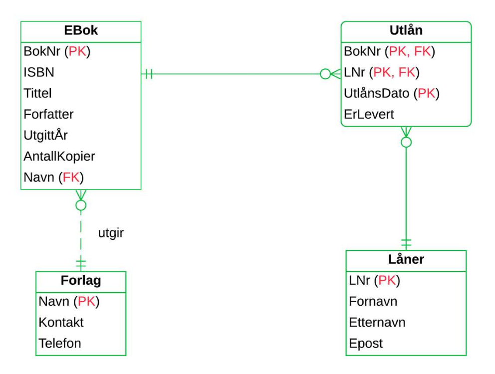 </img>

### Kravanalyse

* **Kravanalyse** systematiserer hvilke data som er hensiktsmessig og nødvendig å lagre i en database
* **Faktainnsamling** er en liste med krav til et system

### Entiteter og attributter

* **Entitet** er et objekt vi ønsker å lagre informasjon om(tabell)
* **Attributter** er egenskapene tildelt entitene(kolonner)
* **Domene** er datatypen tildelt domenet, som feks VARCHAR
* **Entitetstyper** representerer samlinger av forekomster, ergo en "entry" i en rad

### Forhold

* Linje mellom entiteter

#### Kardinalitet

* Forhold mellom entiteter

#### En-til-en

* 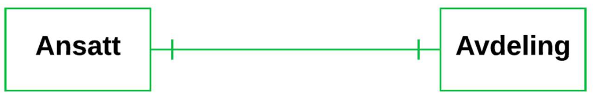 </img>

#### En-til-mange

* Vertikal strek uten kråkefot betyr en eller flere

*  </img>

#### Mange-til-mange

* 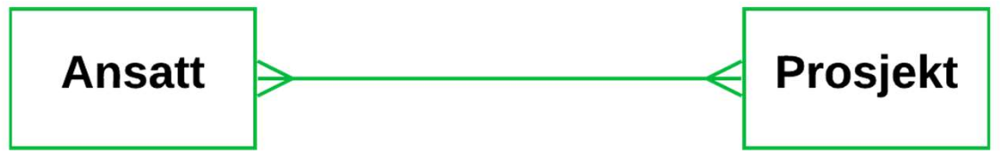 </img>

#### Maksimums- og minimumskardinalitet

* Utrykker hvor mange forekomster av entitet A som kan eller må knyttes til B og omvendt
* Merk at relasjonen her har en hvit '<>', som tilsvarer kråkefot med hvit sirkel
  * "0 eller fler"

#### Roller og navn på forhold

* **Navn** spesifiserer forhold for å klargjøre lettere hva forholdet betyr
* Kan leses som verb: "En ansatt leder en avdeling"

* 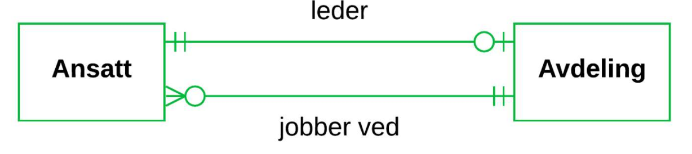 </img>

* **Roller** er alternativ navngivning som faller litt mer naturlig

* 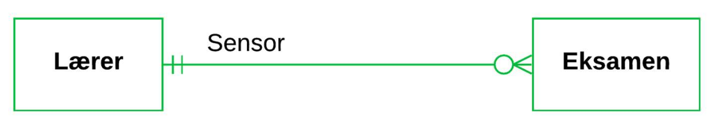 </img>

#### Primærnøkler og ikke-identifiserende forhold

* Alle entiteter skal ha en identifikator(primærnøkkel)
* Entiteter kan identifisere seg ved hjelp av andre entiteter
* Kunde og ordre er et ikke-identifiserbart forhold siden de har begge sine egne identifikatorer
* De blir ikke identifisert av hverandre

* 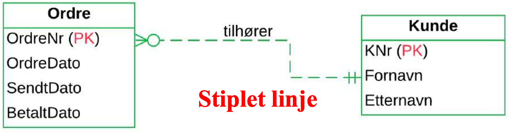 </img>

#### Svake entiteter og identifiserende forhold

* **Svake** entiteter er avhengige av andre entiteter for å eksistere
* Identifikatoren til en svak entitet er delvis eller helt arvet fra en annen identitet
* Svake identiteter kan arve attributtre fra andre svake identiteter
* Forholdet mot svake enheter er **identifiserende**
* Forsvinner entiteten som har forhold mot den svake identiteten, vil den svake forsvinne
* Identifikatorene går i *arv*

* 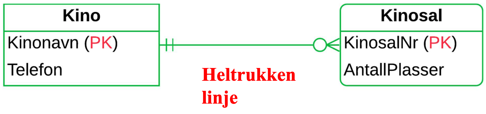 </img>

* Identifikator sammensatt av kolonner fra flere entiteter(tabeller)

* 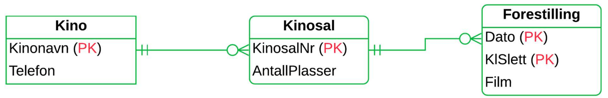 </img>

* Kan også bruke **løpenummer** som identifikator

*  </img>

#### Attributter til forhold og koblingsentiteter

* Utvide modellen med mer spesifikk informasjon som ikke er funnet i noen av identitetene
* **Entitisering**: Erstatter en-til-mange forhold med forhold til begge entitetene
* Ny enhet kalles **assosiativ enhet** eller **koblingsenhet**
* Før:
  * 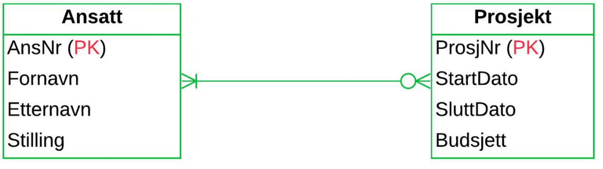 </img>

* Etter:
  * 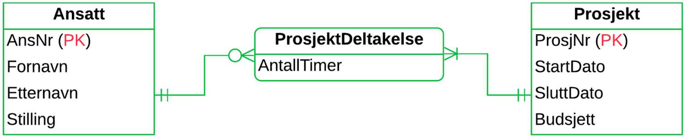 </img>

### Datamodellering med UML

* Unified modeling language
* 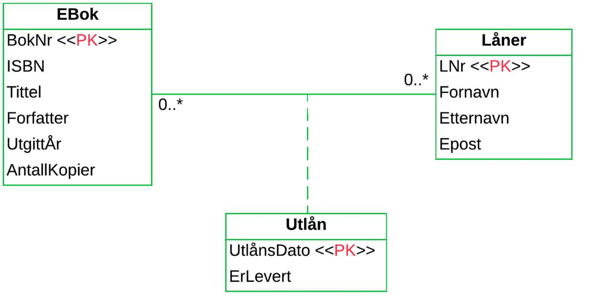 </img>
  * **0..**
    * Null eller mange
  * Utlån er en assosiativ entitet, se striplet linje
    * Entiteten blir identifisert med en dato, en e-bok og en låner

#### Aggregering

* Entitet er "en-del-av"
  * 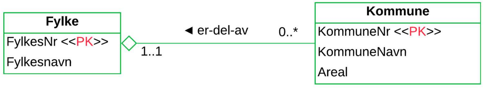 </img>

#### Komposisjon

* Sterkere form for aggregering
* Livsløpet til to entiteter sammenfaller, forsvinner den ene, mister den andre identiteten sin
  * 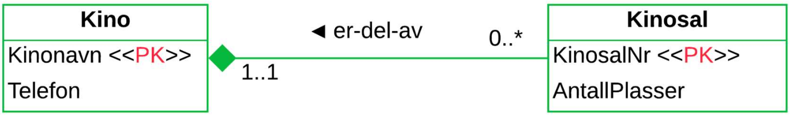 </img>

### Subtyper

* "Delmengder"
* Spesialisering av en annen entitet
* Subtyper arver egenskaper til supertypen og kan ha ekstra attributter
* "er en"
* 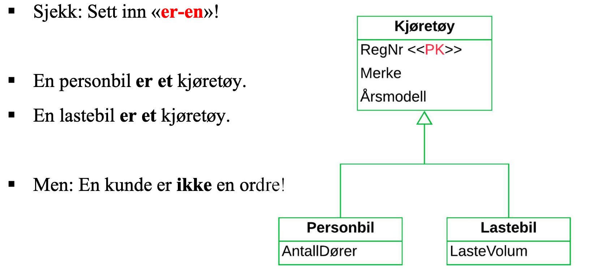 </img>

### Abstraksjonsmekanismer

* **Aggregering**
  * "Har en"

* **Kategorisering/instansiering**
  * "Ansatt er en kategorisering av feks "Hans" og "Lise"

### Chen-notasjon

* Annen dialekt av ER
* Forhold tegnes som romber
* Kardinalitet blir angitt med "1" og "N"
* 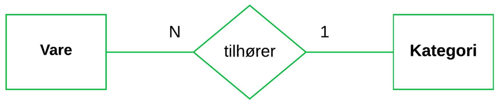 </img>

#### Forhold i Chen-notasjon

* Attributter tegnes i ovaler utenfor entiteter
* 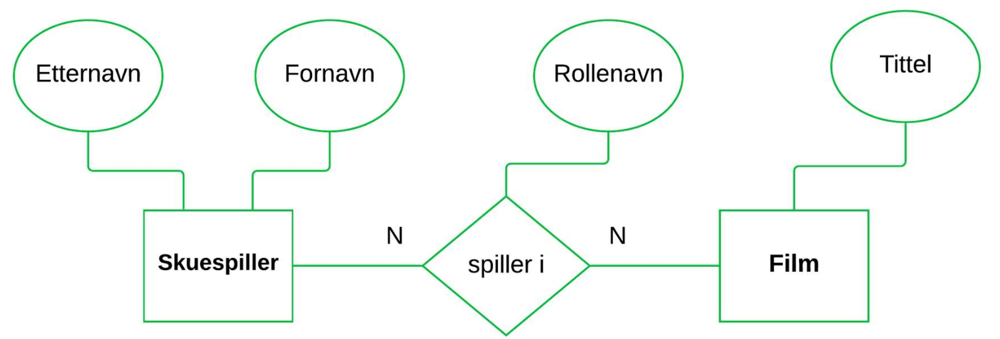 </img>

#### Svake entiteter i Chen

* Doble linjer er svake entiteter
* 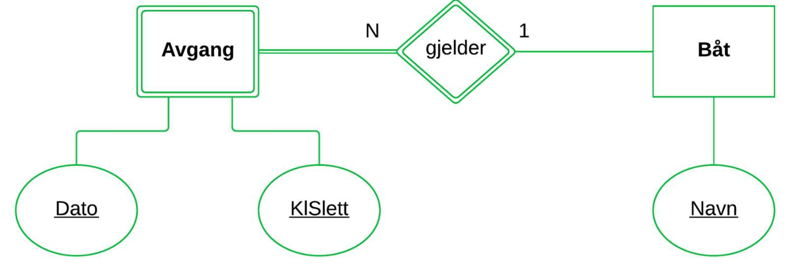 </img>

#### Ikke atomære attributter i Chen

* **Sammensatte attributter**: En attributt kan være en kombinasjon av flere andre attributter
* **Avledede attributter**: En attributt kan beregnes fra en annen
* **Flerverdiattributter**: En attributt kan være sammensatt av flere verdier
*  </img>

## Kapittel 8 - Fra modell til database

### Oppsummeringer av enkle regler

* Entiteter blir til tabeller
* Atributter blir til kolonner
* Identifikatorer blir til primærnøkler
* Mange-til-mange forhold blir til "koblingstabeller". Identifikatorene for de involverte entitene blir til en sammensatt primærnøkkel

### En-til-mange forhold

* Identifikatoren på én-side blir kopiert til tabellen på mange-siden, og det blir en fremmednøkkel mot én-siden
* Primærnøkkelen blir kopiert til mange-siden, men ikke omvendt
* Ikke et krav at fremmednøkkelen heter det samme

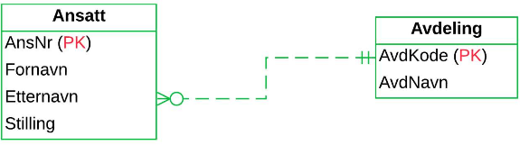
  
* Ved en avdeling jobber det mange ansatte
* En bestemt ansatt er tilsatt på kun en avdeling
* Ansatt er på mange siden av forholdet og avdeling er på en-siden av forholdet

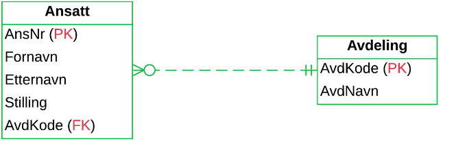

* Her er fremmednøkler på en siden

### Oversettelse av svake entiteter og identifierserende forhold

* I et identifieserende en-til-mange forhold, vil den svake identiteten alltid være på mange siden
* I et identifiserende en-til-en forhold med en svak identitet, vil den svake identiteten også motta fremmednøkkel fra en den andre identiteten

### Mange-til-mange forhold

* Mange-til-mange forhold kan bli til:

  1. En tabell satt sammen av primærnøklene til de to andre tabellene
      * Primærnøklene blir satt sammen fra primærnøklene til de to involverte tabellene, som hver for seg blir fremmednøkler tilbake til disse
        * Ansatt(<u>AnsNr</u>, Fornavn, Etternavn, Stilling)
        * Prosjekt(<u>ProsjNr</u>, Startdato, Sluttdato, Budsjett)
        * ProsjektDeltakelse(<u>AnsNr*, ProsjNr*</u>)
        * 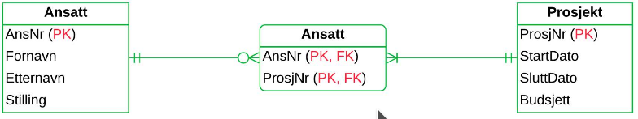
  
        * (Mulig den i midten skal være prosjektdeltakelse og ikke ansatt(blame the slides))

  2. En koblingsentitet og to en-til-mange forhold
     * Koblingsentiteten vil inngå i to mange-til-en forhold
       * Ansatt(<u>AnsNr</u>, Fornavn, Etternavn, Stilling)
       * Prosjekt(<u>ProsjNr</u>, Startdato, Sluttdato, Budsjett)
       * ProsjektDeltakelse(<u>AnsNr*,ProsjNr*</u>, AntallTimer)
       * 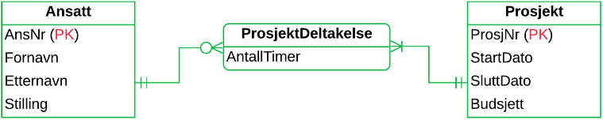

### En-til-en forhold

* Kan håndteres på flere måter:
  * Idenfikatoren i A blir kopiert til B og blir fremmednøkkel mot A
  * Idenfikatoren i B blir kopiert til A og blir fremmednøkkel mot B
  * Fremmednøkler kopieres begge veier
  * Oppretter en koblingstabell
  * Slå sammen felles identiteter til en felles tabell
  
    * 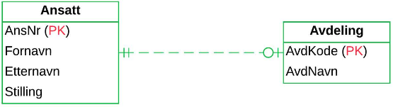

    * Ikke all ansatte er avdelingsledere
    * Enhver avdeling har nøyaktig en leder

  * Alternativt:
    * Ansatt(<u>AnsNr</u>, Fornavn, Etternavn, Stilling)
    * Avdeling(<u>AvdKode</u>, AvdNavn, AnsNr*)
    * 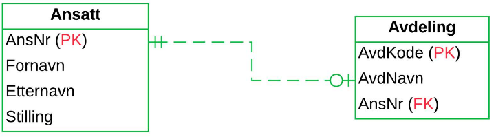

### Håndtere minimumskardinalitet i databaser

* Dersom det er en-til-en og begge fremmednøklene er satt som **NOT NULL** vil det kunne oppstå problemer ved å registrer data
* Løsning: Gjøre innsetningene en del av transaksjonen og merke nøklene **DEFERRABLE**

```SQL
ALTER TABLE Hovedstad
  ADD CONSTRAINT HovedstadLandFK
  FOREIGN KEY(LandKode)
  REFERENCES Land(LandKode)
  INITIALLY DEFERRED DEFERRABLE;
```

* For å slette tabeller lenket sammen slik må fremmednøklene slettes først

```SQL
ALTER TABLE Hovedstad
  DROP CONSTRAINT HovedstadLandFK;
```

### Normalisering

#### Reduans og funksjonelle avhengiheter

* **Redudans**
  * Overflødig eller unødvendig informasjon

|AnsNr       |Fornavn  |Etternavn |PostNr|Poststed     |
|---         |---      |---       |---   |---          |
|2           |Gunnlaug |Angeltveit|3800  |Bø i Telemark|
|6           |Vilde    |Aksnes    |3800  |Gvarv        |
|7           |Henriette|Brobakken |3800  |Bø i Telemark|
|9           |Ragnvald |Allum     |3812  |Akkerhaugen  |
|11          |Oliver   |Abrahamse |3812  |Akkerhaugen  |

* Poststed og PostNr er **funksjonelt avhengige** siden de bestemmer hverandre
* Det er redundant å ha med begge kolonnene

#### Dekomponere tabeller

* Fjerning av redundans ved å dele opp i flere tabeller
* Overgangen til en ny tabell kalles et **normaliseringssteg**
* **Normalisering** er å gjenta dette til alle tabeller er helt fri fra redundans
* En oppdeling av en tabell $T$ til to tabeller $T1$ og $T2$ er en **tapsfri dekomposisjon** hvis $T1$ og $T2$ gir $T$ tilbake

#### 1NF

* **NF** er definisjonen av et antall **normalformer**
* **1NF** er på **første normalform**
* Første normalform er en tabell som bare inneholder atomære verdier
* For å gjøre om på tabeller som ikke er på **1NF**:
  * Flytte verdiliste over til en hjelpetabell med sammensatt primærnøkkel

#### 2NF

* Gitt en tabell **T(<u>A,B</u>,C,D)**
  * B $\rightarrow$ D er en **partiell avhengighet** hvis:
    1. **B** er en ekte delmengde av en (sammensatt) primærnøkkel i **T**
    2. **D** er ikke med i primærnøkkelen i **T**  

* En tabell er på **2NF** hvis den er på **1NF** og den ikke inneholder **partielle avhengigheter**

* 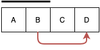
  
  * Linjen over A+B viser at det er **funksjonelle avhengigheter** fra A+B til andre kolonner
  * Den røde linjen viser et brudd på **2NF**

* Eksempel:
  * Odrelinje(<u>OrdreNr, VNr</u>, Dato, Betegnelse)
  * Ordrelinje inneholder VNr $\rightarrow$ Betegnelse, der VNr er en ekte delmengde av primærnøkkelen OrdreNr+VNr
  * Dette er et brudd på **2NF** og gjøre tabellen til **1NF**
  * Løsning:
    * Ordrelinje(<u>OrdreNr, VNr*</u>, Dato)
    * Vare(<u>VNr</u>, Betegnelse)

#### 3NF

* Gitt en tabell **T(<u>A</u>,B,C,D)**
  * A $\rightarrow$ C er en **transitiv avhengighet** hvis:
    1. A er en primærnøkkel for T
    2. Verken B eller C er med i primærnøkkelen i T og B $\rightarrow$ C

* En tabell er **tredje normalform(3NF)** hvis den er på **2NF** og ikke inneholder noen **transitive avhengigheter**

* 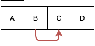

* Eksempel:
  * Ansatt(<u>AnsNr</u>, Fornavn, Etternavn, PostNr, Poststed)
  * PostNr $\rightarrow$ Poststed er en **transitiv avhengighet** og bryter derfor med **3NF**

#### Boyce-Codd NormalForm (BCNF)

* **Determinant**
  * En kolonne som bestemmer en annen
  * A $\rightarrow$ B
    * A er determinant
* **Supernøkkel**
  * En kolonne som bestemmer enhver annen kolonne
  * En kandidatnøkkel er en minimal supernøkkel

* En tabell er på **Boyce-Codd form** hvis enhver determinant er en supernøkkel
* Enhver minimal determinant er en kandidatnøkkel

* 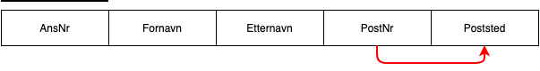
  * AnsNr er kandidatnøkkel
    * Det er en funksjonell avhengighet fra AnsNr til alle andre kolonner
  * PostNr $\rightarrow$ Poststed bryter med **BCNF**
    * PostNr er determinant over Poststed, men ingen andre kolonner
* En tabell som ikke er på **BCNF** bør deles opp
* Hvis en tabell tilfredstiller **BCNF** er den ferdig normalisert

* Fra ukesoppgaver:
  1. Passing (RegistrationNr, Manufacturer, PersonNr, Name, StationNr, Municipality,Date, Time)
     * $\downarrow$
     * Passing(#RegistrationNr, #Name*, #Date, #Time)
     * Cars(#RegistrationNr, Manufacturer PersonNr*)
     * Person(#PersonNr, Name)
     * Toll(#StationNr, Municipality)
  
  2. MultipeChoice (TestNr,  TestName,  QuestionNr,  QuestionText,  AlternateNr,  Al-ternateText, User, Reply, Correct)
     * $\downarrow$
     * Test(#TestNr, TestName)
     * Question(#TestNr*, #QuestionNr, QuestionText, Correct)
     * Alternative(#TestNr*, #QuestionNr, #AlternateNr, AlternateText)
     * User(#TestNr*, #QuestionNr*, User, Reply)

  3. T(A,B,C,D,E) where A $\rightarrow$ B, C $\rightarrow$ D and C $\rightarrow$ E
     * A og C er her kandidatnøkler siden de bestemmer alle de andre kolonnene:
     * T1a(A, B)
     * T1b(A, C)
     * T2(C, D, E)

  4. T(A,B,C,D) where A → B, B → C and C → D
     * T1(A, B, C)
     * T2(C, D)
     * $\downarrow$
       * T1a(A, B)
       * T1b(B, C)
       * T2(C, D)

  5. T(A,B,C,D,E) where A + B → C, B → A, B → D and D → E
     * T1(A, B, C, D)
     * T2(D, E)

## Kapittel 9 - Filer og indekser

### Lagringsmedier

* Flyktig(volatile) minne - Ustabilt minne som går tapt når maskinen skrus av
* Ikke-flyktig minne - Beholder data etter strømforsyning er koblet av
* Hurtigminne(flyktig) i en maskin er bygd opp av ulike typer ram:
  * DRAM
  * Cache
  * Registre

* **Harddisk**
  * Sirkulære, roterende magnetplater
  * Hver plate er delt inn i spor
  * Spor i en gitt posisjon danner en sylinder
  * Hvert spor er delt inn i sektorer
  * En blokk er en sammensetning av ulike sektorer
  * Lesing og skriving skjer med lese/skrive armer
  * Når en arm er posisjonert over et bestemt spor, vil de dekke en sylinder
  * Platene roterer med en konstant hastighet
  * Akkesstiden får vi ved å addere tiden for flytting av lesearmene med rotasjonstiden og overføringstiden
    * Gjennomsnittstiden for å få tak i en bestemt blokk
  * En disk blir overtid fragmentert

* **SSD**
  * Elektronisk lagringsmedia
  * Flash-teknologi av typen NAND
  * Organisert i blokker som er delt opp i sider
  * Kan kun slette hele blokker
  * Konstant aksesstid
    * Spiller ingen roller hvor noe er lagret på disken
  * Ytelse måles i IOS(input/output operations per second)

* Direkteaksess - Data kan bli lest i en vilkårlig rekkefølge
* Sekvensielle lagringsmedium:
  * Må leses fra start til slutt
  * Magnetbånd

* Tre bruksområder:
  1. **Primærminne**
     * Data som blir lest inn fra minne for å utføre beregninger
     * Oppdatert data blir skrevet ut igjen til disk
     * Registering av hvilke data som befinner seg hvor og på hvilken tid
  2. **Sekundærminne**
      * Permanent lagring på disk
  3. **Tertiærminne**
     * Disker og optiske medier
     * Benyttes for sikkerhetskopiering

#### Minnehierarkiet

* Sortert fra hurtig og dyrt, til langsomt og billig:
  1. Cache(ustabilt)
  2. RAM(ustabilt)
  3. SSD(stabilt)
  4. Harddisk(stabilt)
  5. Optiske medier(stabtilt)
  6. Magnetbånd(stabilt)

#### Overføring mellom minne og disk

* Dram er 1000 ganger raskere enn ssd og 100 000 ganger raskere enn harddisker ved direkteoppslag
* Et DBHS vil prøve å redusere antall lese/skrive operasjoner mot disken

#### RAID

* **MTTF**
  * Mean time to failure
  * TIden det i gjennomsnitt tar før en komponent feiler
* Speiling er bruke et dobbelt sett med disker for å få MTTF ned
* **RAID**(redundant array of independent disks) er en samling disker som til sammen danner en logisk disk

* **RAID nivåer**
  * **Nivå 1**: Disker blir organisert i par som er speilinger av hverandre uten bruk av striping(sekvensiell lagring mellom diskene)
  * **Nivå2**: Data blir fordelt utover et antall disker ved striping på bytenivå. Ekstra disker inneholder bare paritetsbytes(redundant data)
  * **Nivå 5**: Data blir fordelt på samme måte som nivå tre, men data blir fordelt med striping på bytenivå

### Filstruktur og søkemetoder

* En database blir lagret på en fil
* En fil består av et antall poster
* Poster er organisert i en bestemt rekkefølge. Kan derfor snakke om poster i bestemte posisjoner
* Hver post består av et antall felt
* 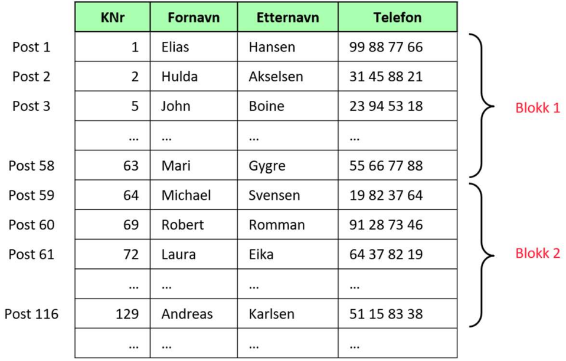

#### Representasjon av poster

* Vi velger datatyper for hver kolonner
* Ettersom forskjellige datatyper har forskjellige størrelser, vil ikke all verdier fylle opp all avsatt plass
* Derfor skape blanke tegn for å fylle opp resten av plassen siden kolonnene har fast lengde
* **CHAR** og **VARCHAR** har **variabel lengde** - Verdier vil kun bruke så mye plass som er faktisk nødvendig

#### Ikke sorterte filer

* Poster blir organisert i rekkefølgen de blir registrert
* **Heap filer**
* Effektivt å sett inn nye poster
* Langsomt å søke siden det må **sekvensielt søkes**
* I verste fall må alle blokker søkes gjennom

#### Sorterte filer

* Poster ordnes med hensyn på en kolonne, feks primærnøkkel til tabellen
* **Sortert fil**(sekvensiell fil)
* Gjør det mulig å bruke effektive søketeknikker
* **Binærsøk**
  * Starter i midten av filen og sammenlikner posisjonen med det vi søker etter
  * Deretter går til den delen av filen som inneholder tallet vi er ute etter
  * Forsetter slik helt til tallet er funnet
* Binærsøk er mye raskere enn sekvensielt søk
* Sekvensieltsøk = $n/2$, binærsøk = $log_2 n$
* Dersom poster er lagret sortert, oppstår det et problem dersom det skal sette inn data i flere av blokkene siden all dataen må effektivt sett bli flyttet for å gjøre plass til de nye postene
* Løsningen er å sette de nye postene i **overflytblokker** og få postene før til å peke på dem, og deretter de nye postene til å peke på hva neste post er
* Etterhvert blir det lange kjeder av pekere, **pekerkjeder**, som blir lite effektive og filen burde derfor etterhvert omorganiseres

#### Hashing

* Blokkadresser blir regnet ut basert på feltene i filen(**hash-nøkkelen**)
* Effektiviserer søk

### Indekser

* Indekser består av **søkenøkler** og **pekere**
* Søkenøkler er verdier fra kolonner
* Pekere er adresser til blokker eller poster
* Tenk stikkordsregister:
  * Søkenøkler er ord som forekommer i boken
  * Pekerene er sidetall
* Indekser effektiviserer søk
* Bruker mer lagringsplass
* 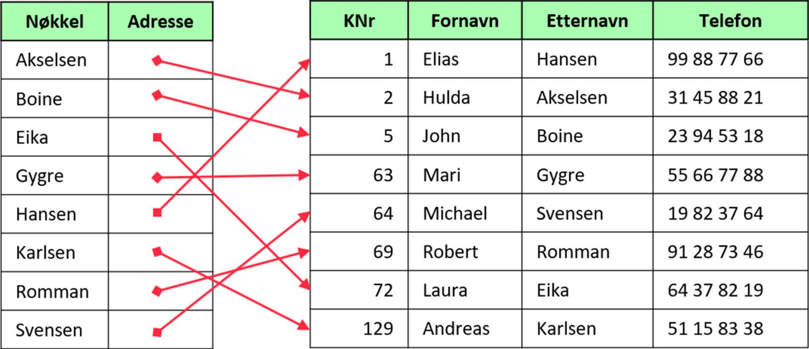

#### Primærindekser

* En indeks der søkenøkkelen samsvarer med det feltet som datafilen er fysisk ordnet med hensyn på
* Ikke nødvendigvis basert på primærnøkkel til tilhørende tabell eller lagre pekere til alle verdiene i filen

#### Sekundærindekser

* Indekser som ikke er primærindekser
* Hjelper med å søke raskere
* **Tette indekser**
  * Peker til samtlige poster
* **Ikke-tette indekser**
  * Pekere til hver blokk

#### Flernivåindekser

* Indeks på indekser
* Når indekser blir for store, ofte tette
* Ved 3 nivåer blir indekser på nivå 3 brukt til å søke på 2, og det som er igjen brukte til å søke på 1
* Indekser på nivå 1 inneholder pekere ut til blokker eller poster i selve datafilen
* Bortsett fra på nivå 1 kan man alltid bruke ikke-tette indekser fordi indekser(på lavere nivåer) er sortert
* **Eksempel**:
  * En fil med 100 000 poster lagret i 2500 blokker(40 poster i hver blokk)
  * Idenksen på nivå 1 er tett, og inneholder 100 000 poster
  * Vi kan lagre 100 indeksposter per blokk
  * Indeksen får da plass i 1000 blokker
  * Indeksen på nivå 2 inneholder en post for hver blokk i den første indeksen(1000) og får derfor plass i 10 poster(en blokk)
  * Indeks på nivå 3 har 10 poster(en blokk)
  * Vi klarer derfor med 4 diskaksesser å finne en bestemt post
  * Med en sekvensielt søk ville det tatt 1250 aksesser i snitt

* **Balansert flernivåindeks** - Alle veier i datafilen er like lange, alle søk tar like lang tid

* **B+ trær**:
  * Balansert flernivåindeks
  * Består av noder i trestruktur
  * Øverste noden er root
  * Hver node inneholder maksimalt n søkeverider og n+1 pekere
  * 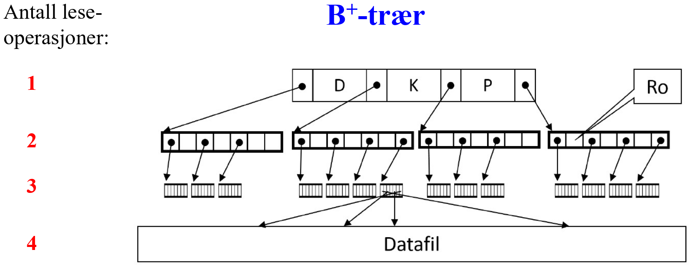
  * Ved innsetting av nye poster i filen kan det bli nødvendig å splitte noder i søketreet, som kan forplante seg oppover slik at et nytt nivå må legges til

#### Bitmap-indekser

* Bedre en B+ til å indeksere kolonner med få forskjellige verdier
* Bitmap-indekser lagrer et bit-mønster som beskriver forekomster av hver enkelt verdi
* Har like mange rader som tabellen den indekserer
* Har like mange kolonner som det er forskjellige verider i tabellkolonnen den er definert for
* Effektiv ved utførelse av spørringer med sammensatte betingelser på indekserte kolonner

#### Indekser med SQL

* Opprette indekser:

  * ```SQL  
      CREATE INDEX EtternavnIdx
      ON Kunde(Etternavn)
      ```

* Sjekke at det ikke blir registrert to like verdier i indekskolonnen:

  * ```SQL
      CREATE UNIQUE INDEX TelefonIdx
      ON Person (Telefon)
      ```

* Sammensatte indekser:

  * ```SQL
      CREATE INDEX NavnIdx
      ON Kunde (Etternavn, Fornavn)
      ```

### Retningslinjer for fysisk design

#### Valg av datatyper

* **Tekst**
  * VARCHAR for varibel lengde og CHAR(x=antall tegn) for fast lengde
  * Navn, kundenummer, fødselsnummer, telefonnummer og generelt alle andre kolonner med tall der vi ikke trenger å regne på tallene bør lagres som tekst
̉̉̉
* **Tall**
  * INTEGER OG SMALLINT for å lagre heltall
  * INTEGER kan lagre større tall, men bruker mer lagringsplass
  * Dersom vi vet at verdiene får plass i SMALLINT, burde det benyttes
  * DECIMAL kan lagre komma tall og spesifisere størrelse med DECIMAL(x=antall siffer, y=antall desimaler)

#### Valg av filstruktur og indekser

* Ikke-sorterte filer kombinert med B+ trær er hensiktsmessig
* Hashing er effektivt ved søk etter konkrete verdier, men ikke intervall søk
* For boolske kolonner er det ingen vits med å opprette en indeks baster på B+ trær, bitmap-indekser er bedre
* To tabeller i et en-til-mange forhold man med fordel flettes på ytre lager, kalt **klyngedanning**(clustering)
* Indekser tar opp lagringsplass og krever vedlikehold ved oppdatering av tabeller
* Ikke lov å opprette indekser på kolonner som inneholder video, bilde eller annen media

## Kapittel 10 - Transaksjoner

* To utforinger for et DBHS for å sikre transaksjoner:
  * **Feilsituasjoner**
    * Systemet må loggføre transaksjoner i tilfelle en transaksjon blir brutt
  * **Samtidige brukere**
    * Passe på at ikke to brukere av systemet endrer på samme data

### Håndtering av feilsituasjoner

#### Definisjoner av transkasjoner

* **COMMIT**(bekreft) og **ROLLBACK**(angre)
* Effekten av transaksjon er ikke effekten endelig før **COMMIT** blir utført
* **ROLLBACK** gjør at transaksjonen ikke får noen effekt på databasen
* **START TRANSACTION** i MySQL starter transaksjoner
  * **START TRANSACTION;**
  * **INSERT ...;**
  * **INSERT ...;**
  * **INSERT ...;**
  * **UPDATE ...;**
  * **UPDATE ...;**
  * **COMMIT;**

* Kommunikasjonen mellom DBHS og bruker kan være satt opp på 2 måter:
  1. Auto-commit - Hver transaksjon blir betraktet som en transaksjon
  2. Alle kommandoer fram til commit ELLER rollback tilhører samme transaksjon
     * Gjør det også mulig å definere sammensatt transaksjoner uten noen spesifikk startkommando

#### Kontrollerte avbrudd og feilsituasjoner

* To typer feil: **diskkrasj** og **strømbrudd**, også kjent som **medifeil** og **instansfeil**

#### Transaksjonsloggen

* DHBS må til enhver tid holde styr på hvilke transaksjoner som er igangsatt, men ikke fullført
* "Hvordan ksn vi vite hvor langt den avbrutte transksjonen kom før den ble avbrutt?"
* Løsning: **Loggføring**
* Loggføre alle databseoperasjoner før databasen blir oppdatert
* En **transaksjonslogg** er en fil som inneholder data om alle operasjoner som er utført mot databasen
* DBHS registrerer når transaksjoner starter, når dataelementer blir oppdatert og når **COMMIT** eller **ROLLBACK** blir utført
* Transaksjoner i loggen blir tidelt hvert sitt nummer
* Tilstander i loggen:
  * *Aktiv*
  * *Fullført*
  * *Bekreftet*
  * *Avbrutt*

  * 

#### Gjennoppbygging med transaksjonslogg

* Etter mediefeil må databasen bygges opp igjen med **sikkerhetskopier**
* Det er 2 måter å bruke transaksjonsloggen til **gjenoppbygging**:
  1. **UNDO**
     * Leser loggen baklengs og erstatter nye verdier med gamle
  2. **REDO**
     * Leser loggen forlengs og gjennomfører avbrutte transaksjoner

* Noen DBHS bruker **ummiddelbar oppdatering** som oppdaterer underveis i transaksjoner
* **Utsatt oppdatering** gjør at oppdateringer blir utsatt til alle operasjoner er registert i loggen

* Hvordan et database gjennomfører **ROLLBACK**:
  * Ved **umiddelbar oppdatering** må det transaksjonen utførte på databasen angres med **UNDO**

  * Ved **utsatt oppdatering** er det bare å notere **ROLLBACK** i loggen siden databasen enda ikke er oppdatert

* Eksempel:
  * 
  
  * T1 og T2 har skrevet **COMMIT** til loggen og ble bekreftet før feilen skjedde
  * T3 og T4 var under utførrelse under feilen
  * Ved **umiddelbar oppdatering** må effekten av T3 trekkes tilbake i tilfelle den hadde rukket å utføre noen skrive operasjoner
  * Ved **utsatt oppdatering** ville ikke dette vært nødvendig
  * T3 og T4 må så startes på nytt
  * Databasen kan ikke vite om T1 og T2 har oppdatert databasen, og må kjøre disse på nytt basert på registreringen i loggen(REDO)
  * For at databasen ikke må gjøre alle transaksjoner noen gang utført, blir det skrevet **sjekkpunkter** til loggen

### Flerbruksdatabaser

#### Prosesser

* Utførelse av et program
* Datamaskiner håndterer flere prosesser ved hjelp av **tidsdeling**
  * Maskinen bruker litt tid per prosess
  * Veksler mellom prosesser

* **Flerbruksdatabaser** - En database der flere brukere er koblet på samtidig
* Transaksjoner er databaseinterne prosesser

#### ACID-egenskapene

* En transaksjon mot en database bør ha følgende egenskaper:
  1. **Alt eller ingenting(Atomicity)**
     * Enten blir transaksjonen utført i sin helhet, eller ikke i det hele tat
  2. **Kosistens(Consistency)**
     * Hvis databasen er i en konsistent tilstand før transaksjonen blir utført, skal databasen også være konsistent når transaksjonen er ferdig utført
  3. **Ingen innblanding(Isolation)**
     * Ingen transaksjoner som foregår samtidig skal interferere med hverandre
  4. **Varighet(Durability)**
     * Når en transaksjon er bekreftet, skal effekten av transaksjonen bli permanent lagret. Dette skal gjelde selv om det oppstår feil på et senere tidspunkt

#### Les - beregn - skriv

* For hver transaksjon som blir utført må DBHS:
  1. Lese data og lagre i minne
  2. Deretter beregne og oppdatere den avsatte plassen i minnet
  3. Så skrive ny verdi tilbake til disken for permanent lagring

* Dette er grunnleggende for å se hva slags problemer som kan oppstå når flere brukere oppdaterer samme data på samme tid

#### Utfordringer med samtidige brukere

* **Tapt oppdatering(Lost update)**
  * Flere brukere skal oppdatere samme data
  * Operasjonene starter omtrent på likt
  * Usynkront lesing og skriving til og fra minne gjør at oppdateringer som brukere skriver kan gå tapt siden de blir overskrevet av hverandre

* **Inkonsistent analyse(Incorrect summary)**
  * Feil med to transaksjoner der den ene kun avleser databasen
  * Ved at data blir lest feil blir innholdet i databasen ikke samsvare med dataen som faktisk har blit lagt inn
  * Transaksjonen som leser data har bare fått med seg et mellomresultat og bryter med prinsippet om ingen innblanding

* **Angret oppdatering**
  * Dersom en transaksjon blir angret med **ROLLBACK** og transaksjonen allerede har skrevet til databasen
  * Dersom andre transaksjoner leser dataen før den er trukket tilbake, vil de andre transaksjonene bruke den gamle dataen videre
  * Mellomresultatet ble lest og brukt videre

#### Låsemekanismer

* Køordning
* **Sekvensiell utførelse**
  * Transaksjonene blir utført en etter en
  * Restriktivt

* **Lås**
  * Regulerer tilgangen til deler av en databaser
  * Transaksjoner som trenger disse delene, vil spørre DBHS om en lås på denne delen
  * Transaksjonene blir satt i **ventekø**
  * **Leselåser** og **skrivelåser**

* Størrelsen på område som blir låst, er låsens **granularitet**
  * Transaksjoner kan låse hele databasen, en hel tabell eller en enkelt rad i en tabell

#### Serialiserende forløp

* Transaksjoner kan være satt sammen av mange enklere operasjoner
* Problemer kan oppstå når flere transaksjoner opererer på flere fellesområder i forskjellige rekkefølger
* Deloperasjonene må utføres i en bestemt rekkefølge kalt **forløp(schedule)**
* **Sekvensielt forløp**
  * Utføre deloperasjoner en etter en
  * Korrekte, men ineffektive
* **Serialiserbart forløp**
  * Så mye samtidig som mulig
  * Forløp som om de deloperasjonene skulle bli utført sekvensielt

#### Tofaselåsing

* Transaksjoner ber om samtidlige låser i starten av sitt forløp, og opphever samtlige låser til slutt
* En transaksjon får ikke lov til å sette nye låser etter at den nye låsen er opphevet
* To faser:
  * **Voksefase**
    * Ny låser blir satt
    * Når den første låsen blir opphevet, går transaksjonen til minkefasen
    * Ikke lov å sette nye låser
    * Kan utføre beregninger til enhver tid
    * Hvis samtlige transaksjoner følger tofaselåsing, får vi serialiserbare forløp
  * **Minkefase**

#### Vranglås(Deadlock)

* To transaksjoner som gjensidig venter på at den andre skal oppheve sin lås
* **The dining philosophers**
  * Filosofene tenker og spiser
  * Midt på bordet står mat
  * Mellom hver filosof ligger en gaffel som filosofene deler med naboen til venstre og høyre for seg
  * Filosofene trenger begge gaflene til å spise
  * Vranglås oppstår hvis alle fire bestemmer å spise samtidig
  * Ingen kommer videre før minst en avbryter
  * Filosofene er transaksjoner og maten er dataen
  * Tenkefasen er når transaksjonen utfører beregninger
  * Spisefasen er når den jobber med data
  * To filosofer som deler en gaffel er det samme som to transaksjoner som jobber med samme dataelement

* DBHS bruker to strategier for å løse vranglåsproblemet:
  * Forhindre at vranglås oppstår
  * Oppdage og løse opp vranglås
* **Tidsstempler** kan forhindre vranglås
* Tidsstempelet blir lagret sammen med låsen når transaksjonen får invilget lås på et dataelement
* DBHS kan også løse opp vranglåser etter de har oppstått med en **ventegraf**
  * Består av noder og kanter
  * DBHS oppdaterer ventegrafen med en kant fra noden merket til transaksjonen som venter til noden merket av transaksjonen som har låst dataelementet
  * DBHS vet når en vranglås oppstår siden grafen inneholder en sykel(T1,T4,T2,T1)
  * DBHS må så velge å avbryte en transaksjon for så å starte den opp igjen senere
  * Utvelgensel av transaksjoner må skje *rettferdig*

#### Isolasjonsnivåer og optimistisk låsing

* Man godter en viss innblanding i serialiserende transaksjoner for effektivitetshensyn
* **Usikker lesing** er at en transaksjon kan lese data skervet av en annen transaksjon før sistnevnte har bekreftet med **COMMIT**
* **Ikke-repeterbar lesing(non repeatable read)** betyr at den transaksjon kan få to forskjellige svar på samme spørring fordi en annen trnasaksjon har endret databasen og bekreftet med **COMMIT**
* **Fantomer(Phantoms)** er rader satt inn av en transaksjon som en annen transaksjon oppdater når den første transaksjonen bekrefter med **COMMIT**
* SQL definerer 4 **isolasjonsnivåer**

* | Isolasjonsnovå  | Fantomer | Ikke-repeterbar lesing | Usikker lesing |  
|                      --- |             --- |                                --- |                     ---|
| SERIALIZABLE     | Nei    | Nei  |    Nei |
| REPEATABLE READ|Ja|Nei|Nei
| READ COMMITTED|Ja|Nei|Nei
| READ UNCOMMITTED|Ja|Ja|Ja

* Sette isolasjonsnivå i SQL
  
  * ```SQL
      SET TRANSACTION ISOLATION LEVEL
      READ COMMITED;
    ```

* Interaktive applikasjoner der brukeren fyller ut skjermaer, kan føre til **lange transaksjoner**
* Hvis mange brukere jobber interaktivt, kan det være med fordel å erstatte tradisjonelle låsemekanismer med **optimistisk låsing**
  * En transaksjon får alltid lov å begynne å arbeide på en rad
  * Kontrollen med konflikter gjøres når oppdaterte data skal lagres i databasen
  * Kan implementeres med **tidsstempler**

## Kapittel 11 - Databaseadministrasjon

### Oppbygningen av et databasesystem

#### Data og metadata

* DBHS samler inn statistisk data om innholdet i databasen som blir brukt til spørreomptimalisering
* **Metadata**:
  * Data som beskriver data og samlingen av slike data for **metadatabasen**

* **Systemkatalogen**:
  * Data som sier hvilke rettigheter forskjellige brukere har til ulike deler av databasen
  * **Metadatabasen** er en del av denne
  * Lagres på tabellform
  * Kan hente data ut med SQL
  * *Eksempel oppbyggning:*
    * Tabell(<u>Tabellnavn</u>, Eier*, DatoLaget)
    * Kolonner(<u>Tabellnavn*, Kolonnenavn</u>, Datatype)
    * Bruker(<u>Brukernavn</u>, Passord, Lagringsplass)
    * Tabellrettighet(<u>Brukernavn*, Tabellnavn*, RettighetW</u>)

#### Oppgavene til et DBHS

* En **sluttbruker** kommuniserer med databasesystemet med en **brukerapplikasjon**, med menyer, skjermbilder og rapporter. Applikasjonen kommuniserer med databasesystemet ved hjelp av SQL
* **Utvikler** er en samlebetegnelse på systemutviklere, databasedesignere og programmerere
* **Utviklingsverktøy** inneholder mkeanismer for datamodellering og implementasjon av databaser og applikasjoner
* **Databaseadministratoren(DBA)** har ansvar for dagling drift av databasesystemet
* Felles for gruppene er at brukerverktøyene og databasesystemet kommuniserer ved hjelp av SQL. Ingen manipulerer direkte
* 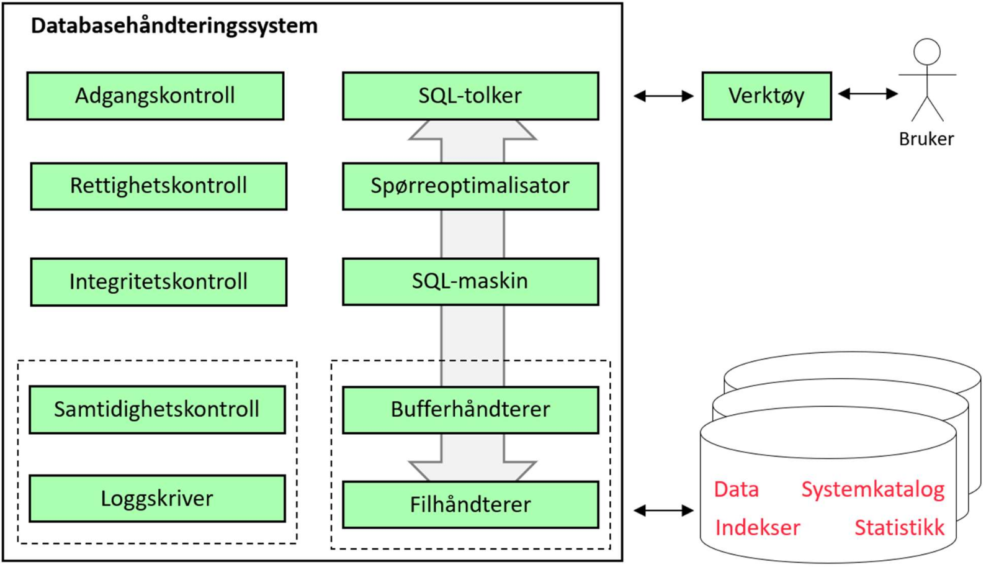
  
  * Brukeren skriver inn en SQL-setning til **SQL-Tolkeren**, som sjekker om syntaksen er korrekt og evt gir feilmeldinger, **parsering**
  * Oppbygningen av databasen er lagret i **sytemkatalogen**
  * SQL-tolkeren leser fra systemkatalogen for å sjekke at tabeller og kolonner referert i spørringen eksisterer
  * Korrekte spørringen blir sendt til **spørreoptimalisering** for å finne en mest mulig effektiv strategi for utførrelse
  * Den optimaliserte spørringen blir overført til **SQL-maskinen(delprogram i DBHS)** for utførrelse
  * **Filhåndtereren** sørger for lesing fra og skriving til filer
  * **Bufferhåndtereren** har som oppgave å vite hvilke blokker som til en hver tid er i minne. Hvis en blokke allerede er i minne, vil det spare tid å bruke den direkte istedenfor å lade den fra disk. Har også som oppgave å velge hvilke blokker som skal leses inn og skrives ut på hvilke tidspunkter
  * **Adganskontroll** har som oppgave å kontrollere brukernavn og passord ved pålogging siden ikke alle brukere har like rettigheter mot databasen
  * **Rettighetskontroll** har som oppgave å sjekke at brukerne kun får utføre operasjoner i henhold til rettighetene de er tildelt
  * **Integritetskontroll** sjekker at alle definerte forretningsregler blir overholdt(valideringsregler, entitesintegritet, referanseintegritet,...)
  * **Loggskriveren** logger og skriver til disk i tilfelle noe skulle gå galt

#### Oppgavene til databaseadministratoren

* **DBA** har overordnet ansvar for instalasjon og drift av datasystemer
* Strategiske delen av jobben kan være en egen stilling, **dataadministrator(DA)**
* Arbeidsoppgaver for **DBA**:
  * Valg, installasjon og oppgradering DBHS
  * Fysisk databasedesign
  * Kapasitetsplanlegging og optimalisering
  * Sikkerhetskopiering og gjenoppbygging etter feil
  * Brukeradministrasjon
  * Overvåking

#### SIkkerhetskopiering og gjenoppbygging

* Måter å sikkerhetskopierer på:
  * **Fullstending/inkrementell**
    * Fullstendig blir hele databasen sikkerhetskopiert
    * Inkrementell blir bare det som er endret siden forrige gang kopiert
    * Kan kombinere begge to
  * **Varm/kald**
    * Kald: Alle brukere må logge seg av og databasen tas ned før sikkerhetskopiering starter
    * Varm: Sikkerhetskopiering mens databasen er i bruk
  * **Fysisk/logisk**
    * Fysisk: Databasetabeller blir lagret på filer
    * Logisk: Sikkerhetskopiering i form av SQL spørringer(**CREATE TABLE** og **INSERT**)
  * Mange virksomheter har krav til **oppetid**
  * Sikkerhetskopiering og **replikering** er ikke det samme

#### Brukeradministrasjon

* Innebærer å opprette brukerkontoer med brukerenavn og passord, og tildele brukere rettigheter i databasen
* Definere forhold mellom brukerrettigheter og **databaseobjekter**
* Rettigjeter er grunnleggende operasjoner på databaseobjekter

* ```SQL
    CREATE USER ola IDENTIFIED BY hemmelig
  ```

* Kan tildele rettigheter med **GRANT**

  * ```SQL
        GRANT SELECT ON Ansatt TO ola
       ```

* Hvis man vil at en bruker skal kunne gi priviligegier videre, legger man til **WITH GRANT OPTION**
* Kan trekke tilbake priviliegier med **REVOKE**

  * ```SQL
      REVOKE SELECT ON Ansatt FROM ola
     ```

* Forskjellige **objektrettigheter** til en tabell:
  * **SELECT**
  * **UPDATE**
  * **INSERT**
  * **DELETE**
  * **ALTER TABLE**

* I noen systemer kan man gi brukere **systemrettigheter**
  * **CREATE SESSION**: Rett til å logge seg på
  * **CREATE ANY TABLE**: Rett til å definere nye tabeller
  * **ALTER ANY TABLE**: Rett til å endre definisjonen av alle tabeller
  * **INSERT ANY TABLE**: Rett til å sette inn nye rader i alle tabeller

* Gi bruker rettigheter til en kolonne

  * ```SQL
      GRANT UPDATE (Antall) ON Vare TO ola
    ```

* Opprette rettigheter på views:

  * ```SQL
      CREATE VIEW BilligeVarer AS
        SELECT*
        FROM Vare
        WHERE Pris < 100
        WITH CHECK OPTION;

      GRANT UPDATE ON BilligeVarer TO ola
    ```

* Lage roller som kan gis til brukere:

  * ```SQL
      CREATE ROLE selger;
      GRANT INSERT ON Ordre TO selger;
      GRANT UPDATE ON Vare TO selger;
      GRANT selger TO ola;
    ```

* To roller har behov for rettigheter:

  * ```SQL
      CREATE ROLE innsyn;
      CREATE ROLE programmerer;
      CREATE ROLE sekretær;
      GRANT SELECT ON Ansatt TO innsyn;
      GRANT SELECT ON Vare TO innsyn;
      GRANT innsyn TO programmerer;
      GRANT innsyn TO sekretær;
    ```

#### Kapasitetsplanlegging og optimalisering

* DBA har ansvar for kapasitetsplanlegging
  * Valg av maskinvare, nettverk, minne, diskplass osv..
* DBHS har som regel rapporteringsmuligheter som kan brukes til **optimalisering** av databasen
* Noen systemer har **optimaliseringshint** for SQL-spørringer for å gjøre de mer optimalisert
* **Denormalisering** - Slå sammen tabeller for å unngå likekoblinger

### Databaseløsninger og systemarkitektur

#### Klient/tjener-arkitektur

* System bestående av en tjener og flere klienter
* Klienter sender forespørseler til tjeneren
* Tjeneren utfører oppgavene og sender en respons tilbake
* 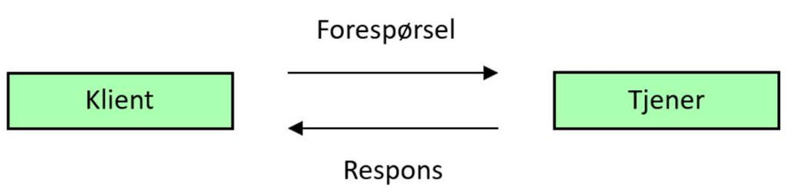

* **Datatjenere** svarer SQL spørringer
  * Kan være et SQL vindu eller en egen applikasjon

* I sin enkleste form kalles klient/tjener-arkitektur for **tolagsarkitektur**
* Dersom det er flere tjenere, f.eks en databasetjener, en applikasjonstjener og en klientmasking, får man en **flerlagsarkitektur**

#### Parallelle og distribuerte databaser

* Parallellprosessering er å bryte ned en oppgave i deloppgaver og behandle disse oppgavene på flere prosessorer for bedre ytelse
* Det finnes flere løsninger:
  * **Delt minne** - Hver prosessor har sin egen disk
  * **Delt disk** - Hver prosessor har sitt eget minne
  * **Ingen deling** - Hver prosessor har eget minne og disk
* **Delt minne** og **Delt disk** er **tette koblinger**
* **Ingen deling** er en **løs kobling**
* Prosessene må koordineres = mere komplekst
* I databasesystemer kan parallellprosessering foregå ved å:
  * Foredele ulike transaksjoner og ulike spørringer til ulike prosessorer(inter query)
  * Bryte ned spørringen til flere deloppgaver og fordele til prosessorer(inter query)

* I **distrubuerte databasesystemer** er databasen lagret på flere maskiner knyttet sammen i et nettverk, typisk et **fjernnett(WAN)**
* DBHS i slike systemer heter **distrubuert databaseahåndteringssystem(DDBHS)**
* Data kan fordeles hos nodene i et DDBS på flerer måter:
  * **Horisontal fragmentering** - En tabell blir delt opp etter rader og de forskjellige radene lagres hos de forskjellige nodene
  * **Vertikal fragmentering** - En tabell blir delt opp etter kolonner og fordelt hos nodene
  * **Kombinert fragmentering** - En tabell blir delt opp etter både rader og kolonner
  * **Replikering** - En tabell, eller deler av en tabell, blir lagret på flere noder(flere kopier)

* **Distrubuert gjennomsiktighet** - Distrubuert databasesystem skal hos brukere oppfattes som et logisk databasesystem
* Hvilke data som er lagret hos hvilken node er lagret hos systemkatalogen
* **Transaksjonshåndtering** - Når data blir oppdatert hos en noder, må oppdateringen også skje hos de andre nodene
  * Skal enten blir fullstendig gjennomført, eller ikke i det hele tatt
  * En transaksjon skal bli gjennomført i sin helhet av alle noder, eller ikke i det hele tatt av noen noder
  * **Tofase-commit** - Noden der transaksjonen blir initiert, inntar en koordinatorrolle

* **Spørreoptimalisering** - Finne effektive måter å gjennomføre SQL spørringer på

#### Minnedatabaser

* En minnedatabase holder hele databasen i minne
* Hurtige
* Kan få sikker lagring med loggføring
* **Caching** - Kopier av visse data blir plassert på et raskt lagringsmedium

### Databaser i skyen

* **IaaS**
  * Infrastructure as a service
  * Gis tilgang på en eller flere maskiner
  * Må selv installere OS og programvare
  * Leverandøren gir hardware

* **SaaS**
  * Software as a service
  * En måte å tilby programvare på
  * Kjøper bare programvare ikke hardware

* **PaaS**
  * Platform as a service
  * Får maskiner, OS og ferdig utviklingsmiljø

* **DBaas**
  * Database as a service

#### Opprette og skalere skydatabaser

* En DBaas-løsning er en ferdig installert DBHS der leverandøren sørger for oppgradering av både DBHS pg inderliggende OS
* Det er enkelt å **skalere** skytjenester
* Skalering kan gjøres **horisontalt** og **vertikalt**
  * **Horisontalt** - Utvide med flere maskiner
  * **Vertikalt** - Oppgradere eksisterende systemer

* **Sharding** er en form for horisontal fragmentering som kan utnytte en løsning der en database er fordelt på flere maskiner
* Skyløsninger gjør det enklere med **replikering** av databasen på flere maskiner, der en maskin tar over hvis en annen feiler(failover)
* **Geografisk replikering** - Ha en oppdatert kopi av databasen på et datasenter i en annen geografisk region
* **Mikrotjenester** - Deling av større applikasjoner fordelt fra mindre og selvstendige byggeklosser der en mikrotjeneste er en slik byggekloss
* **Container** - Lettvektsutgave av en virtuell maskin som gjære det mulig å shippe en mikrotjeneste med alt den avhenger av
  * **Docker** og **Kubernetes**

#### Sikkerhetskopiering til skyen

* Utfordinger til sikkerhetskopiering i skyen
  * **Skalering**
    * Skytjenester har bra skalering
  * **Infrastruktur**
    * Sikker transport og arkivering av fysiske lagringsmedier er krevende
    * Skytjenester gjør at man slipper å håndtere dette selv
  * **Kimprimering og kryptering**
    * Det er viktig at dataen er sikker og er komprimert for hastighet
  * **Gjenoppbygging**
    * Raskere oppbyggning i sammenlikning med fysiske medier
  * **Volum**
    * Kan være vanskelig for store databaser å ta sikkerhetskopi innenfor tidsvinduet man har til rådighet

### Spørreoptimalisering

* Å finne en effektiv måte å utføre SQL-spørringer
* Eksempel:

  * ```SQL
      SELECT O.OrdreDato
      FROM Kunde AS K INNER JOIN
              (Ordre AS O INNER JOIN Ordrelinje AS OL
              ON O.OrdreNr = OL.OrdreNr)
            ON K.KNR = O.KNr
      WHERE K.Etternavn = 'MO'
      AND OL.VNr = '10830'
    ```

    * Spørringen blir utført i følgende steg:
      1. Likekoblingene i From-delen blir utført innenfra og ut. Først kobles Ordre og Ordrelinje, og dette mellomresultatet kobles deretter med Kunde
      2. Resultatet av å koble de tre tabellene blir filtrert gjennom den sammensatte WHERE-betingelsen, noe som gir nok et mellomresultat
      3. Til slutt blir det filtrerte koblingsresultatet lest og verdiene i kolonnen OrdreDato plukket ut

* Svært ineffektivt siden resultatet vil inneholde et srtort antall irrelevante rader
  * DBHS analyserer SQL-koden for å finne den mest effektive rekkefølgen å utføre deloperasjoner på
  * Prosessen kallen **spørreoptimalisering**
  * Deles inn i 2 faser
    * Oversettelse av SQL-setning til et uttrykk i relasjonsalgebra
    * Omskrivning av uttrykkene til en form som lar seg utføre mer effektivt

## Kapittel 12 - Webapplikasjoner

### Webteknologi

#### HTML

* HyperText Markup Language
* **Dokumentformat**
* HTML5 er siste versjon
* Dokumenter består av **elementer**
* Alle ord er omsluttet i **tagger**: <>

* ```HTML
    <!Doctype html>
    <html>
        <head>
            <title>Mitt nettsted </title>
            <meta charset="UTF-8">
        </head>
        <body>
            <h1>Lær mer om internettet!</h1>
            <p>
                <a href="http://www.w3.org/"> Hjemmesiden til WC3
                </a> inneholder mye informasjon om HTML. Her er en
                <a href="intro.html">kort introduksjon til HTML </a>
            <p>
        </body>
    </html>
  ```

  * Hvert HTML-element kan ha et antall navngitte **attributter** som blir tildelt **verdi**
  * **Hyperlenker** - Referanse til en annen side ved at attributtet **href** blir tilordnet en **URL(Uniform resource locator)**
  * URL bygger på hierarkisk på**domenenavn**
  * Protokoll://domene/katalogsti/filnavn.html

#### HTTP

* HypterText Transfer Protocol
* Styrer kommunikasjonen mellom tjener og klient(typisk nettleser)
* Bygger på TCP/IP
* HTTP meldinger består av:
  * Meldingshode
  * Meldingskropp
  * Forespørsel eller respons

* ```HTTP
  POST www.hobbyhuset.no/vareliste.html HTTP/1.1
  Accept: text/html
   ```

* HTTP svarkoder
  * 200
  * 404
  * 500
  * 503
* HTTP respons:

* ```HTTP
  HTTP/1.1 200 OK
  Content-type: text/html

  <html>
  ...
  </html>
  ```

### Databaser og applikasjoner

* Et **informasjonssystem** består av komponenter for å samle inn, lagre, behandle, overføre, søke etter og presentere informasjon som blir brukt i en virksomhet
* Sluttbrukere trenger applikasjoner for å snakke med databasen siden de ikke kan SQL
* I databaseapplikasjoner blir SQL kombinert med andre språk for å lage applikasjoner

#### Fysisk og logisk arkitektur

* **Fysisk arkitektur** - Hvordan et system er delt opp og fordelt på forskjellige maskiner og knyttet sammen i nettverk
* Klient $\leftrightarrow$ [Applikasjon] $\leftrightarrows$ [Databasesystem]
  * Appliksjonen spiller rollen som klient, og sender SQL-spørringer til databasetjeneren
  * Tjenere utfører spørringene og sender spørreresultater tilbake

* Webløsning:
  * [Nettleser]$\leftrightarrows$ [Webtjener]$\leftrightarrows$ [Databasesystem]
  * Nettleseren overfører inndate fra brukeren til webtjeneren
  * Webtjeneren bygger opp en SQL-spørring som ednes til databasetjeneren

* For nettsteder med stor trafikk kan det lønne seg med en applikasjonstjener
  * [Nettleser] $\leftrightarrows$ [Webtjener] $\leftrightarrows$ [Applikasjonstjener] $\leftrightarrows$ [Databasesystem]
* Webløsninger kan deles opp i lag for **database**, **forretningslogikk** og **brukergrensesnitt**

#### Plattform og utviklingsstakker

* En **plattform** er en kombinasjon av maskinvare og basis programvare
* Programmer som kan flyttes fra en plattform til en annen uten endring er **plattformuavhengige**
* En **utviklingsstakk** er en kombinasjon av slike programmer
* |  Eksempel på utviklinkgsstakk   |
  | :---: |
  | PHP |
  | APACHE |
  | MySQL |
  | Linux |

### Introduksjon til PHP

* PHP: Hyptertext Proprocessor
* Skriptspråk
* Hello world i PHP

  * ```PHP
    <!DOCTYPE html>
    <html>
    <body>
    <?php
        print('<h1> Hello World!</h1>');
    ?>
    </body>
    </html>
    ```

#### Dynamiske nettsider

* PHP forespørsler blir sendt til en **PHP-tolker**
  * Utdata er HTML som  webtjener sender videre til nettleseren
* **Tjenersideprosessering** - Ser man på kildekoden for en PHP generert nettsiden, vil bare HTML kode komme opp
* *print* produserer HTML kode
* **Dynamiske nettsider** er generert av scripts

#### Behandle HTML-skjemaer

* HTML-skjemaer brukes for å hente inndata fra brukeren
* Definert med **form-elementer**
* **Form-elementer** kan inneholde et antall **GUI-komponenter**
  * F.eks tekstbokser, nedtrekkslister og kommandoknapper

* **HTML POST-skjema**
  
  * ```PHP
      <!DOCTYPE html>
      <html>
      <body>
          <form method = "POST" action = "varepriser.php">
          <p>Vare:<input type="text" name="vare" size="15"/></p>
          <p><input type="submit" value="Finn pris!"/></p>
      </body>
      </html>
    ```

    <!DOCTYPE html>
      <html>
      <body>
          <form method = "POST" action = "varepriser.php">
          <p>Vare:<input type="text" name="vare" size="15"/></p>
          <p><input type="submit" value="Finn pris!"/></p>
      </body>
      </html>

* **HTML GET-skjema**
  
  * ```PHP
    <html><body>
    <form method="GET" action="skjemabehandler.php">
      <p> Navn:
          <input type="text"  name="navn"  size="20"> </p>
      <p> <input type="submit"  value="Søk" name="sok">
        <input type="reset" value="Rensk" name="rensk"> </p>
    </form>
    </body></html>
    ```

      <html><body>
          <form method="GET" action="skjemabehandler.php">
          <p> Navn:
              <input type="text"  name="navn"  size="20"> </p>
          <p> <input type="submit"  value="Søk" name="sok">
            <input type="reset" value="Rensk" name="rensk"> </p>
        </form>
        </body></html>

* **Form** rammer inn søkeskjemaet med tekstboksen der brukeren skriver inn varenavnet og kommandoknappene for å starte søket

* **Action-attributtet** inneholder URL til PHP-scriptet som behandler søket
  * vare=input fra brukeren
  * PHP-scriptet utfører en **SELECT** mot databasen

#### Behandle skjemadata

* ```PHP
  <html>
  <body>
  <h1>Kundedata</h1>
  <?php
      $fornavn = $_GET["navn"];
      print("<p>Fornavn:  " . $fornavn  . "</p>");
  ?>
  </body>
  </html>
  ```

  * $_GET inneholder skjemada når GET er brukt
    * $_GET er en assosiativ tabell (parameter => verdi)
    * Med GET er skjemadata synlig i URLen(//..//skjemabehandler.php?navn=Kari)

#### Metode POST

* Kan overføre større datamengder enn ved GET
* $_POST er ogsp en assosiativ tabell (parameter => verdi)
* Skjermadata er ikke synlig i URLen
* Hindrer at andre får tak i sensitiv informasjon ved å se på skjermen
* Skjermadata er ikke kryptert

#### $_GET, $_POST og $_REQUEST

* $_GET: Skjemadata overført med metode GET
* $_POST: Skjermadata overført med metode POST
* $_COOKIES: Informasjonskapsler
* $_REQUEST: Summen av $_GET, $_POST OG $_COOKIES

  * ```PHP
      // POST-forespørsel
    <form method="POST" action="skjemabehandler.php">
      <input type="text" name="navn" size="20">
      <input type="submit" value="Søk" name="sok">
    </form>

    // GET-forespørsel
    http://../skjemabehandler.php?navn=Ola
    ```

#### Databasetabeller som assosiative tabeller

* En database består av et antall rader:
  
  * ```PHP
     $dbtab = array($rad1, $rad2, $rad3);
     ```

* Hver _rad_ kan håndteres som en mapping fra kolonneneavn til verdi:

  * ```PHP
    $rad1 = array("nr"=> 1m "navn"=>"Per")
    ```

* ```PHP
  $dbtab = array(
    array("nr" =>1m "navn" => "Per"), array(), ...
  );
  ```

### Databaseprogrammer i PHP

* **MySQLi** er et programbibliotek for å jobbe med MySQL-databaser fra
* Typisk oppbygning av PHP-script
    1. Åpne forbindelse med databasen
    2. Få tak i skjema som brukeren har skrevet inn
    3. Bygg opp en SQL-spørring basert på inndata fra brukeren
    4. Send SQL-spørring til databasen for utførelse
    5. Behandle spørreresultatet og skriv ut en ny nettside(HTML)
    6. Lukk forbindelse til databasen

* 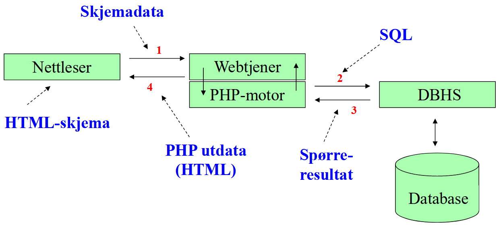

### Programmering i PHP

#### Dagens dato

```PHP
<html>
<body>

<?php
      // Bruker funksjonen DATE for å hente dagens dato
      // på formen dd.mm.åååå. Lagrer i variabelen $dato.
      $dato = DATE("d.m.Y");// Skriver ut dagens dato i HTML h1-overskrift.
      echo "<h1>Dagens dato: $dato</h1>";
  ?>
  
</body>
</html>
```

#### Variabler i PHP

* Alle variabler starter med **$**
* Punktum slår sammen tekstverdier
* Variabler kan endre verdi

* ```PHP
  <html>
  <body>
  <?php
  $navn = 'Ola';
  echo '<h1>Hei ' . $navn . '</h1>';
  $navn = 'Kari';
  echo '<h1>Hei ' . $navn . '</h1>';
  ?>
  </body> </html>
  ```

* En tekst omsluttet av doble apostrofer kan inneholde variabler
* Linjeskift gjøres med **\n**

#### Datatyper i PHP

* Trenger ikke å deklarere variabler i PHP
* Datatyper
  * boolean, integer, float, string
  * array, object ...
* PHP-tolkeren utleder datatypen fra sammenheng

#### Operatorer i PHP

* Aritmetiske operatorer
  * <p> + - * / % </p>

* Sammenligningsoperatorer
  * <p>> >= == != < <=

* Inkrement og dekrement
  * ++ --

* Logiske operatorer
  * && || !

* Spesielle operatorer
  * **.** **.=** - Slå sammen tekst / legg til tekst
  * += *=

#### Innebygde funksjoner i PHP

* Tekst
  * str_pad, strlen, substr, substr_replace, trim, ucfirst, ...
* Dato og tid
  * date, getdate, gettimeofdat, strtotime, ...
* Matematikk
  * abs, ceil, cos, exp, floor, log, ...

* Eksempler:
  * $s = substr('abcdef', 1,3); // $ =='bcd*
  
  * $today = getdate();
  
  * <p>$avst = sqrt(exp($x2.$x1,2) + exp($y2-$y1,2))

#### Konvertering i PHP

* Skjemadata
  * $side = $_GET['txt_side'];
  * $areal = $side * $side

* Implisitt konvertering
  * $tall = '2' +'2';

* Eksplisitt konvertering(typetvang, type casting)
  * $tall = (int) '85';

* Funksjoner for å avlese datatyper
  * is_int($tall), is_numeric($side), ..

#### Presentasjon av tall i PHP

* Parametre til funksjonen number_format
  * Anrall desimaler
  * Tegn for desimalpunktum
  * Tusenskilletegn

* $pris =123456.789
* print(number_format($pris,2,' ',', ' ') )
  * 123 456.78

#### Valgsetninger i PHP

* Bruker skriver inn navnet, programmet skriver pris:

  * ```PHP
      $alder = $_GET['alder'];             // Fra skjema
      $pris = 80;                        // Full pris
      if ($alder < 7)   {
      $pris = 0;                     // [0..6] går gratis
       }
      else {
          if ($alder <= 12 || $alder > 67)
            $pris = $pris * 0.5;    // Halv pris
      }
      print ('Pris: ' . $pris);

#### While-løkker i PHP

* Bruker skriver inn øvre grense(positivt heltall), programmet skriver ut summen av tallene fra 1 ... max

  * ```PHP
    $max = $_GET['max'];    //fra skjema
    $tall = 1;
    $sum = 0;

    while ($tall <= $max){
      $sum = $sum + $tall;
      $tall = $tall +1;
    }
    print('Sum1..'  . $max  . '=' . $sum);
    ```

#### Tabeller i PHP

* Tabeller egnser seg for gjennomløp med for-løkker

* ```PHP
  // Nedbør (mm) pr. dag i en gitt uke
  $nedboer = array(3,0,0,23,0,17,4);

  $antall = sixeof($nedboer):
  for ($i=0; $i<$antall; $i++)  {
    $sum += $nedboer[$i]
  }
  $snitt = $sum / $antall;

  print('Totalt: ' . $sum . ' snitt: ' . $snitt);
  ```

#### Gjennomløp med foreach

* For å produsere punktliste
  * Skrite ut < ul > helt først og < /ul> helt til slutt
  * Så må vi omslutte hver verdi med < li> og < /li >

* ```PHP
  $tabell = array(3,0,0,23,0,17,4);
  print '<ul>';
  foreach ($tabell as $enVerdi) {
    print '<li>' . $enverdi . '</li>';
  }
  print '</ul>';
  ```

#### Navneliste (løkke, gjentakelse)

* Programmet skriver alle navn i en tabell(array)

* ```PHP
  $navnTabell =
      array("Per", "Kari", "Ola", "Lise", "Karianne");

  echo "<table width=\ "1\">";
  foreach ($navnTabell as $fornavn)
  {
    echo "<tr>";
    echo "<td>$fornavn</td>";
    echo "</tr>";
  }
  echo "</table>";
  ```

#### Produsere en HTML-tabell

* Må nøste to løkker

* ```PHP
  $tab1 = array(1,2,3,4,5);
  $tab2 = array(1,2,3,4,5,6,7);
  print '<table>';
  foreach ($tab1 as $v1) {
    print '<tr>';
    foreach ($tab2 as $v2){
      print '<td>'  . $v1*$v2 . '</td>';
    }
    print '</tr>';
  }
  print '</table>';
  ```

#### Assosiative tabeller

* I assosiative tabeller kan man velge indeksering vekk fra bare heltall
* Eksempel:

  * ```PHP
    $nedboer = array (
      "mandag" => 3,
      "tirsdag" => 0,
      "onsdag" => 0,
      "torsdag" => 23,
      "fredag" => 0,
      "lørdag" => 17,
      "søndag" => 4
      );

    $man = $nedboer["mandag"]; //Slår  opp
    $nedboer["mandag"] += 2;  //Oppdaterer
    ```

#### Foreach i assosiative tabeller

* Gjennomløper med en mønstergjenkjenningsteknikk

* ```PHP
  $sum = 0;
  $nedboer = array(..); //Se forrige script
  foreach ($nedboer as $ukedag => $mm){
    print($ukedag . " " . $mm . " mm");
    $sum += $mm
  }
  print("Totalt " . $sum  . " mm nedbør");
  ```

  * Tankegang:
    * En assosiativ tabell er en mapping fra nøkkel til verdi
    * Ukedager til nedbørsmengde
    * Løkkekroppen blir utført for hvert par nøkkel => verdi

#### isset og array_key_exists

* Finnes en bestemt nøkkel i en assosiativ matrise?

* ```PHP
  $d = "juledag";
  if (!array_key_exists($d, $nedboer))
    print("Ukjent ukedag");
  ```

* Har vi fått inndata fra bruker?

* ```PHP
  if (! isset($_GET["txtAntall"]) )
    print("Du vet du skal skrive et tall ikke sant? smh")
  ```

#### Opprette databaseforbindelse

* Koble opp til MySQL-tjener:
  * Adressen til tjener
  * Brukernavn
  * Passord
  * Velge database

* i PHP:

  * ```PHP
    $forbindelse =
      mysql_connect("localhost", "bruker, "passord");
      mysql_select_db("test);

    // Lukke forbindelse
    mysql_close( $forbindelse );
    ```

#### SELECT-spørringer i PHP

* Sender med SQL-spørringen som parameter til mysql_query

* ```PHP
  $sql = "SELECT * FROM Vare;";
  $resultat = mysql_query( $sql);
  ```

* Antall retunerte rader:

* ```PHP
  $antall = mysql_num_rows ($resultat);
  ```

#### Databaseforbindelse

* I kallet på mysql_query

* ```PHP
  $forbindelse =
  mysql_connect("localhost","bruker","passord");
  mysql_select_db("test");
  $sql = "SELECT * FROM Vare;";
  $resultat = mysql_query($sql);
  
  // Eksplisitt:
  $resultat = mysql_query($sql, $forbindelse);
  ```

#### Bygge SQL-spørringer fra skjemadata

* Lagre skjemadata i PHP-variabel:

  * ```PHP
    $sok = $_REQUEST["txtSok"];

* Bygg SQL - merk enkle og doble apostrofer og blanke tegn

* ```PHP
    $sql = "SELECT * FROM Vare "  .
    "WHERE Betegnelse LIKE '" . $sok  . "%';";

* Test: Skrive ut SQL-koden

  * ```PHP
    print("<p>Testutskrift:"  . $sql  . "</p>);
    ```

#### Behandle spørreresultater

* Anta $resultat er et spørreresultat med en kolonne Betegnelse:

  * ```PHP
    $linje =
      mysql_fetch_array($resultat, MYSQL_ASSOC);
    while( $linje )
    {
      $navn = $linje["Betegnelse"];
      print( $navn . "<br>");
      $linje =
        mysql_fetch_array($resultat, MYSQL_ASSOC);
        }
        ```

  * Alternativer: MYSQL_NUM, MYSQL_BOTH

* Det er ikke nødvendig å vite navnet på kolonnene:

* ```PHP
  $linje=mysql_fetch_array($res, MYSQL_ASSOC));
  while ($linje)
  {
    foreach ($linje as $verdi)
    {
      print($verdi  .   " ")
    }
    print("<br>");
    $linje=mysql_fetch_array($res, MYSQL_ASSOC);
  }
  ```

#### Fra spørreresultat til HTML-tabell

* Skriv ut < table>
  * Hent første rad
  * Skriv ut < tr>
    * Hent første verdi
    * Skriv ut < td>
    * Skriv ut første verdi
    * Skriv ut < /td>
    * ... (verdi 2, verdi 3, ... )
  * Skriv ut < /tr>
  * ... (rad 2, rad 3, ... )
* Skriv ut   < /table>

#### UPDATE og DELETE

* Gir ikke et spørreresultat, men kan finne ut hvor mange rader som ble berørt

* ```PHP
  $sql = "DELETE FROM Vare;";
  $resultat = mysql_query( $sql );
  if ( $resultat)
    print(mysql_affected_rows())  . " rader ble slettet!");
  else
    print("Noe gikk galt");
  ```

* UPDATE og DELETE berører samtlige rader hvis vi ikke legger på en WHERE-betingelse

#### INSERT

* Setter som regel inn 1 rad basert på skjemadata:

* ```PHP
  $varekode = $_REQUEST["varekode"];
  $betegnelse = $_REQUEST["betegnelse"];
  $sql = "INSERT INTO Vare(Varekode, Betegnelse)  " .
              "VALUES ("  . $varekode . " ' ") . $betegnelse  . " ' " . ");";
  $resultat = mysql_query( $sql )
  ```

* Merk:
  * Apostrofer rundt tekstverdier, men ikke rundt tall
  * Øvrige kolonner i den nye raden blir satt til NULL

#### Autonummerering

* I MySQL angis autonummerering som en kolonne-egenskap

  * ```SQL
    CREATE TABLE Ansatt
    ( AnsNr INTEGER AUTO_INCREMENT, ....);
    ```

* Kolonner som er autnummererte tas ikke med i INSERT

  * ```SQL
      INSERT INTO Ansatt(Fornavn, Etternavn)
      VALUES('Per', 'Hansen');
    ```

* Hvordan få tak i sist genererte ansattnr:
  
  * ```PHP
      mysql_query($sql);
      $sisteAnsNr = mysql_insert_id();
    ```

### Ukesoppgaver Kapittel 9

1.  Create a PHP script that prints a multiplication table from 1 to 10.Tip:  Use two nested for loops.  Change the script so that the upper limit is read viaa  URL  parameter.   If  the  upper  limit  is  greater  than  20  an  error  meaage  should  beprinted

* Svar:

  * ```PHP
    <!DOCTYPE html>
    <html>

    <head>
    <title>INF115</title>
    <meta http-equiv="Content-Type" content="text/html; charset=UTF-8"/>
    </head>

    <body>
    <h1>Exercise 9.1</h1>

    <?php

    if (!isset($_GET['max']) || $_GET['max'] < 1 || $_GET['max'] > 20)
      print('<p>URL-parameter maximum must be between 1 and 20!</p>');
    else {
      $max = $_GET['max'];

      /*
      * Set table 1*1 to $max*$max
      * Variant 1: Calculation in the cells
      */

      print('<table border="5">');

      for ($i=1; $i<=$max; $i++) {
        for ($j=1; $j<=$max; $j++) {
          print('<td>' . $i . '*' . $j . '=' . $i*$j . '</td>');
        }
        print('</tr>');
      }
      print('</table>');


      print('<hr/>');

      /*
      * Set table 1*1 to $max*$max
      * Variant 2: With headlines
      */

      print('<table border="5">');

      // With the first row as headers
      print('<tr>');
      print("<td>&nbsp;</td>");
      for ($i=1; $i<=$max; $i++) {
        print('<td><b>' . $i . '</b></td>');
      }

      // The contents of the multiplication table
      for ($i=1; $i<=$max; $i++) {
        // The column on the left is "headers"
        print('<tr>');
        print('<td><b>' . $i . '</b></td>');

        // Then we print out $i*1, $i*2,...,$i*$max
        for ($j=1; $j<=$max; $j++) {
          print('<td>' . $i*$j . '</td>');
        }
        print('</tr>');
      }
      print('</table>');

    }
    ?>

    </body>
    </html>
    ```

2. Create  a  PHP  script  that  checks  the  uploaded  username  and  password  against  thefollowing associative table:

    * ```PHP
      $Users = array
      (
      ’Ola’ => ’Hemmelig ’,
      ’Mari’ => ’Iram’
      );
      ```

* Assume that the variables username and password are POST variables.  Create a HTMLform to test the script.
* Svar:

  * ```HTML
    <!DOCTYPE html>
    <html>

    <head>
    <title>INF115</title>
    <meta http-equiv="Content-Type" content="text/html; charset=UTF-8"/>
    <link href="standard.css" rel="stylesheet" type="text/css">
    </head>

    <body>
    <h1>Exercise 9.2</h1>

    <form method="POST" action="ex9_2.php">

    <table border="0" width="50%">
    <tr>
      <td>username:</td>
      <td><input type="text" name="username" size="10"></td>
    </tr>
    <tr>
      <td>Password:</td>
      <td><input type="password" name="password" size="10"></td>
    </tr>
    </table>
    <p>
      <input type="submit" value="login" name="sendButton">
      <input type="reset" value="clear form" name="clearButton">
    </p>

    </form>

    </body>
    </html>
    ```

## Kapittel 14 - XML og JSON

### Introduksjon til XML

* XML - eXtensible Markup Language
* XML er meta-språk

* Syntaksregler
  * Dokumenter er strukturert i elementer med start- og slutt-tagger
  * Hvert element har ett og bare ett rot-element
  * Hvert element kan ha attributter med en attributtverdi
    * Attributter er alltid i ' '
    * Ett element kan ikke ha to attributter med samme navn
  * Kan ha nøstede elementer som i HTML
    * Elementer kan ikke overlappe

### HTML VS XML

* **HTML**
  * Bygget opp fra elementer organisert i en tre-struktur
  * Elementer har en slutt- og start-tagg og består av tekst og/eller andre elementer
  * Lovlige elementer er forhåndsdefinert
    * feks h1,p , b
  * HTML beskriver struktur og presentasjon

* **XML**
  * Meta-språk
    * Ingen forhåndsdefinerte elementer
    * Må tolkes for å blir presentert

### Oppbygging av XML-dokumenter

* XML har HTML-syntaks
  * Elementer og attributter 
  * Må ha en rot
  * Alle elementer må ha slutt-tagg
  * Elementer kan ikke overlappe
  * Kan som i HTML ha elementer som inneholder både tekst og andre elemeter(< t1>telst< t2>mer tekst < /t2>< /t1>)

* ```XML
  <?xml version="1.0" encoding="UTF-8?">
  <melding dato ="07.04.2020" rom="5-116">
    <avsender fnavn ="Kari" enavn="Lie"/>
    <beskjed>XML-forelesning om 5 min!</beskjed>
  </melding> 
  ```

### Navnerom

* Innført for å unngå navnekollisjoner
  * Identifisert ved URI(Uniform Resource Identifier)
* Kan ha to elementer med samme navn så lenge de er definert i forskjellige navnerom

* ```XML
 <studium xmlns = "http://www.usn.no/kurs/"
    xmlns:k = "http://www.usn.no/skipsfart/"
 </studium>
  <k:kurs>Nordvest</k:kurs> ...
  ```

### Lovlig struktur av XML-dokumenter

* Et syntaktisk korrekt XML dokument
  * Nøyaktig et rotelement
  * Alle elementer har et startmeke og et sluttmkerke
  * Elementer er nøstet korrek(trestrukturt)

### DTD - Document Type Definition

* DTD beskriver lovlig oppbygging av XML-dokumenter

* ```XML
    <!ELEMENT FILM (ENFILM)*>
    <!ELEMENT ENFILM (TITTEL, SJANGER?, PRODÅR)>
    <!ELEMENT TITTEL (#PCDATA)>
    <!ELEMENT SJANGER (#PCDATA)>
    <!ATTLIST ENFILM FilmNrCDATA #REQUIRED>
    <!ATTLIST ENFILM Sensur CDATA #IMPLIED>
  ```

* XHTML - HTML formelt definert ved hjelp av XML

* ```XHTML
  <!ELEMENT html (head, body)>
  <!ELEMENT body (p| h1| h2| ul | ol | dl | table)*>
  ```

* En DTD beskriver en generativ grammatikk

### DTD vs XML Schema

* Svakheter med DTD
  * Ingen datatyper, kun tekststrenger
  * Svak støtte for primærnøkler, fremmednøkler og valideringsregler
  * Særegen syntaks, ikke XML-basert

* XML Schema = En rikere DTD
  * Kan benyttes som datadefinisjonssråk for XML-dokumenter
  * Flere datatyper, både enkle of brukerdefinerte
  * Primærnøkler, fremmednøkler og valideringsregler
  * Bruker XML-syntaks
  * Støtter XML navnerom

### XML Schema

* Struktur

```XML
<?xml version="1.0" encoding="UTF-9"?>

<xs:schema
  xmlns:xs = "http://www.w3.org/2001/XMLSchema"
  targetNamespace="http://www.hit.no" <!-- Navnerom -->
  xmlns="http://www.hit.no"
  elementFormDefault="qualified">
<!-- Typedefinisjoner -->
<!-- Elementdefinisjoner-->
</xs:schema>
```

### Koble XML og XML Schema

* Opprett 2 filer på www.xyz.no
  * personer.xml
  * personer.xsd
* XML-filen refererer til XML-skjemaet

```XML
<?xml version="1.0" encoding="utf-8"?>
<personer
  xmlns="http://home.usn.no"
  xmlns:xsi="http://www.w3.org/2001/XMLSchema-instance" 
  xsi:schemaLocation="http://home.usn.no personer.xsd">
  <person>...</person>
  <person>...</person>
</personer>
```

### Innebygde datatyper

* Et element kan tilfeles en av de innebygde datatypene
  * String
  * Decimal
  * Integer
  * Boolean
  * Date
  * Time
  * Eksempler:
  
  * ```XML
    <xs:element name = "fornavn" type="xs:string"/>
    <xs:element name = "alder" type="xs:integer"/>
    <xs:element name = "fodselsdato" type="xs:date"/>  
    ```

### Enkle datatyper ved restriksjon

* **Lengde**
  * Kan lage egne(enkle) datatyper ved trstriksjon av de innebygde
  * Restriksjon på antall tegn(lengde)
  * Gir et element denne datatypen:
    * `` <xs:element name ="fornavn" type="fornavn_t"/>
  
  * ```XML

   <xs:simeType name ="fornavn_t">
      <xs:restriction base="xs:string">
        <xs:maxLength value="20"/>
      </xs:restriction>
    </xs:simpleType>
      ```

* **Intervall**
  * Restriksjon på verdiområde
  * Gir et element denne datatypen:
    * ``<xs:element name ="pnr" type="pnr_t"/>

  * ```XML

   <xs:simeType name ="pnr_t">
      <xs:restriction base="xs:integer">
        <xs:minInclusive value="1"/>
        <xs:maxInclusive value="500"/>
      </xs:restriction>
    </xs:simpleType>
      ```

* **Mønster**
  * Et mønster er et slags regulært uttrykk
  * Gir et element på denne datatypen
    * ``<xs:element name ="regnr" type ="regnr_t"/>

  * ```XML
  
    <xs:simpleType name="regnr_t">
      <xs:restriction base="xs:string">
        <xs:pattern value="[A-Z]{2}[0-9]{5}"/>
      </xs:restriction>
    </xs:simpleType>
    ```

### Komplekse datatyper

* En komplekt datatype kan f-eks modellere rader i en tabell

* ```XML
  <xs:complexTypename="person_t">
    <xs:sequence><xs:element name="pnr" type="pnr_t"/>
      <xs:element name="fornavn" type="fornavn_t"/>
      <xs:element name="etternavn" type="xs:string"/>
      <xs:element name="tlf" type="tlf_t" />
      </xs:sequence>
  </xs:complexType>
  ```

  * Kan bruke både innebygde og egendefinerte datatyper når vi definerer en ny komplekt datatype

### Antall forekomster

* En databasetabell kan inneholde fra 0 til vilkårlig mange rader:

* ```XML

<xs:complexType name="personer_t">
  <xs:sequence>
    <xs:element name="person" type="person_t"
        minOccurs="0" maxOccurs="unbounded"/>
  </xs:sequence>
</xs:complexType>
    ```

### Gjenbruk av datatyper

* Samme datatype kan brukes for flere elementer

* ```XML
  <xs:complexType name="person_t">
   <xs:sequence>
    <xs:element name="pnr" type="pnr_t"/>
    <xs:element name="fornavn" type="navn_t"/>
    <xs:element name="etternavn" type="navn_t"/>
    <xs:element name="tlf" type="tlf_t" />
   </xs:sequence>
  </xs:complexType> 
  ```

  * Basert på:

  * ```XML 
    <xs:simpleType name="navn_t">
      <xs:restriction base="xs:string">
        <xs:maxLength value="20"/>
      </xs:restriction>
    </xs:simpleType>
    ```

### Attributter

* Hvis pnr er et attributt:
  * ``<person pnr="1"> <fornavn>Per</fornavn></person>

* Kan tilordne attributtet en datatype:

* ```XML
  <xs:complexType name="person_t">
    <xs:sequence>
      <xs:attribute name="pnr" type="xs:int" use="required" />
      <xs:element name="fornavn" type="navn_t"/>
   </xs:sequence>
   </xs:complexType>
  ```

  * Kan også bruke egedefinerte datatyper

## Begreper spørsmål og mulig oppgaver

### Generelt

* Forklarer begrepene ”database”, ”databasesystem”, ”databasehåndteringssystem” og relasjonene mellom disse begrepene.  Nevn to databasehåndteringssystemer.
  
  * En database er en strukturell lagring av data. Dersom man ikke ønsker at bruker skal kommunisere direkte med databasen, kan man bruke et databasehåndteringssystem, et program som utfører operasjoner(feks SQL) fra brukeren på databasen. Databasen blir da et databasesystem ettersom det blir styrt av et DBHS.
  * De forskjellige typene av databaser er relasjonsdatabaser ,objektdatabaser, NO-SQL databaser, hierarkiske databaser, nettverksdatabase, logiske databaser

#### Programmeringsspråk

* Hvilke to nordmen har fått Turing Award og hvorfor har de fått den?
  * Kristen Nygard og Ole-Johan Dahl for å utvikle programmerinsspråket Simula

* Nevn tre objekt-orienterte programmeringsspråk.
  * JAVA, C++, C#

* Nevn tre ikke objekt-orienterte programmeringsspråk
  * C, FORTRAN, BASIC

* Hva er forskjellen melleom en interpreter og en kompilator? Bruker an av de to trær som intern datastruktur?
  * En interpreter utøfere instruksjonen fra koden direkte der en kompilator oversetter koden fra high-level- til lov-level kodespråk. Kompilatorer kan bruke tre-strukturer.

#### Datarepresentasjon

* Hvor mange symboler har ASCII-kode og hvorfor?
  * 128 forskjellige symboler. ASCII var originalt bastert på det engelske alfabetet, bestående av storebokstaver, småbokstaver og tall fra 0-9

* Hvor mange verdier kan vi representere med to bytes?
  * 2^16

* Hvor mange bits trenger vi for å representere tre heksadesimale tall?
  * 4*3 = 12

### SQL

* Hva er en primærnøkkel? Hvorfor trenger vi primærnøkkler?
  * En primærnøkkel er en måte å identifiserer data på. Hver tabell har en primærnøkkel som kan identifisere de andre kolonnen på. Ved å bruke primærnøkler kan koble opp de ulike kolonnene i tabellen, og skrive ut de radene man ønsker uten feil, ettersom primærnøkkelen brukes til å sammenkoble verdiene.

* Hva er en fremmednøkkel?
  * En fremmednøkkel er en primærnøkkel fra en annen tabell, brukt i en tabell for å logisk sammenkoble kolonner fra de to tabellene.

* I hvilke situasjoner bruker vi fremmednøkkler? (Hvordan skulle en database uten fremmednøkkler sett ut?)
  * Der vi har kolonner vi trenger å bruke i flere tabeller, er det logisk å lage fremmednøkkler mellom tabellene, slik at man kan ta en kolonne fra en tabell, og sammenlikne verdier fra en kolonne fra en annen tabell.

* Hva er "nullmerker"? Hvorfor brukes "nullmerker"?
  * "Nullmerker" er ikke-verdier for kolonner. Nullmerker blir brukt for å vise at det ikke er lagt inn noe verdi enda

* Hvor bruker vi "pattern matching" i SQL spørringer? Gi et eksempel.
  * Pattern matching brukes for å finne verdier som inneholder søkektriteriet oppgitt i spørringen.
  * ``SELECT * WHERE name LIKE %Arne%

* Hva er en ”datatype”?  Annerledes formulert:  Hvordan defineres/beskrives en ”datetype?
  * En datatype sier noe om hva slags type verdier som kolonnene tar inn. Med datatyper blir det lettere for DBHS å allokere minne til verdien ettersom størrelse og type på verdiene blir forhåndsdefiniert(med unntak av variabler med udefinert størrelse som feks varchar)

* Hva er forskjell mellom datatypene CHAR(20) og VARCHAR(20)?
  * CHAR(20) tar inn en streng på 20 tegn og bare 20 tegn
  * VARCHAR(20) gjør at så lenge strengen er innenfor 20 tegn er den godkjent og lagres i kolonnen
  
* Hva er forskjell mellom datatypene SMALLINT og INTEGER?
  * INTEGER verdier har 32 bit
  * SMALLINT verdier har 16 bit. Mindre tall kan bli skrevet enn INTEGER

* Mulig oppgave:  Representer et aritmetisk uttrykk som en tre.

* Mulig oppgave:  Beregn venstre/høyre ytre kobling av to tabeller.

* Identifiser to plasser hvor vi har møtt ”trær transformasjoner” i kurset.
  * Hierrarisk datastruktur
  * 

* Hvorfor trenger vi prefikset kolonnenavn? Finnes det noe lignende i XML?
  * Prefikset kolonnenavn gjør det mulig å skille mellom kolonner med samme navn mellom flere tabeller. Feks V.VNr fra fra Vare tabellen

* Gi et eksempel på en forretningsregel
  * En forretningsregel er en valideringsregel for en tabell.

  * ```SQL
      Constraint Price_rule
        CHECK (Price>0 AND Price<10000)
    ```

* Utsnitt = views
  * Hva er utsnitt? Hvordan definerer vi utsnitt i SQL?
    * Views er virtuelle tabeller laget fra eksisterende tabeller og kolonner.

    * ```SQL
      CREATE VIEW Example(VNr, Navn, Antall) AS 
        SELECT ...
        FROM ...
        WHERE ...
  
  * Diskuter tre anvendelser av utsnitt
    1. Dersom man skal oppgradere en database, kan det lønne seg med views. Ved å stenge ned gamle databaser og lage nye vil det åpne opp for mulige problemer ettersom ny kode kan skape nye bugs. Views gjør at overgangen til en nye database kan gjøres gradvis ved å lage en view lik den gamle databasen, mens den nye databasen gradvis blir implementert i systemet.
    2. Sikkerhet. Views skaper et ekstra lag mellom bruker og database. Dersom sluttbrukeren bare kommuniserer med de tabellene og kolonnen som er spesifisert, vil det mulig lukke muligheten til å få tilgang til andre tabeller.
    3. Aliaser. I noen tilfeller der databaser er store eller har kompliserte navn, kan det lønne seg å gi spørringen et alias, slik at det skal være lettere å kommunisere med databasen.  
  
  * Beskriv hvordan et DBHS kan utføre spørringer mot utsnitt
    * Views blir lagret logisk av DBHS i systemtabellen. Spørringen som definerer viewet blir utført og deretter selve spørringen(som leser mellomresultat) 

### Relasjonsmodellen og relasjonsalgebra

* Hva var først - relasjonsmodell(teori) eller SQL(praksis)?
  * Relasjonsmodell(1970)
  * SQL(1973)

* Mulig oppgave: Gitt noen mengder, regn ut diverse uttrykk som bruker union, snitt, differanse og kryssprodukt

* Mulige oppgaver: Oversett SQL spørringer til uttrykk i relasjonsalgebra (og motsatt veien). Gi en SQL spørring som man kan oversette i to forskjellige, men ekvivalente uttrykk

* Beskriv de to fasene innen spørreoptimalisering i SQL
  1. Oversettelse av SQL-setning til et uttrykk i relasjonsalgebra
  2. Omskrivning av uttrykkene til en form som lar seg utføre mer effektivt

* Beskriv tre regler som blir brukt i "regelbasert optimalisering"
  * 

### Datamodellering og databasedesign

* Hva er en svak entitiet? Gi eksempel
  * Svake entiteter er avhengig av andre entiteter for å eksistere der forholdet mot en svak entitet er identifiserende. [Kinosal] <-- [Kino]

* Hvorfor bør ikke fremmednøkkler dukke opp i ER diagrammer?(Delspørsmål: Hva slags forhold i et ER diagram kan oversettes direkte til fremmednøkler?)
  * 

* Hva er en subtype av en entitet? Hva arver subtyper? I hvilke situasjoner kan det være lurt å innføre subtyper?
  * En subtype er en delmengde av en entitet. En subtype arver egenslaper til supertypen. Subtyper kan være lurt dersom man trenger å dele opp en tabell i flere "kategorier" som inngår under samme tabell, men allikevel har forskjeller som er verdt å skille mellom

* Hva betyr en funksjonell avhengig mellom to (samlinger av ) kolonner i en tabell?
  * To funksjonelt avhengige kolonner bestemmer hverandre. Med den ene tabellen kan man finne en direkte kobling til en verdi i den andre

* Forklar begrepene: supernøkkel, kandidatnøkkel og primærnøkkel. Hva er forskjellen mellom en kandidatnøkkel og en primærnøkkel?
  * **Supernøkkel**: En kolonne som bestemmer enhver annen kolonne
  * **Kandidatnøkkel**: En minimal supernøkkel. Kan være en kolonne eller rad som blir unikt identifisert i en database.
  * **Primærnøkkel**: En kolonne som unikt identifiserer hver rad i en database tabell
  * En tabell kan har flere kandidatnøkkler, men bare en primærnøkkel

* Gi eksempler på oppdateringsanomalier
  * Oppdateringanomalier: Opperasjoner som medfører at databasen oppfører seg inkonsistent eller at data går tapt. Dersom man sletter en rad som kun oppstår en gang i loggen, vil lagret data om verdiene i raden gå tapt dersom denne raden blir slettet. Ved at en verdi i en kolonne blir endret som medfører at alle instanser av objektet i respektive rader, blir databasen inkonsistent. Dette kan løses ved å entitisere tabellen slik at den endrete kolonnen i utganspunktet referer videre. Siden primærnøkler ikke kan inneholde nullmerker, kan det medføre problemer dersom vi skal registrere verdier for fremtiden som enda ikke er refferert i databasen.

* Hva er et "normaliseringsteg"?
  * Overgangen til å stegvis fjerne redudans ved å dele opp tabeller

* Hva betyr "tapsfri dekomposisjon" av en tabell T i to tabeller T1 og T2?
  * Dersom T bli delt opp i to tabeller T1 og T2, vil det være en tapsfri dekomposisjon dersom de to tabellene gir T tilbake

* Definer begrepene: Partiel avhengighet, transitiv avhengighet, 1NF, 2NF og 3NF
  * **Partiel avhengighet**: Gitt en tabell **T(_A_,B,C,D)**. **B** -> **D** er en partiel avhengighet hvis **B** er en ekte delmengde av sammensatt primærnøkkel i **T** og **D** ikke er med i primærnøkkelen **T**
  * **Transitiv avhengighet**: Gitt en tabell **T(_A,B_,C,D)**. **A** -> **C** er en transitiv avhengighet hvis **A** er en primærnøkkel for **T** og verken **B** eller **C** er med i primærnøkkelen i **T** og **B** -> **C**
  * **1NF**: Første normalform. En tabell som bare inneholder atomære verdier
  * **2NF**: En tabell er på 2NF dersom den er i 1NF og ikke inneholder noen funksjonelle avhengigheter
  * **3NF**: En tabell er på 3NF dersom den er på 2NF og ikke inneholder noen transitive avhengigheter

* Mulige oppgaver: Konstuer en tabell som er 1NF men ikke 2NF. Konstruer en tabell som er 2NF men ikke 3NF

* Forsvinner de funksjonelle avhengighetene i en tabell hvis vi normaliserer tabellen?

* Hva er en blokk?
  * En blokk er en sammensetning av ulike sektorer. En sektor er en del av et spor fra en harddiskplate.

* Hva er en post? Hvilket forhold har poster og blokker?
  * Poster er det som sammensatt av flere felt blir til en fil. En blokk inneholder mange poster

* Hva er forholdet mellom en tabell og en fil?
  * Hver tabell lagres på egen fil. Hver rad lagres i en post og hver verdi i et felt

* Hva er hashing og hva er en hashing funksjon?
  * Hashing er å konvertere en gitt nøkkel til en annen verdi. En hashfunksjon en funksjon som gjør akkurat dette

* For hvilke søk er ikke hashing av hjelp?
  * Intervallsøk

* Hva er en primærindeks? Er det en sammenheng mellom primærnøkler og primærindekser?
  * Datafilen er sortert fysisk på søkenøkkelen, kolonnen. En tabell kan bare ha nøyaktig en primærnøkkel, mens det kan være en eller fler primærindekser.

* Hva betyr det at en indeks er tett? Er primærindekser tett?
  * En tett indeks peker til samtlige poster.  Primærindekser er ikke-tette siden de peker til blokker som nødvendigvis inneholder flere poster, dermed blir ikke forholdet en til en, og primærindekser er ikke tette

* Hva er denormalisering? I hvilke tilfeller kan denormalisering være fornuftig?
  * Slå sammen tabeller for å unngå likekoblinger.

* Hva er en transaksjon? Hva er forholdet mellom transaksjoner og SQL spørringer?
  * En transaksjon er en rekke operasjoner brukere utfører på en database. Transaksjoner utfører i helget så ingenting skal gå galt med databsen

* Hva kan bli et problem med transaksjoner spesielt i flerbrukdatabaser?
  * Dersom to brukere oppdaterer samme data. Dette kan medføre at feil data blir lagret dersom rekkefølgen av transaksjoner kan være avgjørende

* Hva er en transaksjonslogg? Hvor ligger loggen?
  * En transaksjonslogg er en fil som inneholder data om alle operasjoner som er utført på en database. Loggen er lagret på en separat logg fil

* Hva står ACID for? Forklart de fire ACID-egenskapene.
  1. Alt eller ingenting(Atomicity)
     * Enten blir en transaksjon utført i sin helhet, eller ikke i det hele tat
  2. Konsistens(consistency) 
     * Hvis databasen er i en konsistent tilstand før transaksjonen blir utført, skal databasen også være konsistent når transaksjonen er ferdig utført
  3. Ingen innblanding(isolation)
     * Ingen transaksjoner som foregår samtidig skal interferere med hverandre
  4. Varighet(durability)
     * Når en transaksjon er bekreftet, skal effekten av transaksjonen bli permanent lagret. Detta skal gjelde selv om det oppstår feil på et senere tidspunkt

* Hva er en lås?
  * En lås regulerer tilgangen til deler av en database. Transaksjoner som vil ha tilgang til disse delene, må spørre DBHS om en lås på denne delen. Transaksjoner blir satt i en ventekø ettersom de spør om tilgang. Det finnes leselåser og skrivelåser

* Hva er sekvensielt forløp? Og hva er et serialiserbart forløp? Hvorfor er serialiserbare forløp mere effektive?
  * Sekvensielt forløp: Et forløp der deloperasjoner blir utført en etter en
  * Serialiserbart forløp: Et forløp der flest mulig deloperasjoner blir utført samtidig og sluttresultatet blir det samme om et sekvensielt forløp

* Hva er to-faselåsing? Hvorfor skal bruke to-faselåsing?
  * Transaksjoner ber samtlige låser i starten av sitt forløp, og opphever samtliger låser til slutt. En transaksjon får ikke lov å sette nye læser etter at den nye låsen er opphevet. I voksefasen blir en ny lås satt. Når den første låsen blir opphevet, går transaksjonen til minkefasen.

* Hva er vranglås?
  * Når to transaksjoner gjensidig venter på den andre skal oppheve sin lås

* Forklar horisontal og vertikal fragmentering av en tabell. Hva bør vi være obs på hvis vi bruker vertikal fragmentering?
  * Horisontal fragmentering: En tabell blir delt opp etter rader og de forskjellige radene lagres hos de forskjellige nodene
  * Vertikal fragmentering: En tabell blir delt opp etter kolonner og fordelt hos nodene. Primærnøkkel må være med i alle fragmentene for at det skal være mulig å konstruere hele den logiske tabellen ved å koble fragmentene.

* Hva er metadata og hva er en metadatabase?
  * Data om data lagret i systemkatalogen

* Hvilke metadata angående en tabell finner vi i metadatabasen?
  * TABLES:
    * TABLE_CATALOG
    * TABLE_SCHEMA
    * TABLE_NAME
    * TABLE_TYPE
    * ENGINE
    * VERSION
    * ROW_FORMAT
    * TABLE_ROWS
    * AVG_ROW_LENGTH
    * MAX_DATA_LENGTH
    * INDEX_LENGTH
    * DATA_FREE
    * AUTO_INCREMENT
    * CREATE_TIME
    * UPDATE_TIME
    * CHECK_TIME
    * TABLE_COLLATION
    * CHECKSUM
    * CREATE_OPTIONS
    * TABLE_COMMENT
  * **Svaret UWE mest sannsynlig vil ha:**
    * Navnet på tabellen
    * Navn på kolonnene
    * Hva slags type data som er lagret i de enkelte kolonnene

* Metadatabasen er del av systemkatalogen. Nevn to andre typer informasjon man vanligvis finner i systemkatalogen.
  * Acces rights, kolonne informasjon, tabell informasjon

* Hva er oppgaven til integritetskontroll modulen i et DBHS?
  * Å sjekke at alle definerte forretningsregler blir overholdt(valideringsregler, entitetskontroll, referanseintegritet)

* Hva er oppgaven til modulen SQL-parser? Hvilke datastrukturer sender SQL-parseren videre til modulen spørreoptimalistor?
  * Sjekke om syntaksen er korrekt og e.v.t gi tilbake feilmeldinger

### HTML/XML

* Hva er et element i HTML/XML? Nevn tre elementer som finnes i HTML
  * HTML elementer er forhåndsdefinerte strukturklosser som kan inneholde attributter. Elementer må starte og slutte med tags. I HTML har man feks "src", "width" og "height"

* Mulig oppgave: Representer et HTML/XML-dokument som et tre

* Hva er forskjellen mellom URL og URI?
  * Alle er URLer er URIer siden URI kan være feks navn eller link, mens URL bare kan være en link

* Hva er forholdene mellom HTML, XML og XML schema?
  * XML schema er et språk for å definerer lovlige XML-documenter
  * HTML er bygget opp fra elementer organisert i en tre-struktur og beskriver struktur og representasjon
  * XML er et metaspråk uten forhåndsdefinerte elementer og må tolkes for å bli representert

* Nevn tre krav til et velformet XML-dokument
  * Dokumentet må ha elementer med start- og sluttmerke
  * Må ha en rot
  * Elementer er nøstet riktig og kan ikke overlappe

* Hvorfor stiller vi disse kravene?
  * Det sikrer at XML-dokumentet kan bli representert som et tre

* Hvorfor trenger vi stilark i XML men ikke i HTML?
  * Stilark i XML gjør det mulig å transformere og formatere innholdet i XML dokumentet for visning. HTML er språk som beskriver både struktur og presentasjon, noe som gjør at vi ikke trenger stilark.

* Hva består et XSLT-stilark av?
  * Funksjoner som behandler hver sin del av at XML dokument

* Hvorfor kan vi karakterisere XSLT som et funksjonelt programmeringsspråk?
  * XSLT er declarativei motsetning til statefull. Det betyr at XSLT ser på oppbyggningen av programmet som teorier fra en formell logikk.

### PHP

* Hvorfor trenger vi et språk som PHP?
  * Alle webhotel støtter det
  * Det kjører på alle operativsystem
  * PHP kan samhandler med mange forskjellige databaser, inkludert MySQL

* Hvorfor kalles PHP et skriptspråk? Nevn noen andre skriptspråk.
  * Det bruker en interepreter i stedenfor en kompilator
  * Javascript
  * Python
  * Action script

* Hva er forskjellen mellom de to metodene POST og GET som brukes i HTML skjemaer?
  * Post kan overføre større datamenger enn GET, skjermdata er ikke synlig i URL, hindrer at andre får tak i sensitiv informasjon ved å se på skjermen og skjermdata er ikke kryptert. GET brukes for å spørre om data fra en spesifikk kilde, har lengde restriksjoner, kan be cachet, men kan ikke modifisere data

* Hvor befinner PHP-tolkeren seg?
  * Hos serveren

* Hva er assosiative tabeller? Gi et eksempel
  * En tabell som er assosiativ gjør det mulig å velge indekser vekk fra bare tall

* Hva er en utviklingsstakk? Gi et eksempel
  * En utviklingsstakk er en kombinasjon av plattformuavhengige programmer. 

* Hva er SQL-injection?
  * SQL-injections er en måte å få sensitiv data ut fra en database ved å misbruke hvordan en applikasjon kommunisere med SQL databasen på. SQL-injections skjer ved å skrive inn SQL queries inn i en inputt på applikasjonen. En dårlig konfigurert server vil ikke kunne skille mellom data og query, og vil derfor tolke kommandoen som er faktisk SQL query og deretter skrive ut sensitiv data. 

* Hva er HEX-conversion? Forklar hvordan HEX-conversion forhindrer SQL-injection
  * HEX-conversion er å oversette tekst til hexadesimalt format. Ved hexkonvertering blir alle tegn "escapet" 