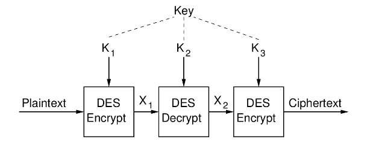

# INF140 Summary

* [INF140 Summary](#inf140-summary)
  * [Cybersecurity Summary](#cybersecurity-summary)
    * [Security Attributes](#security-attributes)
    * [Assets in Cyberspace](#assets-in-cyberspace)
    * [Security Threats](#security-threats)
    * [Network Security](#network-security)
  * [Overview of Cybersecurity](#overview-of-cybersecurity)
    * [What is cybersecurity](#what-is-cybersecurity)
    * [Key questions in cybersecurity](#key-questions-in-cybersecurity)
    * [CIA Triad](#cia-triad)
    * [Pakerian hexad](#pakerian-hexad)
    * [Security attributes](#security-attributes-1)
    * [What can adversaries do](#what-can-adversaries-do)
    * [Security vs privacy](#security-vs-privacy)
    * [Vulnerabilities](#vulnerabilities)
    * [Security threats](#security-threats-1)
    * [Security risks (vulnerabilities x threats x impacts)](#security-risks-vulnerabilities-x-threats-x-impacts)
    * [Security controls(countermeasures, safeguard)](#security-controlscountermeasures-safeguard)
    * [Multi-layered defense](#multi-layered-defense)
    * [Security control protections](#security-control-protections)
    * [Risks](#risks)
      * [Risk management](#risk-management)
      * [Risk assessment](#risk-assessment)
      * [Quantitative and qualitative analysis](#quantitative-and-qualitative-analysis)
    * [Threat models](#threat-models)
  * [Identification and Authentication](#identification-and-authentication)
    * [Identification](#identification)
    * [Requirements on Identification](#requirements-on-identification)
    * [Authentication](#authentication)
      * [User Authentication](#user-authentication)
      * [Means of Authentication](#means-of-authentication)
      * [Password Bases Authentication](#password-bases-authentication)
        * [Storing Passwords in Clear Text](#storing-passwords-in-clear-text)
        * [Storing Passwords as Encrypted text](#storing-passwords-as-encrypted-text)
        * [Storing Passwords as Hashed Text](#storing-passwords-as-hashed-text)
        * [Cracking passwords](#cracking-passwords)
        * [Salting Passwords](#salting-passwords)
        * [Password Storage Best Practice](#password-storage-best-practice)
        * [Passwords Vulnerabilities and Countermeasures](#passwords-vulnerabilities-and-countermeasures)
        * [Other Common Characteristics of Passwords](#other-common-characteristics-of-passwords)
        * [Password Selection Strategies](#password-selection-strategies)
        * [Passwords:  Do’s and Don't s](#passwords-dos-and-dont-s)
      * [Token-Bases Authentication](#token-bases-authentication)
        * [Memory Cards](#memory-cards)
        * [Smart Cards](#smart-cards)
      * [Bio-metric Authentication](#bio-metric-authentication)
  * [Access Control](#access-control)
    * [Access Control Key Points](#access-control-key-points)
    * [Access Control and Other Security Functions](#access-control-and-other-security-functions)
    * [Access Control in the Real World](#access-control-in-the-real-world)
      * [Physical Access Control](#physical-access-control)
      * [Technical Access Control](#technical-access-control)
    * [General Requirements of Access Control](#general-requirements-of-access-control)
    * [Basic Elements of Access Control Systems](#basic-elements-of-access-control-systems)
    * [Access Control Models](#access-control-models)
      * [Discretionary Access Control (DAC)](#discretionary-access-control-dac)
        * [Access Matrix](#access-matrix)
      * [Role-Based Access Control](#role-based-access-control)
        * [Constraints in RBAC](#constraints-in-rbac)
      * [Mandatory Access Control (MAC)](#mandatory-access-control-mac)
        * [Implementations of MAC](#implementations-of-mac)
      * [Attribute-Based Access Control](#attribute-based-access-control)
    * [Access Control in Operating Systems](#access-control-in-operating-systems)
    * [Main Characteristics of Access Control Models](#main-characteristics-of-access-control-models)
  * [Accountability and Auditing](#accountability-and-auditing)
    * [Cybersecurity Principle No1](#cybersecurity-principle-no1)
    * [Accountability](#accountability)
      * [Security Benefits of Accountability](#security-benefits-of-accountability)
        * [Non-repudiation](#non-repudiation)
        * [Deterrence](#deterrence)
        * [Intrusion Detection and Prevention](#intrusion-detection-and-prevention)
        * [Admissibility of Records](#admissibility-of-records)
      * [How is Accountability Achieved](#how-is-accountability-achieved)
    * [Auditing](#auditing)
      * [How Auditing Should be Done](#how-auditing-should-be-done)
        * [What Should be Audited](#what-should-be-audited)
        * [System-level Events](#system-level-events)
        * [Application-level events](#application-level-events)
        * [User-level Events](#user-level-events)
    * [Monitoring](#monitoring)
    * [Logging](#logging)
    * [Accountability and Auditing TLDR](#accountability-and-auditing-tldr)
  * [Cryptography](#cryptography)
    * [Security by Cryptography](#security-by-cryptography)
    * [Encryption for Confidentiality](#encryption-for-confidentiality)
    * [Encryption Terminology](#encryption-terminology)
    * [Requirements and Assumptions for Cryptology](#requirements-and-assumptions-for-cryptology)
    * [Characterizing Cryptographic Systems](#characterizing-cryptographic-systems)
    * [Symmetric Key Encryption for Confidentiality](#symmetric-key-encryption-for-confidentiality)
      * [Attacks on Symmetric Keys](#attacks-on-symmetric-keys)
      * [Block vs Stream Ciphers](#block-vs-stream-ciphers)
      * [Examples of Substitution Ciphers](#examples-of-substitution-ciphers)
        * [Caesar Cipher](#caesar-cipher)
        * [Mono-alphabetic (Substitution) Ciphers](#mono-alphabetic-substitution-ciphers)
        * [Playfair Cipher](#playfair-cipher)
          * [Vigenere Cipher](#vigenere-cipher)
      * [Modern Block Ciphers](#modern-block-ciphers)
      * [Data Encryption Standard (DES)](#data-encryption-standard-des)
        * [DES Round Function](#des-round-function)
      * [Triple-DES (3DES)](#triple-des-3des)
      * [Advanced Encryption Standard (AES)](#advanced-encryption-standard-aes)
      * [DES vs AES](#des-vs-aes)
      * [Attacks on Block Ciphers](#attacks-on-block-ciphers)
        * [Assumptions: Knowledge of Attacker](#assumptions-knowledge-of-attacker)
      * [Using Block Ciphers on Real Data](#using-block-ciphers-on-real-data)
      * [Stream Ciphers](#stream-ciphers)
        * [RC4](#rc4)
    * [Authentication and Hash Functions](#authentication-and-hash-functions)
      * [Hash Functions (Message Digest)](#hash-functions-message-digest)
      * [Hash Attacks](#hash-attacks)
      * [Hash Algorithms](#hash-algorithms)
        * [MD5](#md5)
        * [SHA](#sha)
        * [SHA256](#sha256)
      * [Hash Functions Required Properties](#hash-functions-required-properties)
      * [Authentication using Symmetric Key Encryption](#authentication-using-symmetric-key-encryption)
      * [Authentication using Message Authentication Codes](#authentication-using-message-authentication-codes)
      * [MAC Algorithms](#mac-algorithms)
        * [MAC Attacks](#mac-attacks)
      * [Authentication with Symmetric Key and MACs](#authentication-with-symmetric-key-and-macs)
        * [Authentication using Hash Functions](#authentication-using-hash-functions)
      * [HMAC](#hmac)
      * [Summary on Symmetric Cryptographic Primitives](#summary-on-symmetric-cryptographic-primitives)
      * [Password-Based Key Derivation Functions (PBKDF)](#password-based-key-derivation-functions-pbkdf)
    * [Public and Private Keys](#public-and-private-keys)
      * [Assumptions:  Public Key Encryption](#assumptions-public-key-encryption)
      * [Requirements of Public-Key Cryptography](#requirements-of-public-key-cryptography)
      * [Diffie-Hellman Key Exchange](#diffie-hellman-key-exchange)
      * [Distributing Public Keys](#distributing-public-keys)
    * [Digital Signatures](#digital-signatures)
  * [Malicious Software](#malicious-software)
    * [Malware (Malicious software/code)](#malware-malicious-softwarecode)
      * [Classification of malware](#classification-of-malware)
    * [Viruses](#viruses)
      * [Compression Virus](#compression-virus)
      * [Types of Viruses By target](#types-of-viruses-by-target)
      * [Propagation of viruses](#propagation-of-viruses)
      * [Types of Viruses by Concealment Strategy](#types-of-viruses-by-concealment-strategy)
    * [Worms](#worms)
      * [Worm Replication](#worm-replication)
    * [Trojan Horses](#trojan-horses)
    * [Types of Malware Damage](#types-of-malware-damage)
      * [Zombies and Bots](#zombies-and-bots)
        * [Use of Botnets](#use-of-botnets)
      * [Information Theft](#information-theft)
      * [Phishing](#phishing)
      * [Other Malware](#other-malware)
    * [Comparison of Malware](#comparison-of-malware)
    * [Malware Countermeasure Approaches](#malware-countermeasure-approaches)
      * [Development of Anti-virus Software](#development-of-anti-virus-software)
      * [Generic Decryption](#generic-decryption)
      * [Host-Based Behavior](#host-based-behavior)
    * [Malware Security Issues](#malware-security-issues)
  * [Firewalls](#firewalls)
    * [Why firewalls](#why-firewalls)
    * [Firewall characteristics](#firewall-characteristics)
    * [Firewall capabilities](#firewall-capabilities)
    * [Firewall limitations](#firewall-limitations)
    * [Types of firewalls](#types-of-firewalls)
    * [Packet Filtering Firewall](#packet-filtering-firewall)
    * [IP, TCP, UDP Headers](#ip-tcp-udp-headers)
      * [Packet filtering rules](#packet-filtering-rules)
      * [iptables](#iptables)
      * [iptables concepts](#iptables-concepts)
      * [iptables Chains](#iptables-chains)
      * [iptables rules](#iptables-rules)
      * [Common iptables Syntax](#common-iptables-syntax)
      * [iptables Examples](#iptables-examples)
        * [Drop ICMP Packets](#drop-icmp-packets)
        * [Allow Access Only to Web Server](#allow-access-only-to-web-server)
        * [View Current Rules](#view-current-rules)
        * [Delete All Previous Rules](#delete-all-previous-rules)
        * [Block Packets Through Router](#block-packets-through-router)
      * [Issues with Packet Filtering Firewalls](#issues-with-packet-filtering-firewalls)
    * [Stateful Packet Inspection](#stateful-packet-inspection)
    * [Application proxy](#application-proxy)
    * [Circuit-level proxy](#circuit-level-proxy)
    * [Firewall Architecture](#firewall-architecture)
    * [General Firewall Issues](#general-firewall-issues)
  * [Authentication in Networks](#authentication-in-networks)
    * [Overview of authentication](#overview-of-authentication)
    * [Authentication in WPA2](#authentication-in-wpa2)
    * [Entity authentication in networks](#entity-authentication-in-networks)
    * [Types of authentication protocols](#types-of-authentication-protocols)
      * [Secret info-based authentication](#secret-info-based-authentication)
        * [AAA architecture protocols](#aaa-architecture-protocols)
        * [892.1X(EAPOL)](#8921xeapol)
        * [Extensible Authentication Protocol(EAP)](#extensible-authentication-protocoleap)
        * [RADIUS](#radius)
    * [Virtual Private Network (VPN)](#virtual-private-network-vpn)
    * [Tunneling](#tunneling)
    * [Network access server(NAS)](#network-access-servernas)
    * [Network Access Enforcement Methods](#network-access-enforcement-methods)
  * [Public Key Certificates](#public-key-certificates)
    * [Distribution of Public Keys](#distribution-of-public-keys)
      * [Public announcements](#public-announcements)
      * [Publicly Available Directory](#publicly-available-directory)
      * [Public-Key Authority](#public-key-authority)
      * [Public-Key Certificates](#public-key-certificates-1)
    * [X.509 Certificates](#x509-certificates)
      * [Multiple Certificate Authorities](#multiple-certificate-authorities)
    * [Public Key Infrastructure](#public-key-infrastructure)
    * [PGP - Web of Trust](#pgp---web-of-trust)
  * [Web Security](#web-security)
    * [Comparison of Threats on the Internet](#comparison-of-threats-on-the-internet)
  * [Multiple-Choice Questions (Single Correct Alternative)](#multiple-choice-questions-single-correct-alternative)
    * [Cybersecurity Awareness](#cybersecurity-awareness)
      * [Cybersecurity Ethics](#cybersecurity-ethics)
    * [Cybersecurity attributes, vulnerabilities and controls](#cybersecurity-attributes-vulnerabilities-and-controls)
    * [Cybersecurity Attacks](#cybersecurity-attacks)
  * [INF140 MockExam](#inf140-mockexam)
    * [Part 1](#part-1)
    * [Part 2](#part-2)
    * [Part 3](#part-3)
      * [Question 1](#question-1)
      * [Question 2](#question-2)
    * [Part 4](#part-4)
      * [Part 4 - Question 1: Packet filtering rules](#part-4---question-1-packet-filtering-rules)
        * [4.1.a - Rule1: Block ping(icmp) between subnets](#41a---rule1-block-pingicmp-between-subnets)
        * [4-1.b - Rule 2: Block icmp packets coming into firewall](#4-1b---rule-2-block-icmp-packets-coming-into-firewall)
        * [4-1.c - Rule 3: Block ping packets coming out of firewall](#4-1c---rule-3-block-ping-packets-coming-out-of-firewall)
        * [4-1.d - Rule 4: Prevent node 1 from SSHing to outside nodes](#4-1d---rule-4-prevent-node-1-from-sshing-to-outside-nodes)
        * [4-1.e - Rule 5: Inside hosts can access outside websites](#4-1e---rule-5-inside-hosts-can-access-outside-websites)
  * [Multiple-Choice Questions (Multiple Correct Alternatives)](#multiple-choice-questions-multiple-correct-alternatives)

## Cybersecurity Summary

### Security Attributes

* CIA Triad
  * Confidentiality
  * Integrity
  * Availability

* Access-control
  * Identification
  * Authentication
  * Authorization
  * Accountability

### Assets in Cyberspace

* users
* service, data
* applications/processes
* OS's, firmwares
* hardware
* communication infrastructure: networks, facilities

### Security Threats

* Threats
  * any potential danger that is associated with the exploitation of a vulnerability/weakness
  * local
    * users’ misbehavior, password cracking, virus, worms, Trojan horses, root toolkit, exploit kit, DoS
  * in networks
    * backdoor, remote access, session hijacking,sniffing, spoofing, phishing, social engineering, DDoS,Zombies/Botnes
<!-- pagebreak -->

* inherent Security Weakness in Network Protocols
  * missing authentications of sender in protocols (ARP, TCP,email, HTTP)
<!-- pagebreak -->

* Malicious Software and Behavior
  * Virus, Worms, Trojan Horses, Backdoors, RAT, Rootkits
  * Spoofing, Sniffing, Session Hijacking
  * Zombie, Botnets, information thefts (phishing, social engineering, spam, spyware), ransomware
<!-- pagebreak -->

* Attacks
  * ARP spoofing
  * DNS poisoning
    * flood of Ping,TCP(SYN,ACK,FIN)
  * Distributed DoS
<!-- pagebreak -->

* Damages: data unusable/damaged/lost, process crashed, system halted

### Network Security


* Keywords
  * TCP/IP
  * Network protocols
    * DHCP
    * DNS
    * TCP
    * UDP
    * ICMP
    * IP
    * ARP

* Network Security Kits
  * network access control
    * traffic control
      * firewall (packet filtering, SPI, proxy-based)
      * entity authentication: IEEE 802.X (EAP+RADIUS)
  * security protocols: WPA2, IPSec, TLS, SSH, PGP

## Overview of Cybersecurity

### What is cybersecurity
  
* U-S.Department of Commerce:
  * The protection of information against unauthorized disclosure, transfer, modification, or destruction, whether accidental or intentional

* Wikipedia:
  * The protection of computer systems from the theft of or damage to their hardware, software, or electronic data, as well as from the disruption or misdirection of the services they provide

* U.S.NIST:
  * The protection afforded to an automated information system in order to attain the applicable objectives of preserving the integrity, availability and confidentiality of information system resources

### Key questions in cybersecurity
  
* What do we want to protect
* Why do we need to protect them
* How can we protect them

### CIA Triad
  
* Confidentiality
  * Data cannot be read by unauthorized entities
  * Systems cannot be accessed by unauthorized entities

* Integrity
  * Data integrity: Data cannot be modified in an unauthorized and undesired manner
  * System integrity: Performs its intended function in an unimpaired manner, free from deliberate or inadvertent unauthorized manipulation of the system

* Availability
  * Systems work promptly and service is not denied to authorized user

### Pakerian hexad
  
* Information security
  * Authenticity
    * The proper attribution to the owner or creator of the data in question
  * Availability
  * Utility
    * How useful the data is to the owner
  * Confidentiality
  * Possession
    * The physical disposition of the media on which the data is stored
  * Integrity

### Security attributes

* Assets
  * Confidentiality, integrity, availability
  * Utility, possession, authenticity
  * Accountability/Non-repudiation
  * Authentication
  * Privacy
  * Anonymity

### What can adversaries do
  
* Bot activity
* Account credentials
* Financial credentials
* Hostage attacks
* Reputation hijacking
* Virtual goods
* E-mail attacks
* Web server

### Security vs privacy
  
* Security as term covers several attributes of assets
* Privacy is the control of what kind of information to be disclosed to whom/which entity to what extent

### Vulnerabilities
  
* A weakness in a system that allows a threat source to compromise its security
  * e.g no encryption
  * weak password

### Security threats
  
* Any potential danger that is associated with the exploitation of a vulnerability
  * Malware
  * Hacking tool kits
  * Remote access Trojans
  * Ransomware, spyware
  * Phishing
  * Mass surveillance

### Security risks (vulnerabilities x threats x impacts)
  
* The likelihood of a threat source exploiting a vulnerability and the corresponding impact from compromise of security principles/attributes
  * e.g a weak password has a high likelihood of being easily cracked and data falls in the hands of unauthorized individuals

### Security controls(countermeasures, safeguard)
  
* Actions that are put into place to mitigate or reduce the potential risk
* Administrative controls
  * Personnel training
  * Law/regulation enforcement
* Physical protection
  * Fence, locked gates
  * Security guards
* Technological controls
  * Cryptography
  * Local system: access control, IDS/IPS, anti-malware software
  * Network security: firewall, WPA, SSL/TLS, VPN, TOR

* Technical security controls
  * cryptography
    * Symmetric ciphers
    * Message Authentication
    * Codes
    * Asymmetric/Public-Key Ciphers
    * Asymmetric/Public-Key Digital Signatures
    * Hash
  * Access control
    * Access control lists (ACLs)
    * Firewalls
    * Auditing
  * Multiple server images and backups + speedy recovery

* Security Attributes
  * CIA Triad
    * Confidentiality
    * Integrity
    * Availability
  * 3A access control
    * Authentication
    * Authorization
    * Accountability

* -- | Conf. | Inte. | Avail. | Authen. | Author. | Accou.
  ------|---------|----------|---------|--------|--------|--------|
   Sym.Ciphers   |Y | --| --|--|--|--
  MAC            | -- | Y|--|--|--|--|
  Asym ciphers | Y | --|--|--|--|--|
  | Asym. Dig- Sig |Y|Y|--|--|--|--|
  |Hash|--|Y|--|Y|--|--|
  |ACLs|--|--|--|--|Y|--
  |Audit logs|--|--|--|--|--|Y
  |Multi. Images, backup|--|--|Y|--|--|--

### Multi-layered defense
  
* Makes it more difficult for adversaries to further penetrate into the network
* Buys time to detect and mitigate the attack

### Security control protections
  
* Preventative
  * Physical
    * Locks
    * Security guards
    * Badge systems
    * Biometric systems
    * Mantrap doors
  * Administrative
    * Security policy
    * Separation of duties
    * Information classification
    * Personnel procedures
    * Testing
    * Security awareness training
  * Technical
    * ACLs
    * Encryption
    * Antivirus software
    * Smart cards
    * Dial-up-call-back systems

* Detective
  * Physical
    * Motion detectors
    * Closed-circuit TV's
  * Administrative
    * Monitoring and supervising
    * Job rotation
    * Investigations
  * Technical
    * Audit logs
    * IDs

* Corrective
  * Physical
    * None
  * Administrative
    * None
  * Technical
    * Server images

* Deterrent
  * Physical
    * Fences
    * Lighting
  * Administrative
    * None
  * Technical
    * None

* Recovery
  * Physical
    * Off site facility
  * Administrative
    * None
  * Technical
    * Data backup

### Risks

* Physical damage
* Human interaction
* Equipment malfunction
* Internal and external attacks
* Misuse of data
* Application errors

#### Risk management

* A process of identifying and assessing risk, but also reducing it to an acceptable level and remaining at that level
* Procedures:
  * Frame risk
  * Assess risk
  * Respond to risk
  * Monitor risk
  
#### Risk assessment
  
* Risk = vulnerability x threat x impact
  * Detailed examination of the components of risk used to ensure that security is cost effective, relevant, timely and responsive to threats
  * Goals:
    * Identify assets and their value to the organization
    * Determine the likelihood that a threat exploits a vulnerability
    * Determine the business impact of these potential threats
    * Provide a resource balance between the impact of the threat and the cost of countermeasure
  * Ultimate goal: Provide cost-effective countermeasure according to risks

#### Quantitative and qualitative analysis

* Quantitative: Each element in the analysis is quantified and entered into equations to determine total and residual risk

* Qualitative: Assign ratings instead of numeric quantities to the risk
* Residual risk = total risk - countermeasure

### Threat models
  
* Data:
  * Data at rest
  * Data in transit
  * Data in use
* Humans:
  * Social engineering
  * Password misuse
  * Social network
* Threats:
  * Malicious adversaries seeking vulnerabilities over time by examining system
  * Insider
  * Natural damage
* Attack tree:
  * Set of attacks that associate a threat source and vulnerabilities

## Identification and Authentication

### Identification
  
* A process that presents an identifier to others or systems
  * Expected to be unique but not necessarily secret

### Requirements on Identification

* Each value should be unique for user accountability
* The value should not be shared
* A standard naming scheme should be followed
* The value should be non descriptive of the user's position or tasks

### Authentication

#### User Authentication

* A process that verify the binding between a claimed entity with some attributes/information such as:
  * Password, PIN, security token, bio metric information that cannot be provided by others
* User authentication is the primary line of the defense in computer security
* Other security tools rely on user authentication

#### Means of Authentication

* Knows
  * Password, PIN ...
* Possesses
    Token, key card, smart card ....
* Is
  * Static biometrics
* Does
  * Dynamic biometrics

#### Password Bases Authentication

* Many systems rely on a combination of user ID and password
* System stores username and password initially
* User submits username/password to system and the system compares against stored values
* Identity(ID) :
  * Determine whether the user is authorized to gain access
  * Determines privileges of user(e.g normal or superuser)
  * User in access control to grant permissions to resources for user

##### Storing Passwords in Clear Text

* *ID,P*
* Insider attack: Normal user reads the database and learns other users passwords
  * Countermeasure: Access control on password database

* Insider attack: Admin user reads the database and learns other users passwords
  * Countermeasure: non-admin users must not be trusted.

* Outsider attack: Attacker gains unauthorized access to database and learns all passwords
  * Countermeasure: Do not store passwords as clear text 

##### Storing Passwords as Encrypted text

* *ID,E(K,P)*
* Encrypted passwords are stored
* When user submits password, it is encrypted and compared to the stored value
* Drawback: Secret key, K, must be stored somewhere. If an attacker can read the database, then they might also be able to access and read the key as well

##### Storing Passwords as Hashed Text

* *ID, H(P)*
* Hashed of passwords are stored
* When user submits password, it is hashed and compared to the stored value
* Practical properties of hash functions:
  * Variable sized input
    * Produce a fixed length, small output
  * No collisions
  * One way function
* If an attacker gains database access, practically impossible to take a hash value and directly determine the original password

##### Cracking passwords

* **Brute force attack**
  * Duration = size of password space / speed of hash

* **Dictionary attack**
  * Speeds up brute force attack
  * Uses common passwords from a dictionary of know passwords
  
* **Rainbow table attack**
  * Pre-calculated hashes by someone else
  * Possible passwords and corresponding hashes stored in database
  * Attacker performs lookup on database for target hash
  * Could be 100s and 1000s of terabytes big
  * Trade-off between time and memory cost
    * Reduce search time, but increase storage space
  * Countermeasures:
    * Longer passwords
    * Slower hash algorithms
    * Salting passwords before hashing

##### Salting Passwords

* *ID, Salt, H(P || Salt)*
* When ID and password initially created, generate random s-bit value (salt), concatenate with password and then hash
* When user submits password, the salt from the password database is concatenated, hashed and compared
* If attacker gains database access and they get to know the hash
  * Same effort to fine password as a brute force attack
* Rainbow tables are no longer feasible
  * Space required increased by a factor of $2^s$

##### Password Storage Best Practice

* When storing user login information, always store a hash of a salted password
* Password policies
* Salt: Random, generated when ID/password are first stored
  * 32 bits or longer
* Hash function: Slow, adaptive speed(work factor)
  * E.g bcrypt/scrypt, PBKDF2
* Design for failure: Assume password database will eventually be compromised

##### Passwords Vulnerabilities and Countermeasures

* Offline Dictionary Attack  
  * Attacker obtains access toID/password (hash) database 
    * Use dictionary to find passwords
  * Countermeasures:  
    * Control access to database
      * Reissue passwords if compromised
      * Strong hashes and salts

* Specific Account Attack
  * Attacker submits password guesses on specific account
  * Countermeasure:  
    * Lock account after too many failed attempts

* Popular Password Attack  
  * Try popular password with many IDs
  * Countermeasures:
    * Control password selection
    * Block computers that make multiple attempts

* Password guessing against single user
  * Gain knowledge about user and user that to guess password
  * Countermeasure
    * Control password selection
      * Train users in password selection

* Computer hijacking
  * Attacker gains access to computer that user currently are logged in to
  * Countermeasure:
    * Auto-log out

* Exploiting user mistakes
  * User writes down password, shares with friends, and is tricked into revealing passwords, user pre-configured passwords
  * Countermeasures:
    * User training
      * Passwords + other authentication

* Salt Implementation
  * short salt length, hard coded salt value
  * Countermeasures
    * Personnel training

* Exploiting Multiple Password Use
  * Passwords re-used across different systems/accounts, make easier for attacker to access resources once one password discovered
  * Countermeasures
    * Control selection of passwords on multiple account/devices

* Electronic Monitoring
  * Attacker intercepts passwords sent across network
  * Countermeasures
    * encrypt communications that send passwords

##### Other Common Characteristics of Passwords

* Most use only alphanumeric characters
* Most are in (password) dictionaries
* Many users re-use passwords across systems
* Some very common passwords:  123456, password,12345678, qwerty, abc123, letmein, iloveyou, . . .
* When forced to change passwords, most users change a single character

##### Password Selection Strategies

* User education
  * Ensure users are aware of importance of hard-to-guess passwords
    * Advise users on strategies for selecting passwords

* Computer-generated passwords
  * Generate random or pronounceable passwords (but poorly accepted by users)
  
* Reactive password checking
  * Regularly check user’s passwords, inform them if weak passwords
  
* Proactive password checking
  * Advise user on strength when selecting a password

##### Passwords:  Do’s and Don't s

* Passwords Do’s
  * Choose Long and Complex Passwords
  * DO use passwords of at least eight characters or longer if set by a person
  * DO use passwords of at least six characters or longer if set by a system or service
  * DO allow support for at least a 64 character length
  * DO use a combination of all ascii character types
  * A Good Strategy:
    * Manipulate a personal, memorable sentence/poem with numbers and symbols
      * E.g.:“Tobeornottobe, itisaquestion!” byo→0,b→6,s→$
  
  * **Secure Practices**
    * DO create distinct passwords for different accounts
    * DO check strength of passwords
      * https://howsecureismypassword.net/
    * DO verify your password is not listed in known password dictionaries
      * https://haveibeenpwned.com/Passwords

* Passwords DO NOT’s
  * Password Selection
    * DO NOT use dictionary words
    * DO NOT use pets, people, places, events, etc
    * DO NOT reuse passwords
    * DO NOT use adjacent keyboard strings:  qwerty1234
  * Password Usage
    * DO NOT write down your passwords, stick to your screen, hide under your keyboard
    * DO NOT reuse passwords
    * DO NOT change your password often
    * DO NOT completely share your strategy with others

#### Token-Bases Authentication

* Objects that a user possesses for purpose of user authentication are called tokens

##### Memory Cards

* Can store but do not process data
* Most common is magnetic stripe card
* Can include internal electronic memory
* Can be used alone for physical access
  * Hotel room, ATM ...
* Provides significantly greater security when combined with a password or PIN
* Drawbacks
  * Required a special reader
  * Loss of token
  * User dissatisfaction

##### Smart Cards

* Physical characteristics
  * Include an embedded microprocessor
  * A smart token that looks like a bank card
  * Can look like calculators, keys, small portable objects
* Interface
  * Manual interfaces include a keypad and display for interaction
  * Electronic interfaces communicate with a compatible reader/writer
* Authentication protocol
  * Static
  * Dynamic password generator
  * Challenge-response

#### Bio-metric Authentication

* Attempts to authenticate an individual based on unique physical characteristics
* Based on pattern recognition
* Technically complex and expensive when compared to passwords and tokens
* Physical characteristics used include
  * Facial characteristics
  * Fingerprints
  * Hand geometry
  * Retinal pattern
  * Iris
  * Signature
  * Voice

## Access Control

* The prevention of unauthorized use of a resource, including the prevention of use of a resource in an unauthorized manner

### Access Control Key Points

* Access control prevents unauthorized use of resources(objects) to subjects
* Subjects are processes on behalf of users and applications
* Classes of subjects
  * Owner
  * Group
  * World
* Objects
  * Files
  * Database records
  * Disk blocks
  * Memory segments
  * Processes
* Access rights
  * Read
  * Write
  * Execute
  * Delete
  * Create
* DAC
  * Access rights may be granted to other subjects(common in OS's and DB's)
* RBAC
  * Subjects take on roles
    * Access rights assigned to roles
* MAC
  * Subjects/objects assigned to different levels
  * Subjects can not modify assignment
* ABAC
  * Access based on attributes of subjects, objects and even actions and context

### Access Control and Other Security Functions

* Identification
  * A claim of an entity's identity
* Authentication
  * Verification that the credential of a user or other entity are valid
* Authorization
  * Granting of a right or permission to a system entity to access a resource
* Access control
  * Gran access right or permission at a more granular level
* Audit
  * Independent review of system records and activities in order to test for adequacy of system control
  * Ensure compliance to policy
  * Detect breaches and recommend new changes
  * (Security administrator) -> (Authorization database) -> (Access control function) -> (System resources) | (Access control function) <- (Authentication function) <- (User)

### Access Control in the Real World

#### Physical Access Control

* Controlling access of individuals and vehicles into buildings and places
  * Use employee card to enter a building(the issue of tailgating) or use key to open a door
  * Grant access only during certain time period
  * Access control in airport
    * Passport + boarding pass, security check, passport control

#### Technical Access Control

* Log on a system to access resources(frontend)
* Filtering certain incoming traffic(backend)
* File permission in OS
* a lot more

### General Requirements of Access Control

* Reliable input (the primary purpose of identification and authentication)
* Fine specifications for precise levels of access
* Least privilege (also know as zero-access principle)
* Separation of duty
* Open and closed policies(blacklist and whitelist)
* Policy combinations and conflict resolution
* Administrative policies

### Basic Elements of Access Control Systems

* Subject
  * Entity capable of accessing resources
    * Often subject is a software process
    * Classes of subjects
      * Owner
      * Group
      * World
* Object
  * Resource to which access is controlled
  * Records
  * Blocks
  * Pages
  * Files
  * File partitions
  * Directories
  * Email inbox
  * Programs
  * Communication ports

* Access right
  * Describes the way in which a subject may access an object
  * Read/Write/execute
  * Search

* **A subject accesses an object through certain access rights**

### Access Control Models

* Discretionary Access Control(DAC)
* Use identity of requester or  and access rules (that determine what requester is allowed to do) to control access
  * Entities may allow other entities to access resources

* Mandatory Access Control(MAC)
  * Compare security labels with security clearances to determine access
    * Entities can not grant access to resources to other entities

* Role-based Access Control
  * Roles of users in system and rules for roles are used to control access

* Attribute-based Access Control
  * Use attributes of any part of a system to define allowable access

* These models differ from each other with respect to who can grant permission to whom for access to the resources
* These models are not mutually exclusive

#### Discretionary Access Control (DAC)

* DAC
  * An entity may be granted access rights that permit the entity
    * If the choose so, to enable another entity to access a resource
* Common access control scheme in operating systems and database management systems

##### Access Matrix
  
* Specifies access rights of subjects on objects
* In practice an access matrix is sparse, implement as either
  * Access Control Lists
    * For each object, list subjects and their access rights
  * Capability Lists
    * For each subject, list objects and the rights the subject have on that object
  * Alternative implementation
    * Authorization table listing subject, access mode and object
      * Easily implemented in database

* User    |File 1   | File 2 B | File 3
    --------|---------|----------|---------
    User A  | Own | Own/Read/Write | Read
    User B  | --  | Write | Read/Write/Execute
    User C  |Read| --  |  --

* Authorization table

* Subject | Access Mode | Object
  ---------|----------|---------
  A | Own | File 1
  A | Read | File 1
  A | Write | File 1
  A | Write | File 2
  A | Read | File 2
  B | Read | File 1
  B | Write | File 3
  C | Own | File 3
  C | Read | File 3
  C | Write | File 3

#### Role-Based Access Control

* RBAC
  * Users are assigned to roles
    * Access rights are assigned to roles instead of users/identities
  * Roles are typically used assigned to jobs within an organization
  * Users may be assigned multiple roles
    * Static
    * Dynamic
  * Sessions are temporary assignments of user to role(s)
  * Access control matrix can map users to roles and roles to object

##### Constraints in RBAC

* Constraints define relationship between roles or conditions on roles
* A higher role included all access rights of lower roles
* Mutually exclusive roles
  * Users can only be assigned to one role in the set

* **Cardinality**
  * Maximum number of assignments
    * Maximum number of users assigned to a role
    * Maximum number of roles a user can be assigned to
    * Maximum number of roles that can be granted a particular access right

* Prerequisite
  * Condition upon which user can be assigned to a role
    * E.g users can only be assigned a senior if they already are assigned as a junior role

#### Mandatory Access Control (MAC)

* Based on **multilevel security**
  * Top secret -> secret -> confidential -> unclassified
  * Subject has security clearance of a given level
  * Object has security classification of a given level
* Two required properties for confidentiality
  1. No read up
     * Subjects can only read an object of less than or equal their own security level
  2. No write down
     * Subjects can only write into objects of greater than or equal their own security level

* Clearance and classification is determined by administrator decisions
  * Users can not override security policy
* Bell-LaPadula model formally defines multilevel security and MAC

##### Implementations of MAC

* SELinux
  * Linux kernel modules available to most distroes
* AppArmor
  * Some Linux distroes
* TrustedBSD
  * FreeBSD
  * OpenBSD
  * OSX
* Mandatory Integrity Control
  * Vista
  * Windows 7
  * Windows 8

#### Attribute-Based Access Control

* ABAC uses attributes of any part of any system to define allowable access
* Attributes can belong to subjects, objects, actions, or contexts
  * Subject
    * Clearance
    * Position
    * Title
    * Department
    * Location
    * etc...
* ABAC provides the most granularity of any of the access control models

### Access Control in Operating Systems

* Different models are built into the core or the kernel of the operating system
* For every access attempt, before a subject can communicate with an object, the security kernel reviews the rules of the access control model to determine whether the request is allowed
* Access control are generally enforced more strictly in UNIX and LINUX systems than in Windows
  * (No shit!)

### Main Characteristics of Access Control Models

* **DAC**
  * Data owners decide who has access to resources
  * ACLs are used to enforce these access decisions

* **MAC**
  * Operating system enforces the systems security policies through the use of security labels

* **RBAC**
  * Access decisions are based on each subject's role and/or function position
    * Rule-based Access Control adds on to RBAC by imposing rules that further restrict access decisions

* **ABAC**
  * Access decisions are based on attributes of any component of or action on the system

## Accountability and Auditing

### Cybersecurity Principle No1

    An asset should only be accessed by an authenticated entity in an authorized manner

* Steps of access control
  1. Identification->
  2. Authentication->
  3. Authorization->
  ->Resource->
  4. Accountability

### Accountability

    The requirement for actions of an entity to be traced uniquely to that entity, which supports

* Non-repudiation
* Deterrence
* Fault isolation
* Intrusion detection and prevention
* After-action recovery and legal action
* Provides the means to trace activities in our environment back to their source
* Depends on identification, authentication, and access control being present so that one can know who a given transaction is associated with and what permissions were used to allow them to carry it out
* Providing sufficient control in place to deter or prevent those that would break the rules and abuse the resources they have access to

#### Security Benefits of Accountability

##### Non-repudiation
  
* A situation in which sufficient evidence exists to prevent and individual from successfully denying
  * That he or she has made certain statements
  * That he or she has taken certain actions
    * E.g logs or digital signature by cryptographic techniques

##### Deterrence

* Laying out clear rules about how resources should be accessed
* Announcing clearly that all access activities are monitored, and there will be penalties for acting against the rules

* With the aim of warning individuals, who are authorized or unauthorized to access resources, to think twice before straying outside the lines

##### Intrusion Detection and Prevention

* Intrusion detection performs strictly as a monitoring and alert tool, only notifying us that an attack or undesirable activity is taking place
* Intrusion prevention, often working from information sent by the intrusion detection, can actually take action based on what is happening in the environment
* E.g In response to an attack overt the network, an IPS might refuse traffic from the source of the attach

##### Admissibility of Records

* Accountability methods, with a regulated and consistent tracking system, can provide a solid and and documented chain of custody for evidence collection, dictating that all evidence be labeled with information indicating who secured and validated it

#### How is Accountability Achieved

* Accountability is tracked by recording user, system, and application activities
* It is done through auditing functions and mechanisms within an operating system or application
* Audit trails contain information about
  * Operating system activities
  * Application events
  * User actions

### Auditing

    Auditing is and independent review and examination of records and activities

* To assess the adequacy of system controls
* To ensure compliance with established policies and operational procedures
* To recommend necessary changes in
  * Controls
  * Policies
  * or Procedures

#### How Auditing Should be Done

* Points to be in mind
  * Store the audits securely
  * The right audit tools will keep the size of the logs under control
  * The logs must be protected from any unauthorized changes in order to safeguard data
  * Review the data in the right manner
  * The ability to delete logs is only available to administrators
  * Logs should contain activities of all high-privileged accounts(root, admins)

##### What Should be Audited

* Auditing can vary a lot from organization to organization
* A general category of items and actions to be audited include
  * System-level events
  * Application-level events
  * User-level events

##### System-level Events

* System performance
* Log in attempts
* Log in ID
* Date and time of each log in attempt
* Lockouts of users and terminals
* Use of administration utilities
* Devices used
* Functions performed
* Requests to alter configuration files

##### Application-level events

* Error messages
* Files opened and closed
* Modifications of files
* Security violations within applications

##### User-level Events

* Identification and authentication attempts
* Files, services, and resources used
* Commands initiated
* Security violations

### Monitoring

* Subset of auditing
* Tends to focus on observing the environment in order to discover undesirable conditions such as 
  * Failures
  * Resource shortages
  * Security issues
  * Trends that might signal the arrival of such conditions
* Typically watching specific items of data collected such as
  * Resource usage on computers and network latency
  * Attacks occurring repeatedly against servers with network interfaces exposed to the internet

* Clipping level(threshold)
  * Once a threshold value is passed, the activity is considered to be an event that is logged, investigated, or both

### Logging

* Gives history of the activities that have taken place in the environment being logged
* Logging mechanisms can be setup to log anything from solely critical events to every actions carried out by the system or software such as
  * Software error logs
  * Hardware failures
  * Users logging in and out
  * Resource access
  * Tasks requiring increased privileges in most logs
* Available to administrators for review
* Usually not modifiable by the users of the system
* May be asked to analyze in relation to a particular incident or situation

### Accountability and Auditing TLDR

* Accountability
  * Ensures users are accountable for their actions
  * Is important for deterrence and digital forensics
  * Is implemented by monitoring, logging and auditing

* Auditing
  * Audit trails user, system, and application activities by monitoring and logging
  * Automates tools and human involvements are usually needed for auditing

## Cryptography

### Security by Cryptography

* Confidentiality
  * Render data unintelligible to unauthorized user
  * **Encryption**
    * **Ciphers**
    * Key management
      * Symmetric ciphers
      * Asymmetric ciphers

* Integrity
  * Detect unauthorized modifications
  * **Hash/MAC**

* Authentication
  * Verify the identity of an entity
  * **Digital signature**

* Non-repudiation
  * Sender can not deny sending a message
  * **Digital signature**

### Encryption for Confidentiality

* 
* Aim: Assure confidential information not made available to unauthorized individuals(**data confidentiality**)
* How: Encrypt the original data
  * Anyone can see the encrypted data, but only authorized individuals can decrypt to see the original data
* Used for bots sending data across networks and storing data on a computer system

### Encryption Terminology

* Plaintext
  * original message
* Ciphertext
  * encrypted or coded message
* Encryption
  * convert from plaintext to ciphertext(enciphering)
* Decryption
  * restore the plaintext from ciphertext(deciphering)
* Key
  * information used in cipher known only to sender/receiver 
* Cipher
  * a particular algorithm (cryptographic system)
* Cryptography
  study of algorithms used for encryption
* Cryptanalysis
  * study of techniques for decryption without knowledge of plaintext
* Cryptology  areas of cryptography and cryptanalysis

### Requirements and Assumptions for Cryptology

* Requirements for secure use of symmetric encryption
  1. Strong encryption algorithm
  2. Sender/receiver know secret key (and keep it secret)

* Assumptions
  * Cipher is known
  * Secure channel to distribute keys

### Characterizing Cryptographic Systems

* Operations used for encryption
  * Substitution
    * replace one element in plaintext with another
  * Transposition
    * re-arrange elements
  * Product systems
    * multiple stages of substitutions and transpositions
  * Mathematical Transformation
    * trap-door one-way function

* Number of keys used
  * Symmetric
    * sender/receiver use same key (single-key,secret-key, shared-key, conventional)
  * Public-key
    * sender/receiver use different keys (asymmetric

### Symmetric Key Encryption for Confidentiality


* Requirements
  * Strong encryption algorithm:
    * given algorithm, ciphertext and known pairs of (plaintext, ciphertext),attacker should be unable to find plaintext or key
  * Shared secret keys:  sender and receiver both have shared a secret key; no-one else knows the key

#### Attacks on Symmetric Keys

* Goal of the Attacker
  * Discover the plaintext (good)
  * Discover the key (better)
* Assumed Attacker Knowledge
  * Ciphertext
  * Algorithm
  * Other pairs of (plaintext, ciphertext) using same key
<!-- pagebreak -->

* Attack Methods
  * Brute-force attack
    * Try every possible key on ciphertext
  * Cryptanalysis
    * Exploit characteristics of algorithm to deduce plaintext or key
  * Assumption:
    * attacker can recognize correct plaintext

#### Block vs Stream Ciphers

* Block Ciphers
  * Encrypt plaintext block by block, typically 64 or 128 bits
  * Encryption performed by scrambling plaintext and key
  * Different operation modes with probabilistic encryption for improved security
  * Widely used in e-commerce
<!-- pagebreak -->

* Stream Ciphers
  * Encrypt plaintext by bits/bytes/words
  * Encryption performed by XOR plaintext with keystream(created by pseudo-random number generator)
  * Fast algorithms/implementations in hardware
  * Cannot re-use keys

#### Examples of Substitution Ciphers

##### Caesar Cipher

* Earliest known cipher, used by Julius Caesar (Roman general 2000 years ago)
* Replace each letter by the letter three positions along in alphabet

* Allow shift by k positions
* Assume each letter assigned number (a= 0,b= 1, . . . )
  * C=E(k,p) = (P+K) mod 26
  * P=D(k,C) = (C−K) mod 26
<!-- pagebreak -->

* Security
  * vulnerable to the brute force attacks

##### Mono-alphabetic (Substitution) Ciphers

* Mono-alphabetic
  * use a single alphabet for both plaintext and ciphertext
* Arbitrary substitution
  * one element maps to any other element
    * n element alphabet allows n! permutations or keys

* Example
  * Plain: A B C D E  ...  W X Y Z
  * Cipher : D Z G L S  ...  B T F Q

* Security
  * Caesar cipher: 26 keys
  * Mono-alphabetic (English alphabet) 
    * 26! keys(>4×1026)
  * Vulnerable to frequency attacks

##### Playfair Cipher

* Initialization
   1. Create 5x5 matrix and write keyword (row by row)
   2. Fill out remainder with alphabet, not repeating any letters
   3. Special: Treat I and J as same letter

* Encryption
   1. Operate on pair of letters (digram) at a time
   2. Special: if digram with same letters, separate by special letter (e.g. x
   3. Plaintext in same row: replace with letters to right
   4. Plaintext in same column: replace with letters below
   5. Else, replace by letter in same row as it and the same column as other the plaintext letter

* Example
  * Plaintext: helloworld
  * Keyword: security
    * Plaintext:`HE LX XL OW OR LD`
    * Ciphertext:`FU OQ QO ...  QL`

* Security
  * frequency attack: diagram of 676 entries
  * relatively easy (digrams, trigrams, expected words)

###### Vigenere Cipher

* Set of 26 general Caesar ciphers
* Letter in key determines the Caesar cipher to use
* Example:
  * key = `uib`
  * Plain :`INTERNETTECHNOLOGIES`
  * Key:`UIBUIBUIBUIBUIBUIBUIBUI`
  * Cipher :  `CVUYZOYBUYKIHWMIOJYA`

* Multiple ciphertext letters for each plaintext letter
  * e.g.,the first I → C and the second I → J

* Is it breakable?
  * Yes
  * Monoalphabetic or Vigenere cipher?
    * Letter frequency analysis
  * Determine length of keyword
  * For keyword length m, Vigenere is m mono-alphabetic substitutions
  * Break the mono-alphabetic ciphers separately
  * **Weakness is repeating, structured keyword**
<!-- pagebreak -->

* How to destroy the structure of keyword in the key string
  * combine the keyword and plaintext:
    * Autokey cipher
  * have sufficiently long key:
    * Vernam cipher

#### Modern Block Ciphers


* Encrypt a block of plaintext as a whole to produce same sized ciphertext
* Typical block sizes are 64 or 128 bits
* Modes of operation used to apply block ciphers to larger plaintexts
* Two widely used standard:  DES and AES

#### Data Encryption Standard (DES)


* Designed by IBM and NSA; standardized by NIST in 1977 as FIPS-46
* 1999: NIST recommended Triple-DES;
  * DES only for legacy systems
  * 2005: FIPS-46 standard withdrawn
* Block size
  * `64 bits`
* Key length:  
  * `56 bits`
  * 64 bits, but 8 are parity
* Feistel structure
* Decryption is almost identical to encryption
  * single implementation for both algorithms
* **Key size is insecure**, algorithm considered secure
* Status:  not recommended

<!-- pagebreak -->

##### DES Round Function


#### Triple-DES (3DES)



* Standardized by ANSI/NIST in 1998/99
* Applies DES three times:
  * Encrypt, Decrypt, Encrypt
* Block size
  * `64 bits`
* Key length
  * `168 bits`
  * options for 112 and 56 bits
* **Three times slower than DES**
<!-- pagebreak -->

* Status
  * Banks still use in many applications
    * available as an option in many products

#### Advanced Encryption Standard (AES)

* NIST held competition to select algorithm to replace DES/3DES in 1997
  * Won by Rijndael algorithm by Rijmen and Daemen
  * 2001: Standardized as FIPS-197
* Block size
  * `128`
* Key length
  * `128, 192, 256 bits`
* Substitution-permutation network
<!-- pagebreak -->

* Status
  * used in many products, e.g. WiFi (WPA), full disk encryption (BitLocker, FileVault2, dm-crypt,LUKS), Internet security (HTTPS), . . .

#### DES vs AES

* DES
  * Standardized in 1977
  * `64-bit blocks`
  * `56-bit key`
    * 16 x 48-bit round keys
  * Feistel StructureI
    * processes 32 bits
    * bitwise operation
    * 8 S-boxes (6→4)
    * Sbox not involved in generating round keys

* AES
  * Standardized in 2001
  * `128-bit blocks`
  * `128/192/256-bit key`
    * 10/12/14 128-bit rkeys
  * SPN structure
    * F processes 128 bits
    * bytewise operation
    * one S-box (8→8)
    * Sbox used in generating round keys
    * 1 state/4 words/16 bytes/128 bits

#### Attacks on Block Ciphers

* Brute Force Attack
  * Approach
    * try all keys in key space
  * Metric
    * number of operations (time)
  * k bit key requires $2^k$ operations
  * Depends on key length and computer speed


* Age of Earth:  4×109 years
* Age of Universe:  1.3×1010years
<!-- pagebreak -->

* Cryptanalysis
  * Approach
    * Find weaknesses in algorithms
    * Methods
      * Linear cryptanalysis
      * differential cryptanalysis
      * meet-in-the-middle attack
      * side-channel attacks
      * ...
    * Metrics
      * Number of operations
      * Amount of memory
      * Number of known plaintexts/cipher texts


##### Assumptions: Knowledge of Attacker

* All algorithms used in cryptography, e.g. encryption/decryption algorithms, hash functions, are public.
* An attacker knows which algorithm is being used, and any public parameters of the algorithm.
* An attacker can intercept any message sent across a network.
* An attacker does not know secret values (e.g.symmetric secret key $K_{AB}$ or private key $P_{RA}$).
* Brute force attacks requiring greater than $2^{80}$ operations are impossible

#### Using Block Ciphers on Real Data

* Block ciphers typical operate on 64 or 128 bit blocks
* Modes of operation are used to apply ciphers on multiple blocks
  * Electronic Code Book (ECB), Cipher Block Chaining(CBC), Cipher Feedback Mode (CFB), OutputFeedback Mode (OFB), Counter (CTR), XTS-AES
<!-- pagebreak -->

* Trade-offs
  * security
  * parallelism
  * error propagation
* Often require Initialization Vector (IV)
* CFB, OFB and CTR can turn block cipher into stream cipher

#### Stream Ciphers


* Encrypt one byte at a time by XOR with pseudo-random byte (keystream)
* Generally faster implementations than block ciphers
* Keystream should not repeat (large period)
  * use different key or nonce when re-using cipher

##### RC4

* Designed by Ron Rivest in 1987
* Used in secure web browsing and wireless LANs
* Can use variable size key
  * `8 to 2048 bits`
* Several theoretical limitations of RC4

### Authentication and Hash Functions

* Receiver wants to verify
  1. Contents of the message have not been modified (data authentication)
  2. Source of message is who they claim to be (source authentication)
<!-- pagebreak -->

* Different approaches available
  * Hash Functions
  * Symmetric Key Encryption
  * Message Authentication Codes
  * Public Key Encryption (see Digital Signatures)

#### Hash Functions (Message Digest)


* A cryptographic hash function, H(), takes
  * a variable sized input message, *M*,
and produces a fixed size, small output hash, *h*, i.e.

    * $h=H(M)$

#### Hash Attacks

* Security Requirement
* Preimage resistant:
  * For any given h, computationally unfeasible to find y such that $H(y)=h$
    * one-way property
* Second preimage resistant 
  * For any given x, computationally unfeasible to find $y \neq x$ with $H(y) = H(x)$
    * weak collision resistant
  * Collision resistant
    * Computationally unfeasible to find any pair (x,y) such that $H(x) = H(y$)
      * strong collision resistant
<!-- pagebreak -->

* Brute Force Attacks
  * Depend on hash value length of n bits
  * Preimage and second preimage resistant:  $2^n$
  * Collision resistant:  $2^{n/2}$

#### Hash Algorithms

##### MD5

* Message Digest algorithm 5
* Developed by Ron Rivest in 1991
* Standardized by IETF in RFC 1321
* Generates 128-bit hash
* Was commonly used by applications, passwords, file integrity
  * no longer recommended
* Collision and other attacks possible
  * tools publicly available to attack MD5

##### SHA

* Secure Hash Algorithm, developed by NIST
* Standardized by NIST in FIPS 180 in 1993
* Improvements over time:
  * SHA-0, SHA-1, SHA-2,SHA-3
* SHA-1 (and SHA-0) are considered insecure
  * no longer recommended
* SHA-2 considered secure
* SHA-3 has been standardized and deployed
  * e.g.  the cryptocurrency Etherum


##### SHA256


* An input M is padded such that the length is a multiple
of 512 bits long
* *M* is parsed into message blocks M1,M2,...,MN
* The messages blocks are processed one at a time:

  * $H_i=H_{i - 1} + C_{M_{i}}(H_{i − 1})$
  * where '+' is word-wise mod 232 addition and C is a compression function with 256-bit output


#### Hash Functions Required Properties


#### Authentication using Symmetric Key Encryption


* Assumption:
  decryption using wrong key or modified ciphertext will produce unintelligible output
  Symmetric key encryption can provide
    data authentication
    source authentication (as well as confidentiality)

#### Authentication using Message Authentication Codes


* Append small, fixed-size block of data to message
  * cryptographic checksum or MAC
    * *MAC=F(K,M)*
  * M= input message
  * F= MAC function
  * K= shared secret key of k bits
  * MAC= message authentication code (or tag) of n bits
  * MAC function also called keyed hash function
  * MAC function similar to encryption, but does not need to be reversibleIEasier to design stronger MAC functions than encryption functions

#### MAC Algorithms

* Data Authentication Algorithm (DAA)
  * based on DES
  * considered insecure
* Cipher-Based Message Authentication Code (CMAC)
  * mode of operation used with Triple-DES and AES
  * OMAC, PMAC, UMAC, VMAC, ...
  * HMAC
    * MAC function derived from cryptographic hash functions
    * MD5/SHA are fast in software (compared to block ciphers)
    * Libraries for hash functions widely available
    * Security of HMAC depends on security of hash function used

##### MAC Attacks

* Security Requirements
  * Key is secret and difficult to find from pairs of (M,MAC)
  * Given pairs of (M, MAC), difficult to find the MAC of another message
<!-- pagebreak -->

* Brute Force Attacks on MACs
  * Option 1
    * Try all possible keys for one or more pairs of(MAC, M)
    * effort ≈ $2^k$
  * Option 2
    * Try many values of M to find correct MAC
      * effort ≈ $2^n$
  * Effort to break MAC:min(2k,2n)

#### Authentication with Symmetric Key and MACs

* An entity receiving ciphertext that successfully decrypts with symmetric secret key $K_{AB}$ knows that the original message has not been modified and that it originated atone of the owners of the secret key (i.e. $A$ or $B$).
* An entity receiving a message with attached MAC that successfully verifies, knows that the message has not been modified and originated at one of the owners of the MAC secret key

##### Authentication using Hash Functions


* Hash function *H*:
  * variable-length block of data M input
    * fixed-size hash value $h=H(M)$ output
  * Applying $H$ to large set of inputs should produce evenly distributed and random looking outputs
  * Cryptographic hash function
    * computationally unfeasible to find
      1. M that maps to known $h$(one-way property)
      2. $M_1$ and $M_2$ that produce same $h$(collision-free property)
  * Append hash value to message; receiver verifies if message changed

#### HMAC


* HMAC(K,m) = H((K ⊕ opad) || H((K ⊕ ipad )||m))

#### Summary on Symmetric Cryptographic Primitives


* Common Features:
  * iterative operations on the input (and key if in place)
  * output random-like binary strings
    * this feature enables the design of one primitive based on other secure primitives

#### Password-Based Key Derivation Functions (PBKDF)


* MK = PBKDF2(P, S, C, dkLen)
  * P: Password
  * S: Salt
  * C: number of iterations
  * dkLen: intended length of derived key ( < $2^{32}$)
  * len := dkLen/hLen
  * int(i):= 32-bit encoding of the integer i

### Public and Private Keys

* **Public Key**
  * For secrecy
    * used in encryption
  * For authentication
    * used in decryption
  * Available to anyone
<!-- pagebreak -->

* **Private Key**
  * For secrecy
    * used in decryption
  * For authentication:
    * used in decryption
  * Secret, known only by owner

* Public-Private Key Pair
  * User $A$ has pair of related keys, public and private
    * ($PU_A$,$PR_A$)

#### Assumptions:  Public Key Encryption

* There is a pair of keys, public ($PU$) and private ($PR$).One key from the pair is used for encryption, the other is used for decryption. Each entity has their own pair
  * e.g. ($PU_A$,$PR_A$).
* Encrypting a plaintext message, $M$, with a key,produces ciphertext C
  * e.g.$C=E(PU_A,M)$
* Decrypting ciphertext with the correct key will produce the original plaintext. The decryptor will be able to recognize that the plaintext is correct (and therefore the key is correct)
  * E.g.$M=D(PR_A,C)$.
* Decrypting ciphertext using the incorrect key will not produce the original plaintext. The decryptor will be able to recognize that the key is wrong, i.e. the decryption will produce unrecognizable output.

#### Requirements of Public-Key Cryptography

1. Computationally easy for $B$ to generate pair $(PU_b,PR_b)$
2. Computationally easy for $A$, knowing $P_U$ band message $M$, to generate ciphertext
   * $C=E(PU_b,M)$
3. Computationally easy for $B$ to decrypt ciphertext using $PR_b$
    * $M=D(PR_b,C) =D[PR_b,E(PU_b,M)]$
4. Computationally unfeasible for attacker, knowing $PU_b$ and $C$, to determine $PR_b$
5. Computationally unfeasible for attacker, knowing $PU_b$ and $C$, to determine $M$
6. (Optional) Two keys can be applied in either order
   * $M=D[PU_b,E(PR_b,M)] =D[PR_b,E(PU_b,M)]$

* 6 requirements lead to need for trap-door one-way function
  * Every function value has unique inverse
  * Calculation of function is easy
  * Calculation of inverse is unfeasible, unless certain information is known
    * $Y=f_k(X)$
      * easy, if $k$ and $Y$ are known
    * $X={f_k}^{−1}(Y)$
      * easy, if $k$ and $Y$ are known
    * $X={f_k}^{−1}(Y)$
      * unfeasible, if $Y$ is known but $k$ is not
<!-- pagebreak -->

* What is easy? What is unfeasible?
  * Computational complexity of algorithm gives an indication
  * Easy if can be solved in polynomial time as function of input

#### Diffie-Hellman Key Exchange


* Diffie and Hellman proposed public key crypto-system in 1976
* Algorithm for exchanging secret key (not for secrecy of data)
* Based on discrete logarithms
* Easy to calculate exponential modulo a prime
* Unfeasible to calculate inverse, i.e. discrete logarithm

#### Distributing Public Keys

* By design, public keys are made public
* Issue
  * how to ensure public key of A actually belongs to A (and not someone pretending to be A)
* Approaches for public key distribution
  1. Public announcement (web page, email, newspaper)
  2. Publish in electronic directory (which manually authenticates users)
  3. Public key authority
     * Users manually publish key at authority, and gain authorities public key
     * Users automatically request other users public keys from authority
  4. Public key certificates
     * Users manually register with authority
     * Authority issues certificates to users
       * users public key signed by authority
     * Users automatically exchange certificates

### Digital Signatures

* Aim of a signature
  * prove to anyone that a message originated at (or is approved by) a particular user
* Symmetric key cryptography
  * Two users,A and B, share a secret key K
  * Receiver of message (user A) can verify that message came from the other user (B)
  * User C cannot prove that the message came from B(it may also have came from A)
* Public key cryptography can provide signature
  * only one user has the private key

## Malicious Software

### Malware (Malicious software/code)
  
* Software or firmware intended to perform an unauthorized process that will have an adverse impact on the confidentiality, integrity, or availability of an information system
* A virus, worm, Trojan horse, or other code-based entity that infects a host. Spyware and some forms of adware are also examples of malicious code

#### Classification of malware
  
* Propagation
  * How the malware spreads
  * Virus
  * Worms

* Payload
  * Actions malware takes when reaching its victim
  * System corruption
  * Zombies and bots
  * Information theft
  * Stealthing

* Countermeasure
  * Anti-virus software

### Viruses

* A computer virus is computer program that:
  * Hides inside another program
  * Propagates itself to other programs and/or other computers
  * Often includes some destructive code

* Phases of a virus
  1. Dormant
     * Virus is is idle and waiting for some event to be activated
  2. Propagation
     * Virus copies itself into other programs or areas of operating system
  3. Triggering
     * Virus is activated to perform some function
     * Similar triggers to logic bombs, but also number
  4. Execution
     * Main function is performed(harmless/destructive)

#### Compression Virus

* This simple virus can be detected because file length is different from original program
* This detection can be avoided using compression
  * Assume program P1 is infected with virus CV1.
    1. For each uninfected file P2, the virus compresses P2 to produce P2’
    2. Virus CV is pre-pended to P2’ (so resulting size is same as P2)
    3. P1’ is uncompressed and (4) executed

#### Types of Viruses By target

* Boot Sector Infector
  * Infects a master boot record or boot record and spreads when a system is booted from the disk containing the virus

* File Infector
  * Infects files that the operating system or shell considers to be executable

* Macro Virus
  * Infects files with macro or scripting code that is interpreted by an application

* Multipartite Virus
  * Infects files in multiple way

#### Propagation of viruses

* Randomly select *.exe to insert itself to the target when it’s executed by other program
* Resides in memory and attaches itself to the target when an external drive is inserted to the computer
* Spread through infected software that appears to be useful and free software publicly available
* An email attachment
* A macro virus spreads when users share files

#### Types of Viruses by Concealment Strategy

* Encrypted Virus
  * A portion of the virus creates a random encryption key and encrypts the remainder of the virus

* Stealth Virus
  * A form of virus explicitly designed to hide itself from detection by anti-virus software

* Polymorphic Virus
  * A virus that mutates with every infection

* Metamorphic Virus
  * A virus that mutates and rewrites itself at each iteration and may change behavior as well as appearance

### Worms

* A computer worm is a computer program that
  * Can run independently
  * Can propagate a complete working version of itself onto other hosts in a network
  * May consume computer resources destructively

* Program that actively seeks out more machines to infect and each infected machine
* Serves as an automated launching pad for attacks on other machines
* Exploits software vulnerabilities in client or server programs
* Can use network connections to spread from system to systems
* Spreads through shared media (USB drives, CD, DVD or other data disks)
* E-mail worms spread in macro or script code included in attachments and instant messenger file transfers
* Upon activation the worm may replicate and propagate again
* Usually carries some form of payload

#### Worm Replication

* E-mail or instant messaging
  * Worm e-mails a copy of itself to other systems
    * Sends itself as an attachment via an instant message service

* File sharing
  * Creates a copy of itself or infects a file as a virus on a removable media

* Remote execution capability
  * Worm executes a copy of itself on another system

* Remote file access capability
  * Worm uses a remote file access or transfer service to copy itself from one system to the next

* Remote login capability
  * Worm logs onto a remote system as a user ant then uses commands to copy itself from one system to the other

* Propagation by social engineering
  * Tricking user to assist in the compromise of own systems
  * Spam email
  * Trojan Horses
    * Useful software that also performs harmful functions

### Trojan Horses

* A Trojan horse is a useful or seemingly useful program that contains hidden code of a malicious nature that executes when the program is invoked
* It does not propagate itself as viruses or worms
* It will be eliminated if the host program is deleted
* Can take advantage of security flaws
  * Anonymizer proxy (Google chrome, Internet Explorer)

### Types of Malware Damage

* Action taken by malware on system - Corrupt the system
* Data destruction
  * Delete
  * Overwrite data
    * Encrypt data and then demand payment to decrypt

* Real world damage
  * Corrupt BIOS code so the computers cannot boot
  * Control industrial systems to operate such that they fail

* Logic bomb
  * Activate when certain conditions are met
    * Presence/absence of files
    * Date/time
    * Particular software or user

#### Zombies and Bots

* Take over another internet attached computer and uses that computer to launch or manage attacks
* Botnet
  * Collection of bots capable of action in coordinated manner

##### Use of Botnets

* Distributed denial-of-service(DDOS) attacks
* Spamming
* Traffic sniffing
* Keylogging
* Spreading new malware
* Installing advertisement add-ons and browser plugins
* Attacking IRC chat networks
* Manipulating online polls/games

#### Information Theft

* Keyloggers
  * Captures keystrokes to allow attacker to monitor sensitive information
  * Typically uses some form of filtering mechanism that only return information close to keywords

* Spyware
  * Subverts the compromised machine to allow monitoring of a wide ranger of activity on the system
  * Monitoring history and content of browsing activity
  * Redirecting certain web page requests to fake sites
  * Dynamically modifying data exchanged between the browser and certain web sites of interest

#### Phishing

* Exploits social engineering to leverage the user's trust by masquerading as communication form a trusted source
* Include an URL in a spam e-mail that links to a fake web site that mimics the login page of a banking site, gaming site, or similar site
* Suggests that urgent actions is required by the user to authenticate their account
* Attacker exploits their account
* Spear-phishing
  * Recipient are carefully researched by the attacker
  * E-mail is crafted to specifically suit its recipient, often quoting a range of information to convince them of its authenticity

#### Other Malware

* Backdoor
* Trapdoor
* Mobile code
* Drive-by-downloads
* Flooders
* Rootkit

### Comparison of Malware

* Virus
  * Hides inside another program
  * Propagates itself into other programs and systems
  * Potentially causes destruction against assets in information systems

* Worm
  * An independent program
  * Propagates itself into other programs and systems
  * Potentially causes destruction against assets in information systems

* Trojan Horse
  * Hides inside another program
  * Potentially cause destruction against assets in the information systems

### Malware Countermeasure Approaches

* Prevention is the ideal solution, but almost always impossible
  * Elements of prevention
    * Policy
    * Awareness
    * Vulnerability mitigation
    * Apply access controls
    * User awareness and training
* Detection, identification and removal
* Requirements of countermeasures
  * Generality
  * Timeliness
  * Resiliency
  * Minimal denial-of-service costs
  * Transparency
  * Global and local coverage
* Multiple approaches to meet requirements
  * Host-based scanner
  * Perimeter scanning
  * Distributed intelligence gathering

#### Development of Anti-virus Software

* 1st generation - Simple scanners
  * Requires a malware signature to identify the malware
  * Limited to the detection of known malware

* 2nd generation - Heuristic scanners
  * Uses heuristic rules to search for probable malware instances
  * Another approach is integrity checking

* 3rd generation - Activity traps
  * Memory-resident programs that identify malware by its actions rather than its structure in an infected program

* 4th generation - Full-featured protection
  * Packages consisting of a variety of anti-virus techniques used in conjunction
  * Include scanning and activity trap components and access control capability

#### Generic Decryption

* A polymorphic  virus must decrypt itself to activate
* Generic decryption runs executable code in a virtual machine and monitors instructions
  * CPU emulator - Virtual machine software
  * Virus signature scanner - Scans for signatures
  * Emulation control module - Controls execution of target code

* If decryption is performed, the malware is exposed and detected
* Enables anti-virus program to easily detect complex polymorphic viruses and other malware while maintaining fast scanning speeds
* How long to run each interpretation?
  * Too long - Systems performance is degraded
  * Too short - Malware might not be spotted

#### Host-Based Behavior

* Integrates with OS and monitors program behavior in real-time
* Blocks potentially malicious actions before the affect the system
  * Attempts to open , view, delete and modify files
  * Attempt to format disks
  * Modifications to logic of executable files
  * Modification of critical system settings
  * Scripting of email or IM clients to send executable files
  * Initiation of network connection
* Does not depend on signatures of fingerprinting
* Allows malicious code to run, some actions may be undetected

### Malware Security Issues

* Cat and mouse
  * Many countermeasures rely on knowledge of existing malware, producers of malware try to defeat countermeasures

* Performance degradation and denial-of-service
  * Countermeasures often affect normal system behavior

* What can you actually trust?

## Firewalls

### Why firewalls

* Effective for protecting LANs
* Establishes a controlled link between the premises network and the internet
* Used as a perimeter defense:
  * Single choke point to impose security and auditing
  * Insulates the internal systems from external networks

### Firewall characteristics
  
* Design goals:
  * All traffic from inside to outside must pass through the firewall
  * Only authorized traffic as defined by the local security policy will be allowed to pass
  * The firewall itself is immune to penetration
* General techniques:
  * Service control(e.g filter based on IP-address, port number)
  * Direction control(e.g internal LAN, to external internet)
  * User control(e.g student vs faculty)
  * Behavior control(e.g. filter emails)

### Firewall capabilities
  
* Defines a single choke point
* Provides a location for monitoring security events
* Convenient platform for several internet functions that are not security related
* Can server as platform for VPN end-point

### Firewall limitations
  
* Cannot protect against attacks bypassing firewall
* May not protect fully against internal threats
* Improperly secured wireless LAN  can be accessed from outside the organization
* Laptop, phone, or USB drive may be infected outside the corporate network then used internally

### Types of firewalls
  
* Packet filtering: Accepts/Rejects packets based on protocol headers
* Stateful Packet Inspection: Adds state information on what  previously happened to a packet filtering firewall
* Application proxy: Relay for application traffic
* Circuit-level Proxy: Relay for transport connections

### Packet Filtering Firewall
  
* Security policy implemented by set of rules
* Rules define which packets can pass through the firewall
* Firewalls inspects each arriving packet(all directions), compares to rule set, and takes actions according to those rules
* Default policies: Actions for packets for which no rule matches(Drop packet is recommended)

### IP, TCP, UDP Headers


#### Packet filtering rules
  
* Packet Information
  * IP address
  * Port number
  * Protocol number
  * Firewall interface: Identifies immediate source/destination
  * Other transport, network, data link packet header fields

* Rules
  * Conditions defined using packet information, direction
  * Wildcards(*) support to match multiple values
  * Actions typically accept or drop
  * List of rules processed in order

#### iptables

* Linux
* Packet filtering firewall
* netfilter: module for filtering packets in Linux kernel
  * iptables: User space application to manipulate packet filters of netfilter
  * Administrator privileges needed for manipulating kernel packet filter

#### iptables concepts

* Different tables of filters(depending on kernel config)
  * Selected using -t options(filter, nat, mangle)
  * Tables contains chains

#### iptables Chains

* Different rules depending on how/where packet processed by the Linux kernel
  * INPUT
  * OUTPUT
  * FORWARD
  * PREROUTING
  * POSTROUTING

#### iptables rules

* Packet filtering rules
* Consists of:
  * **Matching conditions** desired packet characteristics
    * Protocol, source/destination address, interface
    * Protocol specific extensions
  * **Target** action to take if packet matches specified conditions
    * ACCEPT, DROP, RETURN ...
  * Packets are checked against rules in chain, from 1st to last
  * If rule does not match, check against next rule in chain
         If rule matches, take action as specified by target

#### Common iptables Syntax

* ```iptables -t tables -operation chain -p protocol -s srcip -d dstip-i inif -o otif -param1 value1 ... -j target```
  * tables: filter, nat, mangler
  * operation: Append, Delete, Insert, List, Flush, Policy
  * Chain: INPUT, OUTPUT, FORWARD, PREROUTING, POSTROUTING
  * Protocol: tcp, udp, all, ...
  * srcip, dstip: IP address 0.0.0.0/24
  * inif, outif: interface name
  * param, value: protocol specific parameter and value
  * target: ACCEPT, DROP, RETURN

#### iptables Examples

##### Drop ICMP Packets

* Drops all icmp packets sent by this computer
* Design
  * Assumes default policy is ACCEPT
  * Assumes filter table is empty -> append new rule
  * Packets sent -> OUTPUT chain
  * Protocol is icmp
  * Target is DROP

* Implementation
  * ```iptables -A OUTPUT -p icmp -j DROP```

##### Allow Access Only to Web Server

* Aim
  * Prevent others from sending to this computer, except to the local HTTP web server

* Design
  * Packets received -> INPUT chain
  * HTTP uses TCP -> protocol is tcp
  * Web server listens on port 80 -> destination port is 80
  * Set the default policy to DROP
  * Target it ACCEPT

* Implementation
  * ```iptables -P INPUT DROP```
  * ```iptables -A INPUT -p tcp --dport 80 -j ACCEPT```

##### View Current Rules

* Aim
  * List the current set of rules, showing actual addresses

* Design
  * Numeric addresses -> -n

* Implementation
  * ```iptables -L -n```

##### Delete All Previous Rules

* Aim
  * Delete all (flush) the rules from the default filter table, and reset policy to default ACCEPT

* Implementation
  * ```iptables -F```
  * ```iptables -P INPUT ACCEPT```
  * ```iptables -L```

##### Block Packets Through Router

* Aim
  * On this router, block all packets arriving on interface eth0 and destined to subnet 2.2.2.0/24 (and then view the rules)

* Design
  Packets forwarded through routers -> FORWARD chain
  Verbose output needed to see interfaces -> -v

* Implementation
  * ```iptables -A FORWARD -i eth0 -d 2.2.2.0/24 -j DROP```
  * ```iptables -L FORWARD -n -v```

#### Issues with Packet Filtering Firewalls

* Advantages
  * Simplicity
  * Transparent to users
  * Very fast

* Disadvantages
  * Cannot prevent attacks that employ application specific vulnerabilities or functions
  * Do not support advances user authentication
  * Vulnerable to attacks on TCP/IP protocol bugs
  * Improper configuration can lead to breaches

### Stateful Packet Inspection

* Traditional packet filtering firewalls makes decisions based on individual packets and does not consider past packets(stateless)
* Many applications establish a connection between client/server. Group of packets belong to a connection
* Often easier to define rules for connections, rather than individual packets
* Needs to store information about past behavior(stateful)
* Stateful packet inspection(SPI) is an extension of traditional packet filtering firewalls
* Issues: Extra overhead required for maintaining state information
* For connections accepted by packet filtering firewall, record connection information
  * src/dest IP address src/dest port, sequence number, connection state (e.g. Established closing)
* Packets arriving that belong to existing connections can be accepted without being processed by firewall

### Application proxy

* Application-level Gateway
* Acts as a relay of application-level traffic
  * User contacts gateway using a TCP/IP application
  * Gateway contacts application on remote hos and relays TCP segments between server and user
* Must have proxy code for each application, may restrict application features supported
* Tend to be more secure than packet filters
* Disadvantage is the additional processing overhead on each connection

### Circuit-level proxy

* Circuit-level Gateway
* Sets up TCP connections, one between itself and a TCP user on an inner host and one on an outside host
* Relays TCP segments from one connection to the other without examining contents
* Security function consists of determining which connections will be allowed
* Typically used when inside users are trusted
* May use application-level gateway inbound and circuit-level gateway outbound, lower overheads

### Firewall Architecture

* Firewalls can be located on hosts: end-users computers and servers
* In networks with a large number of users, firewalls are located on network devices that interconnect internal and external networks
* Common to separate internal network into two zones:
  1. Public-facing servers
  2. End-user computers and internal servers
* Public-facing servers are put in the DE-Militarized Zone (DMZ)

### General Firewall Issues

* Complexity and human error
  * Writing firewall rules that implement the security policy is difficult for large networks
* Bypassing security policies using tunnels
* Bypassing firewalls using other networks or devices

## Authentication in Networks

### Overview of authentication
  
* Authentication is an important mechanism for access control
* Controls access/usage of resources in local and remote systems
* What to authenticate:
  * User authentication to get access to local/remote resource
  * Entity authentication communicating with each other and claiming to be who they are

### Authentication in WPA2

* Phase 1 - Discovery
* Phase 2 - Authentication
* Phase 3 - Key management
* Phase 4 - Protected data transfer
* Phase 5 - Connection termination

### Entity authentication in networks
  
* Usually implemented by authentication protocols
* Designed for transfer of authentication data between two/multiple entities
* Allows the receiving entity to authenticate the connecting entity(client/server server/client)
* **The most important layer of protection for secure communication within networks**

### Types of authentication protocols
  
#### Secret info-based authentication

* Point-to-point protocols
* PAP(password-based authentication protocol)
* CHAP(Challenge-handshake authentication protocol)
* EAP(Extensible authentication protocol)

##### AAA architecture protocols

* Remote authenticate dial-in user service(RADIUS)
* Kerberos
  * Mostly for LAN
* Public info-based authentication
* TLS/SSL, PGP
  * Mostly for the internet

##### 892.1X(EAPOL)
  
1. EAP data is encapsulated in EAP over LAN (EAPOL)
2. Then re-encapsulated between the authenticator and the authentication server using RADIUS/Diameter
3. The supplicant is approved/rejected to access resources

##### Extensible Authentication Protocol(EAP)
  
* Authentication framework
* Not a specific authentication mechanism
* Provides common features and negotiation of authentication methods
* Approximately 40 commonly used EAP methods(e.g EAP-TLS, EAP-TTLS, EAP-PSK, EAP-IKEv2)
* EAP peer:
  * Client computer/supplicant
* EAP authenticator:
  * An access point or NAS that requires EAP authentication prior to granting access to a network

* Authentication server:
  * A back-end server that negotiates the use of a specific EAP method with an EAP peer, validates the EAP peer's credentials, and authorizes access to the network
  * **EAP message may include:**
    * Code: identifies the type of EAP message
    * Identifier: Matches responses with requests
    * Length: Indicates the EAP message in octets(code, identifier, length and data fields)
    * Data:
      * Information related to authentication, often Type sub field for indicating the type of data carried and Type-Data field

##### RADIUS
  
* AAA(authentication, authorization and accounting) protocol that manages network access
* Two packet types to manage the full AAA process
  * Access-Requests manages authentication and authorization
  * Accounting-requests manages accounting
  * RADIUS server checks that the information is correct using authentication schemes such as PAP, CHAP
    * Decision:
      * Reject/Accept/Challenge/asking additional information from the user
    * RADIUS Roaming:
      * Realms: Identify where the RADIUS server should forward the AAA requests for processing
      * Proxy operation: Forward the request to the configured home server for the domain/realms information in the request

### Virtual Private Network (VPN)
  
* Allows remote users to access applications and resources outside of the physical network
* Goal:
  * Enable users to transfer data across public network as if they were directly connected to the private network
* Benefits:
  * Remote end system benefits from the functionality, security, and management of the private network
* Implementation:
  * Connection to private network is established using an encrypted layered tunneling protocol
  * VPN users use authentication methods, including passwords or certificates to gain access to the VPN

### Tunneling
  
* Communication protocol that allows for the movement of data from one network to another
* Involves allowing private network communications to be sent across a public network through a encapsulation process
  
### Network access server(NAS)
  
* Functions as an access control point for users in remote locations connecting to an enterprise's internal network
* May include own authentication services or rely on a separate authentication service from the policy server

### Network Access Enforcement Methods
  
* Enforcement methods are the action that are applied to ARs to regulate access to the enterprise network
* Common NAC enforcement methods:
  * IEEE 802.1X
  * Virtual local area network(VLANs)
  * Firewall: Provides a form of NAC by allowing or denying network traffic between an enterprise host and an external user
  * DHCP Management

## Public Key Certificates

### Distribution of Public Keys

* Public keys are made public by design
* Issue: How to ensure public key of A actually belongs to A
* For approaches for distributing public keys
  1. Public announcement
  2. Publicly available directory
  3. Public-key authority
  4. Public-key certificates

#### Public announcements

* Make public key available in open forum
* Problem: Anyone can announce a key pretending to be another user

#### Publicly Available Directory

* All users publish keys in central directory
* Users must provide identification when publishing key
* Users can access directory electronically
* Weakness: Directory must be secure

#### Public-Key Authority

* Specific instance of using publicly available directory
* Assume each user has already security published public-key at authority; each user knows authorities public key
* Problem: authority can be bottlenecked
* Alternative: public-key certificates

#### Public-Key Certificates

* Assume public keys sent to CA can be authenticated by CA; each user has certificate of CA
* A certificate is the ID and public-key of a user signed by CA
  * $C_A=E(PR_{auth},[T || ID_A || PU_a])$
  * Time-stamp T validates currency of certificate(expiration date)
* Common format for certificates is X.509 standard
  * S/MIME(mail)
  * IP security(network layer)
  * SSL/TLS(transport layer)
  * SET(e-commerce)

### X.509 Certificates

* Each user has a certificate, although it is created by the Certificate Authority(CA)
* Certificates are stored in a public directory
* Certificate format includes:
  * Version of  X.509
  * Serial number unique to the issuer (CA)
  * Signature algorithm
  * Issuer's name and unique identifier
  * Period of validity
  * Subject's name and unique identifier
  * Subject's public-key information: algorithm, parameters, key
  * Signature
* Certificates may be revoked before expiry
  * CA signs a Certificate Revocation List (CRL), which is stored in a public directory

#### Multiple Certificate Authorities

* Multiple CA's can be arranged in hierarchy

### Public Key Infrastructure

* Public-key certificates
* Chains of CAs up until root CA with self-signed certificate
* Certificate Revocation Lists (CRLs)
* ...

### PGP - Web of Trust

* Users trust other users with their public keys and shares accordingly

## Web Security

### Comparison of Threats on the Internet


* Keywords
  * Integrity
  * Confidentiality
  * Dos
  * Authentication
  
## Multiple-Choice Questions (Single Correct Alternative)

### Cybersecurity Awareness

1. Which of the following statements best describes modern hacker?

        A.  Bored and lonely anti-social teenagers who hack as a challenge and sometimes for profit.
        B.  Computer savvy people who hack individuals and businesses as a form of competition.
        C.  Highly-organized crime gangs run like businesses who deploy highly automated and sometimes highly targeted attacks against individuals and businesses for profit.
        D.  All of the above.

        Answer: D

2. You have inadvertently opened a web link contained in a suspicious email and now your computer is behaving strangely. What should course of action should you follow next?

        A.  The purpose of a firewall and security software is to B.block malicious code getting into your computer in the first place so no action is needed
        B.  You need to update and run your anti-virus software.
        C.  You need to contact your IT help desk or Information Security team.
        D.  Keep an eye on the performance of your computer.

        Answer: C

3. Who are the targets of modern day hackers?

        A.  Banks and finance companies who process a lot of payments.
        B.  Any organisation or individual is liable to be the victim of hackers.
        C.  Companies which hold a lot of proprietary information.
        D.  Companies which hold credit card numbers of customers.
        
        Answer: B

4. When receiving a suspicious email, what is the best way to validate a legitimate email vs. a phishing email?

        A.  Bad spelling, poor syntax and grammar are one of the tell-tale signs of a fake email.
        B.  Look at the email headers to see where it really came from.
        C.  Look for poorly replicated logos.
        D.  Contact the sender on some other medium besides email to verify whether they sent you the email.
        
        Answer: D

5. Unexpectedly, you get an email from a colleague who requests you to urgently click on an email link which they have sent you. What is the safest option?

        A.  The link is from a known person therefore it’s safe to open.
        B.  If the link was malicious the organisation’s firewall would have flagged or blocked it, therefore it’s safe to open.
        C.  Reply to the sender to double-check if the link is safe to open as they might have sent it accidentally.
        D.  Do not click the link. Phone the sender for verification.

        Answer: D

6. Where should you store the encryption pass phrase for your laptop?

        A.  On a sticker underneath your laptop’s battery as it’s not visible to anyone using the laptop.
        B.  On a sticky note attached to the base of your laptop.
        C.  In a password-protected Word file stored on your laptop.
        D.  Use the password management tool supplied/authorised by your organisation.

        Answer: D

7. You have a highly sensitive document which you need to email to a trusted third-party. What is the safest way to send this?

        A.      Make sure you scan the document with your anti-virus software first.
        B.      Send the document from your work email account.
        C.      Encrypt the document first. Then send the password to the third-party using a different communication method.
        D.      Send the document using a file sharing application.

        Answer: C

8. A colleague calls you telling you they have an urgent deadline to meet. But unfortunately, they have forgotten their password to the client database. What should you do to help?

        A.      Go to a computer terminal and log the user in so they can meet their deadline.
        B.      Suggest to your colleague that they call your IT help desk for a password reset link.
        C.      Give them your login credentials temporarily so your colleague can meet their deadline.
        D.      Put your login credentials on an encrypted USB memory stick and hand it to them.

        Answer: B

9. You have just moved to a new department and have been issued with a new set of passwords. Which one of these methods offers you the safest option for storing them?

        A.      Write them down in a notebook beside your desk for handy reference.
        B.      Use a sticky note making sure you place under your keyboard instead of on or near your computer.
        C.      Store them in an Excel file on your computer but give the file name something unrelated to passwords.
        D.      Use the password management tool supplied/authorized by your organization.

        Answer: D

10. You have an old laptop with work-related files still stored on it. You want to give the system away to charity. What is the safest way to keep the file contents confidential?

        A.      Login to the computer to delete the files and uninstall programs.
        B.      Login to the computer, delete the files and then empty the recycle bin.
        C.      Install a new copy of the operating system on the computer.
        D.      Remove the hard disk and give it to your IT or help desk team to destroy the content securely.
        
        Answer: D

11. You’ve just got a warning from your bank that suspicious activity has been detected and to login immediately using a URL (link) provided. What is the best course of action to take?

        A.      Login immediately and change your password to a more complex one.
        B.      Contact your bank using the telephone number on the back of your credit card.
        C.      Login to your bank account immediately and check your balance.
        D.      Check the headers in the email and then login.

        Answer: B  

12. Who deploy malware to a system or network?

        A.      Criminal organizations, Black hat hackers, software developers, cyber-terrorists
        B.      Criminal organizations, White hat hackers, malware developers, cyber-terrorists
        C.      Criminal organizations, gray hat hackers, Malware developers, Penetration testers
        D.      Criminal organizations, Black hat hackers, malware developers, cyber-terrorists

        Answer: D

13. Your existing password is “Northwave” and your IT department has requested that you change it. Which one of these would be the safest to use?

        A.      Yellowbuscamerahorse
        B.      Northwave1
        C.      Northwave!
        D.      W@venorth

        Answer: D

14. A supplier has sent you a USB memory stick in the post which contains drawings of a project that you're collaborating on. What is the safest course of action?

        A.      Perform a virus scan of the memory stick before opening any of its files.
        B.      Use the USB port in front of your computer instead of the back which enables you to disconnect the memory stick quickly if it’s infected.
        C.      Do not use the USB stick. Request the supplier to the send the file via email or upload it to a secure file sharing service.
        D.      Insert the USB memory stick but don’t click on any of the files.

        Answer: C

15. Patching is important to your computer because

        A.      Patches remove viruses
        B.      It reduces spam in your inbox
        C.      It makes your computer less vulnerable to virus attacks
        D.      It provides new system functions

        Answer: C

#### Cybersecurity Ethics

1. Suicide Hackers are those _________

        A.      who break a system for some specific purpose with or without keeping in mind that they may suffer long term imprisonment due to their malicious activity
        B.      individuals with no knowledge of codes but an expert in using hacking tools
        C.      who know the consequences of their hacking activities and hence try to prevent them by erasing their digital footprints
        D.      who are employed in an organization to do malicious activities on other firms

        Answer: A

2. They are nefarious hackers, and their main motive is to gain financial profit by doing cyber crimes. Who are "they" referred to here?

        A.      Gray Hat Hackers
        B.      White Hat Hackers
        C.      Black Hat Hackers
        D.      All of the above

        Answer: C

3. Hackers who help in finding bugs and vulnerabilities in a system & don't intend to crack a system are termed as ________

        A.      Black Hat hackers
        B.      White Hat Hackers
        C.      Grey Hat Hackers
        D.      Red Hat Hackers

        Answer: B

4. What is the ethics behind training how to hack a system?

        A.      To think like hackers and to help defend such attacks
        B.      To hack a system without the permission
        C.      To hack a network that is vulnerable
        D.      To corrupt software or service using malware
        
        Answer: A

### Cybersecurity attributes, vulnerabilities and controls

1. According to the CIA Triad, which of the below-mentioned element is not considered in the triad?

        A.      Confidentiality
        B.      Integrity
        C.      Authenticity
        D.      Availability

        Answer: C 

2. When you use the word ________ it means you are protecting your data from getting disclose -

        A.      Confidentiality
        B.      Integrity
        C.      Authentication
        D.      Availability

        Asnwer: A

3. When integrity is lacking in a security system, _________ occurs.

        A.      Database hacking
        B.      Data deletion
        C.      Data tampering
        D.      Data leakage

        Asnwer: C 

4. Why are the elements confidentiality, integrity, authentication, authorization and availability are considered fundamental?

        A.      They help understanding hacking better
        B.      They help understanding threats better
        C.      They help understands security and its components better
        D.      They help to understand the cyber-crime better

        Answer: C

5. This helps in identifying the origin of information and authentic user. This referred to here as __________

        A.      Confidentiality
        B.      Integrity
        C.      Authentication
        D.      Availability

        Answer: A

6. Which of these is not a proper method of maintaining confidentiality?
        A.      Biometric verification
        B.      ID and password based verification
        C.      2-factor authentication
        D.      switching off the phone

        Answer: D

7. One common way to maintain data availability is __________

        A.      Data clustering
        B.      Data mirroring and backup
        C.      Data recovery
        D.      Data Altering
        
        Answer: B

8. The integrity of data is not related to which of the following?

        A.      Unauthorized manipulation or changes to data
        B.      The modification of data without authorization
        C.      The intentional or accidental substitution of data
        D.      The extraction of data to share with unauthorized entities

        Answer: C

9. Existence of weakness in a system or network is called _______

        A.      Threat
        B.      Vulnerability
        C.      Exploit
        D.      Attack

        Answer: B

10. A/An ________ in a system is a potential danger that a vulnerability will be exploited.

        A.      Threat
        B.      Vulnerability
        C.      Exploit
        D.      Attack

        Answer: C

11. ________ is a way to breach the security by using the vulnerability of that system.

        A.      Threat
        B.      Vulnerability
        C.      Exploit
        D.      Attack

        Answer: C

12. The new reinforced lock and cage serve as which of the following?

        A.      Logical controls
        B.      Physical controls
        C.      Administrative controls
        D.      Compensating controls

        Answer: B

13. The operating system access controls comprise which type of control in the following?

        A.      Logical controls
        B.      Physical controls
        C.      Administrative controls
        D.      Compensating controls

        Answer: A

14. Which is the most valuable technique in practice when determining if a specific security control should be implemented?

        A.      Risk analysis
        B.      Cost/benefit analysis
        C.      Annualized loss expectancy results
        D.      Identifying the vulnerabilities and threats causing the risk

       Answer: A

### Cybersecurity Attacks

1. The full form of Malware is ________

        A.      Malfunctioned Software
        B.      Multipurpose Software
        C.      Malicious Software
        D.      None of above

        Answer: C

2. Compromising a user's session for exploiting the user's data and do malicious activities or misuse user's credentials is called ___________

        A.      Session Hijacking
        B.      Session Fixation
        C.      Cookie stuffing
        D.      Session Spying
        
        Answer: A

3. What kind of cybersecurity risks can be minimized by using a Virtual Private Network (VPN)?

        A.      Use of insecure Wi-Fi networks
        B.      Key-logging
        C.      De-anonymization by network operators
        D.      Phishing attacks

        Answer: A

4. Which of the following exploits computer networks and security holes to reproduce itself ?

        A.      Worm
        B.      Trojan Horse
        C.      Virus
        D.      Email Virus

        Answer: A

5. A/An __________ is a piece of software or a segment of command that usually take advantage of a bug to cause unintended actions and behaviors.
  
        A.      malware
        B.      trojan
        C.      worms
        D.      exploit

        Answer: D

6. Which of this is an example of physical hacking?

        A.      Remote Unauthorised access
        B.      Inserting malware loaded USB to a system
        C.      SQL Injection on SQL vulnerable site
        D.      DDoS (Distributed Denial of Service) attack

        Answer:B

7. Which method of hacking will record all your keystrokes?

        A.      Keyhijacking
        B.      Keyjacking
        C.      Keylogging
        D.      Keyboard monitoring
    
        Answer: C

8. Stuxnet is a _________

        A.      Worm
        B.      Virus
        C.      Trojan
        D.      Antivirus

        Answer: A

9. WannaCry is a

        A.      Adware
        B.      Spyware
        C.      Ransomware
        D.      Riskware

        Answer: C

10. ________ automates an action or attack so that repetitive tasks are done at a faster rate.

        A.      Auto-bots
        B.      Cookie-bots
        C.      Robots
        D.      Bots

        Answer:D

11. A computer ________ is a malicious code which self-replicates by copying itself to other programs.

        A.      program
        B.      virus
        C.      application
        D.      worm

        Answer: B

12. Which of the following is not a type of virus?

        A.      Boot sector
        B.      Polymorphic
        C.      Multipartite
        D.      Trojans

        Answer: D

13. _______________ infects the master boot record and it is challenging and a complex task to remove this virus.

        A.      Boot Sector Virus
        B.      Polymorphic
        C.      Multipartite
        D.      Trojans

        Answer: A

14. ______________ are difficult to identify as they keep on changing their type and signature.

        A.      Non-resident virus
        B.      Boot Sector Virus
        C.      Polymorphic Virus
        D.      Multipartite Virus

        Answer: C 

15. A ___________ is a small malicious program that runs hidden in a legitimate-like software.

        A.      Virus
        B.      Trojan
        C.      Shareware
        D.      Adware

        Answer: A

16. ____________ can work in background and steals sensitive data

        A.      Virus
        B.      Shareware
        C.      Trojan
        D.      Adware

        Answer: Trojan

17. Trojans normally do not do one of the following. What is that?

        A.      Deleting Data
        B.      Protecting Data
        C.      Modifying Data
        D.      Copying Data

        Answer: B

18. A _______________ provides malicious users remote control over the targeted computer.

        A.      DDoS-Trojan
        B.      Backdoor Trojan
        C.      Trojan-Banker
        D.      Trojan-Downloader

        Answer: B

19. Which of the following malware can modify data on your system, so that your system doesn't run correctly or you can no longer access specific data, and it even asks for ransom in order to give your access?

        A.      Trojans-IM
        B.      Backdoor Trojans
        C.      Trojan-Downloader
        D.      Ransom Trojan

        Answer: D

20. A ___________ is a method in which a computer security mechanism is bypassed untraceable for accessing the computer or its information.

        A.      front-door
        B.      backdoor
        C.      clickjacking
        D.      key-logging
        
        Answer: B

21. Backdoors cannot be designed as ______________

        A.      the hidden part of a program
        B.      as a part of Trojans
        C.      embedded code of the firmware
        D.      embedded with anti-malware

        Answer: D(even tho they technically can. Try to goole "anti virus software" and move to page 1000 and download it for instance)

22. ______________ is an internet scam done by cyber-criminals where the user is convinced digitally to provide confidential information.

        A.      Phishing attack
        B.      DoS attack
        C.      Website attack
        D.      MiTM attack

        Answer: A

23. Which of the following type of data, phishers cannot steal from its target victims?

        A.      bank details
        B.      phone number
        C.      passwords
        D.      apps installed in the mobile

        Answer: D

24. The intent of a ______________ is to overkill the targeted server's bandwidth and other resources of the target website.

        A.      Phishing attack
        B.      DoS attack
        C.      Website attack
        D.      MiTM attack

        Answer: B 

25. DoS is abbreviated as _____________________

        A.      Denial of Service
        B.      Distribution of Server
        C.      Distribution of Service
        D.      Denial of Server

        Answer: A

26. A DoS attack coming from a large number of IP addresses, making it hard to manually filter or crash the traffic from such sources is known as a _____________

        A.      GoS attack
        B.      PDoS attack
        C.      DoS attack
        D.      DDoS attack

        Answer: D

27. Which of the following is a type of transport layer DoS?

        A.      HTTP flooding
        B.      Ping flooding
        C.      TCP flooding
        D.      DNS query flooding

        Answer: C

28. __________ is a naming system given to different computers which adapt to human-readable domain names.

        A.      HTTP
        B.      DNS
        C.      WWW
        D.      ISP

        Answer: B

29. Which of the following is a kind of attack which uses DNS based vulnerabilities for diverting the traffic of the internet

        A.      DNS poisoning
        B.      DNS re-routing
        C.      DNS cracking
        D.      Domain link poisoning

        Answer: A

30. ______________ is a means of storing & transmitting information in a specific format so that only those for whom it is planned can understand or process it.

        A.      Malware Analysis
        B.      Cryptography
        C.      Reverse engineering
        D.      Exploit writing

        Answer: B

31. Which of the following is normally not used to provide data integrity?

        A.      Symmetric Encryption
        B.      Asymmetric Encryption
        C.      Hash function
        D.      Message Authentication Code

        Answer: A

32. ___________ is not an attack technique where numerous TCP segments are spoofed with a bogus source address which is then sent to a server.

        A.      SYN flooding attack
        B.      ACK flooding attack
        C.      Fin flooding attack
        D.      Ping flooding attack
    
        Answer: D

33. Which of the protocol is not used in the network layer of the TCP/IP model?

        A.      ICMP
        B.      IP
        C.      IGMP
        D.      HTTP

        Answer: D

34. Which of the following the correct order of layers in TCP/IP model from top to down?

        A.      Application, Transport, Network, Data, Physical
        B.      Application, Transport, Data, Network, Physical
        C.      Application, Data, Network, Transport, Physical
        D.      Application, Network, Transport, Data, Physical
        
        Answer: B

35. Which of the following attacks pretends to associate a certain IP address to its MAC address in a LAN?

        A.      DNS spoofing
        B.      DHCP spoofing
        C.      ARP spoofing
        D.      SYN spoofing

        Answer: C

## INF140 MockExam

### Part 1

1. Unexpectedly, you get an email from a colleague who requests you to urgently click on an email link which they have sent you.What is the safest option?

        A.  The link is from a known person therefore it’s safe to open.
        B.  If  the  link  was  malicious  the  organisation’s  firewall  would  haveflagged or blocked it, therefore it’s safe to open.
        C.  Reply to the sender to double-check if the link is safe to open asthey might have sent it accidentally.
        D.  Do not click the link. Phone the sender for verification

        Answer: D

2. Who are the targets of modern day hackers?

        A. Banks and finance companies who process a lot of payments.
        B. Any organisation or individual is liable to be the victim of hackers.
        C. Companies which hold a lot of proprietary information.
        D. Companies which hold credit card numbers of customers.

        Answer: B

3. According to the CIA Triad, which of the below-mentioned element is not considered in the triad?

        A.  Confidentiality
        B.  Integrity
        C.  Authenticity
        D.  Availability

        Answer: C 

4. Why are the elements confidentiality, integrity, authentication, authorization and availability are considered fundamental?

        A.  They help understanding hacking better
        B.  They help understanding threats better
        C.  They help understands security and its components better
        D.  They help to understand the cyber-crime better

        Answer: C

5. The integrity of data is not related to which of the following?

        A.  Unauthorized manipulation or changes to data
        B.  The modification of data without authorization
        C.  The intentional or accidental substitution of data
        D.  The extraction of data to share with unauthorized entities

        Asnwer: D

6. Existence of weakness in a system or network is called

        A.  Threat
        B.  Vulnerability
        C.  Exploit
        D.  Attack

        Answer: B

7. Suicide Hackers are those

        A.  who  break  a  system  for  some  specific  purpose  with  or  without keeping in mind that they may suffer long term imprisonment due to their malicious activity
        B.  individuals  with  no  knowledge  of  codes  but  an  expert  in  using hacking tools
        C.  who know the consequences of their hacking activities and hence try to prevent them by erasing their digital footprints
        D.  who are employed in an organization to do malicious activities on
        other firms

        Answer: A

8. The full form of Malware is

        A.  Malfunctioned Software
        B.  Multipurpose Software
        C.  Malicious Software
        D.  None of above

        Answer: C

9. Trojans normally do not do one of the following. What is that?

        A.  Deleting Data
        B.  Protecting Data
        C.  Modifying Data
        D.  Copying Data
        
        Answer: B 

10. A ____ is  a  method  in  which  a  computer  security  mechanism  is bypassed untraceable for accessing the computer or its information.

        A.  front-door
        B.  backdoor
        C.  clickjacking
        D.  key-logging

        Answer: B

11. Backdoors cannot be designed as(stupid question tho)

        A.  the hidden part of a program
        B.  as a part of Trojans
        C.  embedded code of the firmware(hardware backdoor)
        D.  embedded with anti-malware

        Answer: D

12. The intent  of a ____ is  to  overkill  the  targeted  server’s  band-width and other resources of the target website.

        A.  Phishing attack
        B.  DoS attack
        C.  Website attack
        D.  MiTM attack
        
        Answer: B

13. A DoS attack coming from a large number of IP addresses, making it hard to manually filter or crash the traffic from such sources is known as a

        A.  GoS attack
        B.  PDoS attack
        C.  DoS attack
        D.  DDoS attack

        Answer: D 

14. Which of the following is a type of transport layer DoS?

        A.  HTTP flooding
        B.  Ping flooding
        C.  TCP flooding
        D.  DNS query flooding

        Answer: C

15. ___is a naming system given to different computers which adapt to human-readable domain names.

        A.  HTTP
        B.  DNS
        C.  WWW
        D.  ISP

        Answer: B

16. ______ is a means of storing & transmitting information in a specific format so that only those for whom it is planned can understand or process it.

        A.  Malware Analysis
        B.  Cryptography
        C.  Reverse engineering
        D.  Exploit writing
        
        Answer: B

17. _________ are difficult to identify as they keep on changing their type and signature.

        A.  Non-resident virus
        B.  Boot Sector Virus
        C.  Polymorphic Virus
        D.  Multipartite Virus

        Answer: C

18. A _____ is a small malicious program that runs hidden in a legitimate like software.

        A.  Virus
        B.  Trojan
        C.  Shareware
        D.  Adware

        Answer: B

19. _____ is  not  an  attack  technique  where  numerous  TCP  segments are spoofed with a bogus source address which is then sent to a server.

        A.  SYN flooding attack
        B.  ACK flooding attack
        C.  Fin flooding attack
        D.  Ping flooding attack

        Answer: D

20. Which of the protocol is not used at the network layer of the TCP/IP model?

        A.  ICMP
        B.  IP
        C.  IGMP
        D.  HTTP

        Answer: D

### Part 2

1. Which of the following characteristics are provided by RADIUS(Remote authentication dial-in user service)?

        A. Accountability
        B. Authorization
        C. Availability
        D. Authentication
        E. Aggregation
        F. Anti-malware
        
        Answer: A, B, D

2. Which statements about public-key certificates are correct?

        A. It is used to authenticate an entity in a network
        B. It is widely used because public-key ciphers are more secure than symmetric ciphers
        C. it is widely used because it makes key distribution more easily in the Internet
        D. It is used to prevent man-in-the-middle attacks in a network

        Answer: A, C,  D (?)

3. Which of the following firewalls act both client and server roles in controlling network traffic?

        A. Packet filtering network
        B. Stateful packet inspection firewalls
        C. Application-proxy firewalls
        D. Circuit-proxy firewalls

        Answer: C, D

4. Suppose a user’s password is hashed with SHA256 and the hash is then stored in a system.  In practice, which of the following will significantly reduce the quality of the hash and may lead to a successful password cracking?

        A.  the user’s password consists of only 20 lower-case letters
        B.  upper-case letters in the user’s password are converted to lower-case letters before the password is hashed
        C.  SHA256 is replaced with a fast hash function with 64-bit digest
        D.  The user’s password has length < 8
        E.  A dynamically varying salt is added the the calculation of the password hash
        F.  The user’s password is a combination of lower-case letters, uppercase letters, digits, punctuations and its length is 6

        Answer: B, C, D(Stemmer nok ikke, men bra praksis å ha allikevel), F

5. Which of the following are types of preventative security control?

        A. User authentication
        B. Data encryption
        C. Data backup
        D. Firewall
        E. Intrusion detection system
        F. Anti-malware system
        G. Least-privilege access control

        Answer: A, B, D, F, G

6. Which of the following are common features of a computer virus and a Trojan horse?

        A. Residing in a software
        B. Replicating itself in the infected system and network
        C. Exploiting system flaws and vulnerabilities in a system
        D. Running itself when certain condition is triggered
        E. Sending message to a remote controller
        
        Answer: A, D, E

7. Which of the following are security controls of user authentication?

        A. A person uses a room card to open a hotel room
        B. A person provides user name and password when login to a website
        C. A person enters the letters from the image of “I am not a robot”in a login page
        D. A person opens his/her mobile phone with fingerprint
        E. A user in a system is promted “Permission Denied” when he/she opens a file in the system

        Answer: A, B, D, E(Could be access control)

8. Which of the following belong to the social engineering attack?

        A. An attacker uses a telephone system to gain access to private personal and financial information from the public
        B. An attacker sends an e-mail that appears to come from a legitimate business requesting “verification” of information
        C. An attacker pretends to be another person with the goal of gaining access physically to a system or building 8 of 12
        D. An  attacker  sends  highly  customized  emails  to  few  end  users  to obtain their private information
        E. An attacker sends an advertisement to a large number of recipient
        F.  An attacker inserts a virus-infected USB stick to a file system

        Answer: B, C, D

9. Which of the following processes use an access control list?

        A.  a student logs in to mittuib with his/her student credentials
        B.  a student downloads some lecture slides at mittuib
        C.  a student check his/her grade for a course at mittuib
        D.  a student wants to see a student fellow’s grade at mittuib but is rejected
        E.  a lecture uploads lecture notes for his/her course at mittuib

        Answer: B, C, D, E

10. Which of the following security controls are based on cryptographic primitives?

        A. Accountability
        B. Authorization
        C. Authentication
        D. Availability

        Answer: C

### Part 3

#### Question 1

* In a computer system, access is the flow of information between two entities.
* A/An [ **subject** ] is an active entity that requests access to a/an [ **asset**  ].
* A/An [ **object** ] is a passive entity that contains information or needed functionality.
* Access control is a broad term that covers several different types of mechanisms that enforce access control features on computer systems, networks,and information.
* When a user wants to access a system, progressively,there will be four security controls in the system: [ **cryptography** ], [ **security protocols** ], [ **firewall** ] and [ **access control** ].
* An access control mechanism dictates how subjects access objects.
* There are different access models.
* A system that uses [ **discretionary access control** ] enables the owner of the resource to specify which subjects can access specific resources.
* In, [ **mandatory Access Control** ] users do not have the discretion of determining who can access objects.
* Instead, this model greatly reduces the amount of rights, permissions, and functionality a user has for security purposes.

#### Question 2

* The  Transmission  Control  Protocol/Internet  Protocol  (TCP/IP)  is  a suite of protocols that governs the way data travels from one device to another.
* Different from the Open Systems Interconnection (OSI) model, the TCP/IP model has five layers, which from bottom to top are[ **hardware** ], [ **Network interface** ], [ **internet** ], [ **(Host-to-Host) transport** ] and [ **application** ].
* Cryptography  plays  a  critical  role  in  secure  communications.    * In theTLS/SSL protocol suit, both RSA and Diffie-Hellman are used for key ex-change between the client and the server.
* Suppose the client and the server choose Diffie-Hellman for key  exchange.
* The  public  parameter  is  set  asp = 1013 with generator 2.
* Assume the client generates a private key Kc= 13 and the server generates a private keyKs = 11.
* Then the client’s public key is [ **2^(mod 1013)** ] and the server’s public key is [ **2^(mod 1013)** ].
* After they exchange these public keys, they share a secret information:[ **$2^{13+11} \mod 1013 = 2^{24} \mod 1013$** ]
* If the shared secret information, with ASCII encoding, is taken as the input for MD5 to generate a 128-bit encryption key for AES, then the encryption key in hexadecimal form is [ **63 34 30 31 35 62 37 66 33 36 38 65 36 62 34 38 37 31 38 30 39 66 34 39 64 65 62 65 30 35 37 39** ]

### Part 4


#### Part 4 - Question 1: Packet filtering rules

* Default policy as ACCEPT
* Firewall on node 3, i.e the router connecting the two subnets
* 1 and 2 are inside, while 4 and 5 are outside 

##### 4.1.a - Rule1: Block ping(icmp) between subnets

* ```iptables -A FORWARD -p icmp -i eth1:1.1 -d eth2:2.1 0.0.0.0/24 -j DROP```
* ```iptables -A FORWARD -p icmp -i eth2:2.1 -d 0.0.0.0/24 eth1:1.1 -j DROP```

##### 4-1.b - Rule 2: Block icmp packets coming into firewall

* ```iptables -A INPUT -p icmp -j DROP```

##### 4-1.c - Rule 3: Block ping packets coming out of firewall

* ```iptables -A OUTPUT -p icmp -j DROP```

##### 4-1.d - Rule 4: Prevent node 1 from SSHing to outside nodes

* ```iptables -A FORWARD -i eth1:11 -p tcp -dport 22 -d eth2:2.1 0.0.0.0/24```

##### 4-1.e - Rule 5: Inside hosts can access outside websites

* Change default policy as DROP and write packet filtering rules for the following goals
* ```iptables -F```
* ```iptables -P INPUT DROP```
* ```iptables -A INPUT -p tcp -dport 80 -j ACCEPT``

## Multiple-Choice Questions (Multiple Correct Alternatives)

1. Which of the following are common features of a computer virus and a trojan horse?

        A.      residing in a software
        B.      replicating itself in the infected system and network
        C.      exploiting system flaws and vulnerabilities in a system 
        D.      running itself when certain condition is triggered
        E.      sending message to a remote controller

        Answer: A, D

2. Which of the following belong to the social engineering attack?

        A.      an attacker uses a telephone system to gain access to private personal and financial information from the public
        B.      an attacker sends an e-mail that appears to come from a legitimate business requesting “verification” of information
        C.      an attacker pretends to be another person with the goal of gaining access physically to a system or building
        D.      an attacker sends highly customized emails to few end users to obtain their private information
        E.      an attacker sends an advertisement to a large number of recipients
        F.      an attacker inserts a virus-infected USB stick to a file system

        Answer: B, C, D

3. Which of the following are security controls of user authentication?

        A.      an employee uses his/her employee card to enter an office
        B.      a person provides user name and password when login to a website
        C.      a person enters the letters from the image of ``I am not a robot" in a login page
        D.      a person opens his/her mobile phone with fingerprint
        E.      a user in a system is promted “Permission Denied” when he/she opens a file in the system

        Answer: A, B, D, E 

4. Which of the following processes use an access control list?

        A.      a student logs in to mittuib with his/her student credentials
        B.      a student downloads some lecture slides at mittuib
        C.      a student check his/her grade for a course at mittuib
        D.      a student wants to see a student fellow’s grade at mittuib but is rejected
        E.      a lecture uploads lecture notes for his/her course at mittuib

        Answer: B, C, D, E

5. Which of the following access control methods used in a compute system?

        A.      manpower-based access control
        B.      attribute-based access control
        C.      role-based access control
        D.      rule-based access control
        E.      discretionary access control

            Answer: B,C,E

6. Which of the following security controls heavily depend on cryptographic primitives?

        A.      accountability
        B.      authorization
        C.      authentication
        D.      availability
        E.      integrity

        Answer: A, C, E

7. Which of the following security controls are elements of access control?

        A.      accountability
        B.      authorization
        C.      authentication
        D.      availability

        Answer: A, B, C

8. Which of the following are in the category of preventative security control?

        A.      user authentication
        B.      data encryption
        C.      data backup
        D.      firewall
        E.      intrusion detection system
        F.      anti-malware software
        G.      least-privilege access control

        Answer: A, B, D, F, G

9. Which of the following firewalls act as both client and server in controlling network traffic?

        A.      packet filtering firewalls
        B.      stateful packet inspection firewalls
        C.      application-proxy firewalls
        D.      circuit-proxy firewalls

        Answer: C, D 

10. Which of the following commands use the ICMP protocol?

        A.      traceroute www.uib.no
        B.      ping www.uib.no
        C.      hping3 -S –flood -p 80 www.uib.no
        D.      netstat www.uib.no

        Answer: A, B, C

11. Which of the following attacks can be enabled by ARP spoofing?

        A.      SYN Flooding
        B.      DNS poisoning
        C.      packet sniffing
        D.      Denial of Service

        Answer:  C, D

12. Suppose a user’s password is hashed with SHA256 and the hash is then stored in a system. In practice, which of the following will significantly reduce the quality of the hash and may lead to a successful password cracking?

        A.      the user’s password consists of only 20 lower-case letters
        B.      upper-case letters in the user’s password are converted to lower-case letters before the password is hashed
        C.      SHA256 is replaced with a fast hash function with 64-bit digest
        D.      a dynamically varing salt is added the the calculation of the password hash
        E.      the user’s password is a combination of lower-case letters, upper case letters, digits, punctuations and its length is 6

        Answer: B, C, E

13. In a Linux system, suppose a user’s password is stored in /etc/shadow as:
    Password:
         $6$lM97wGbU5S.Funda$8HxX3gD5UjdwnXD7mHu7Foh9s6w.NCn5cxifoki7pr0m01Re5VG/yad86LjKmpJuXB/66ks1Y7T5y6cjV6.351:18313:0:99999:7:::
        Which of the following statements about the above password file are not correct?

        A.      there is no login name in the file
        B.      ‘Password’ is the user name
        C.      ‘$6$’ indicates the number of bytes in the salt
        D.      ‘$6$’ indicates the hash type used in the calculation
        E.      ‘18313’ indicates the number of hash iterations in the file

        Answer: A, C, B(apparantly?)

14. Which of the following are security requirements of a cryptographic Hash function?

        A.      it has variable input length
        B.      it has fixed output length
        C.      it should be pre-image resistant
        D.      it should be collision resistant
        E.      it should have distinct outputs for any two different input
        F.      it should be distingushible from randomly generated string

        Answer: A, B, C, D, 

15. Which of the following can be used for protecting data integrity?

        A.      user authentication
        B.      symmetric encryption
        C.      digital signature
        D.      message authentication code
        E.      hash function

        Answer: C, D

16. Which of the following are entity authentications in network access control?

        A.      firewalls
        B.      WPA2 with IEEE 802.X
        C.      IEEE 802.11
        D.      RADIUS
        E.      Password-based Authentication Protocol
        F.      Virtual Private Network

        Answers: B, D, E

17. Which of the following characteristics are provided by the series of WiFi Protected Access?

        A.      IEEE 802.1X, WEP, MAC
        B.      IEEE 802.1X, EAP, TKIP
        C.      IEEE 802.1X, EAP, WEP
        D.      IEEE 802.1X, EAP, CCMP
        
        Answer: B, D

18. Which of the following characteristics are provided by RADIUS?
        accountability
        authorization
        availability
        authentication
        anti-malware

19. Which of the following statements about HTTPS are correct?

        A.      it provides data confidentiality and integrity in communcations
        B.      it enables the web client to authenticate the web server by its X.509 public-key certificate
        C.      it enables the web client to authenticate the web server by its PGP public-key certificate
        D.      it helps the server prevent DDoS attack
        E.      it enables the client to remotely login to the server in a secure manner

        Answer: A, B

20. Which of the following statements about public-key certificate are correct?

        A.      it is used to authenticate an entity in a network
        B.      it is widely used because public-key ciphers are more secure than symmetric ciphers
        C.      it is widely used because it makes key distribution more easily in the Internet
        D.      it is used to prevent man-in-the-middle attack in a network

        Answer: A, C, D
